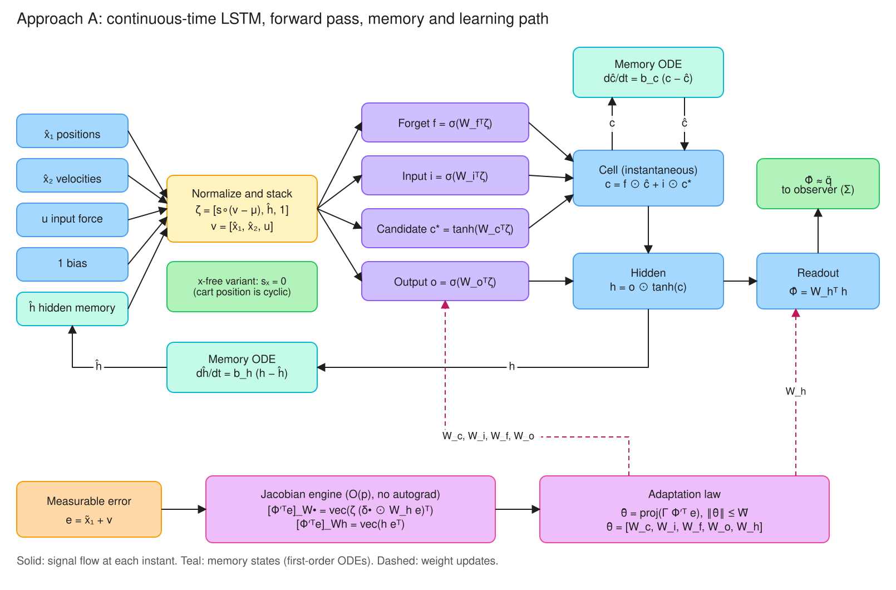
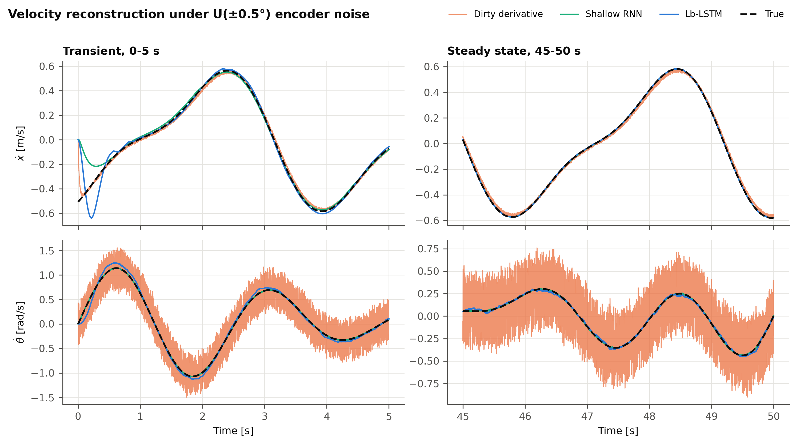
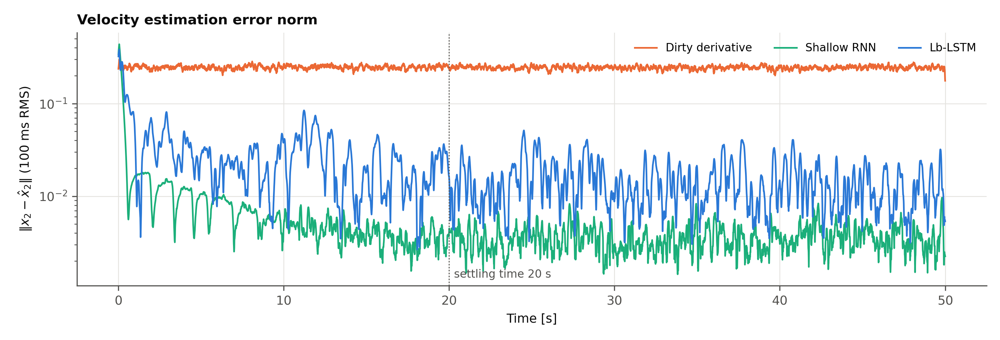
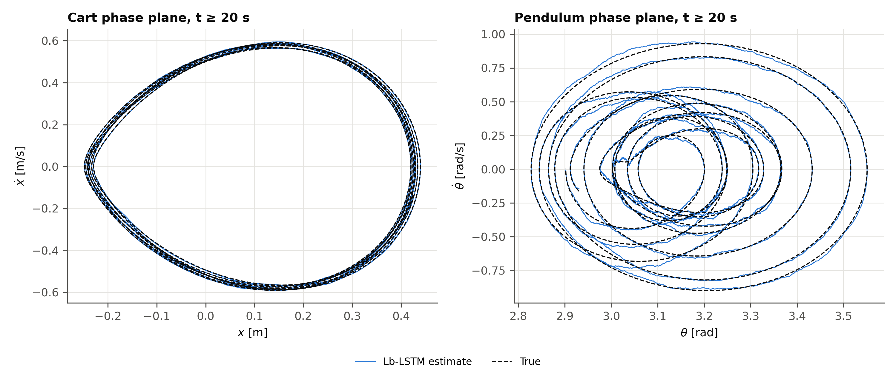
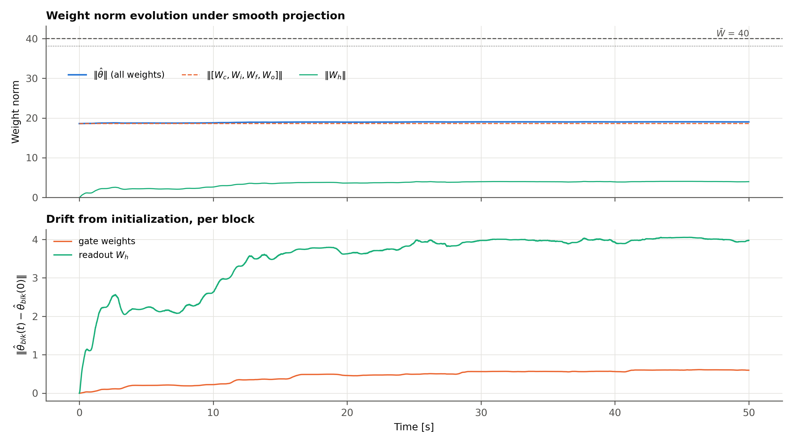
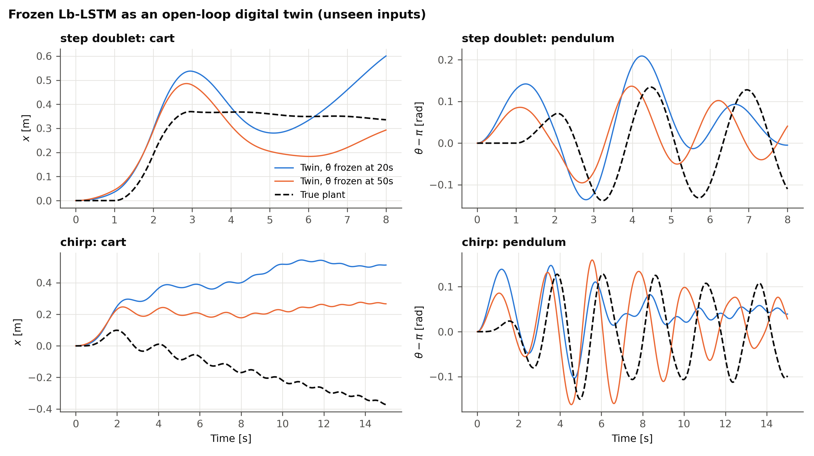

# Approach A: Black-Box Continuous-Time Lb-LSTM Adaptive Observer

[](#)
[](#)
[](#10-reproducing-the-results)

This branch implements the Lyapunov-based LSTM (Lb-LSTM) adaptive state observer of
**Griffis, Patil, Hart & Dixon, "Lyapunov-Based Long Short-Term Memory (Lb-LSTM) Neural
Network-Based Adaptive Observer", IEEE Control Systems Letters 8 (2024) 97–102.** The
observer runs on the Feedback Instruments 33-936S cart-pendulum testbed from `main`.

The LSTM treats the acceleration field $g(x, u)$ as a **complete black box**. It uses no
mass, inertia, damping or kinematic structure. The only plant knowledge it uses is the
relative degree: positions are measured and $\dot{x}_1 = x_2$. All updates are analytical
ODEs in NumPy, with no autograd.

**Results in brief (50 s, U(±0.5°) encoder noise; details in §9):**

| | Steady-state $\dot{x}$ RMSE | Steady-state $\dot{\theta}$ RMSE | $\dot{\theta}$ chatter ratio |
|:---|---:|---:|---:|
| Dirty derivative | 0.0171 m/s | 0.244 rad/s | 337 |
| **Lb-LSTM (black box)** | **0.0024 m/s** | **0.0167 rad/s** | **1.64** |
| Shallow RNN (grey box: exact nominal model) | 0.0004 m/s | 0.0038 rad/s | 1.37 |

- **Velocity estimation.** The observer cuts velocity error 7–15× compared with the dirty
  derivative and removes its chattering. The result holds across initialization seeds.
- **Online model fit.** During observation the adapted $\hat{\Phi}$ fits the true
  accelerations well: NMSE 0.05.
- **Identification.** The *frozen* weights do **not** generalize as a digital twin to
  unseen inputs: median one-step $\ddot\theta$ NMSE is about 1 across seeds. The adaptation
  law learns what it needs to observe, not a globally valid model. §9.4 explains why, and
  why this motivates Approach C.

---

## 1. Problem setting

For $n$ measured generalized coordinates and $m$ inputs,

$$\dot{x}_1 = x_2, \qquad \dot{x}_2 = g(x, u), \qquad y = x_1 + v,$$

with $g$ unknown and $x_2$ unmeasured. On the rig: $x_1 = [x,\ \theta]^T$,
$x_2 = [\dot x,\ \dot\theta]^T$, $u = F$ ($n = 2$, $m = 1$). Every vector equation below
acts element-wise on the $n$ channels.

## 2. Continuous-time LSTM (Eqs. 7–8)

The augmented input is
$\zeta = [\hat{x}_1^T,\ \hat{x}_2^T,\ u^T,\ \hat{h}^T,\ 1]^T \in \mathbb{R}^{d}$, with
$d = 2n + m + L + 1$. The gates and the instantaneous cell and hidden outputs are

$$f = \sigma_g(W_f^T\zeta),\quad i = \sigma_g(W_i^T\zeta),\quad c^\ast = \sigma_c(W_c^T\zeta),\quad o = \sigma_g(W_o^T\zeta)$$

$$c = f \odot \hat{c} + i \odot c^\ast, \qquad h = o \odot \sigma_c(c), \qquad \hat{\Phi} = W_h^T h,$$

and the continuous memory evolves as

$$\dot{\hat c} = -b_c\,\hat c + b_c\,(f\odot\hat c + i\odot c^\ast), \qquad \dot{\hat h} = -b_h\,\hat h + b_h\,(o\odot\sigma_c(c)),$$

where $\sigma_g$ is the logistic sigmoid, $\sigma_c = \tanh$, $W_{c,i,f,o}\in\mathbb{R}^{d\times L}$
and $W_h\in\mathbb{R}^{L\times n}$.



*Diagram 1. Data flow through the continuous-time LSTM. The inputs are normalized and stacked with the
hidden memory and a bias into $\zeta$ (written $z$ in the figure). The four gates produce the
instantaneous cell $c$ and hidden output $h$ (drawn $\bar c$, $\bar h$), and the readout gives
$\hat\Phi$. The memories $\hat c$, $\hat h$ follow first-order ODEs. The dashed path is learning:
the measurable error $e$ and the forward-pass quantities give $\Phi'^Te$ in $O(p)$ (§4), and the
adaptation law (§5) updates every weight block. The green note marks the cart-position input scale,
which the shared benchmark sets to zero (x-free variant).*

**Interpretation used here.** $\hat c$ and $\hat h$ are the recurrent *memory states*.
They are first-order low-pass copies of the cell and hidden outputs, the continuous-time
analogue of the one-step delay in a discrete LSTM. $c$ and $h$ are the *instantaneous*
outputs of the gate network. At each instant the LSTM is therefore a static map of
$(\zeta, \hat c)$. This is what gives $\hat\Phi$ a non-zero partial derivative with respect
to **every** weight block (§4). Had $\sigma_c(\hat c)$ been used in the output instead, the
Jacobian with respect to $W_c, W_i, W_f$ would vanish identically.

**Input preconditioning.** In the code,
$\zeta = [s\odot([\hat x_1, \hat x_2, u] - \mu),\ \hat h,\ 1]$. The per-channel scale $s$
and offset $\mu$ are data normalization, not model knowledge. On the rig, $\mu$ is the mean
of the first second of encoder data. This matters: the pendulum hangs at
$\theta \approx \pi$, so without centering the informative $\pm 0.4$ rad variation rides on
a large offset. The gates then cannot resolve it with bounded weights. In the tuning
sweeps, uncentered configurations fit the training trajectory with frozen-weight
$\ddot\theta$ NMSE 0.85–1.5; the chosen centered configuration reaches 0.06–0.13.

## 3. Dynamic auxiliary filter and the algebraic cancellation (Eqs. 3–6, 11)


*Diagram 2. Block diagram of the observer. The auxiliary filter turns the measurable error
$\tilde x_1$ into $\eta$ and $\nu$. The linear feedback $\chi$, the robust term and the LSTM
output $\hat\Phi$ add up to $\dot{\hat x}_2$, and two integrators give the estimates. Adaptation is
driven only by the measurable error $e$.*

With the measurable error $\tilde x_1 = y - \hat x_1$:

$$\eta = p - (\alpha + k_r)\tilde x_1$$

$$\dot p = -(k_r + 2\alpha)p - \nu + ((\alpha + k_r)^2 + 1)\tilde x_1, \qquad p(0) = (\alpha + k_r)\tilde x_1(0)$$

$$\dot\nu = p - \alpha\nu - (\alpha + k_r)\tilde x_1, \qquad \nu(0) = 0$$

$$e = \tilde x_1 + \nu$$

The observer is

$$\dot{\hat x}_1 = \hat x_2, \qquad \dot{\hat x}_2 = \hat\Phi + k_s\,\mathrm{sgn}(e) + \chi, \qquad \chi = -(3\alpha + k_r)\eta + (2 - \alpha^2)\tilde x_1 - \nu.$$

`sign_mode="tanh"` replaces $\mathrm{sgn}(e)$ with the boundary-layer approximation
$\tanh(e/\epsilon)$.

> **Note on the $\tilde x_1$ coefficient in $\chi$.** The task specification, and Griffis et al.
> [1, Eq. (11)], give $(\alpha^2 + 2)$. With the filter exactly as written above, the cross terms of the
> Lyapunov derivative cancel **only for $(2 - \alpha^2)$**. The derivation follows, a
> SymPy check reproduces it, and `tests/test_blackbox_lstm.py` asserts it against the
> implemented vector field. With $(\alpha^2+2)$, a residual $-2\alpha^2\,\tilde x_1^T r$
> remains. That residual is bounded and can be dominated with Young's inequality, but it
> is no longer an exact cancellation. If the paper does use $(\alpha^2 + 2)$, some other
> filter coefficient must differ; set `chi_x1_coeff=alpha**2 + 2` to reproduce that variant.

### 3.1 Filter algebra and exact cancellation

**Derivation.** Define the unmeasurable filtered error $r = \tilde x_2 + \alpha\tilde x_1 + \eta$,
with $\tilde x_2 = x_2 - \hat x_2$.

1. **$\nu$ is a filtered copy of $\eta$.** Substituting $p = \eta + (\alpha+k_r)\tilde x_1$
   into $\dot\nu$ gives $\dot\nu = \eta - \alpha\nu$.

2. **$e$ is a filtered copy of $r$.** $\dot e = \tilde x_2 + \eta - \alpha\nu = r - \alpha e$,
   so $r = \dot e + \alpha e$. This is the RISE structure that lets $\mathrm{sgn}(e)$, a
   function of a *measurable* signal, act on the unmeasurable $r$.

3. **$\eta$ dynamics.** Differentiate $\eta$ and substitute $\dot p$, $p$ and
   $\tilde x_2 = r - \alpha\tilde x_1 - \eta$:

   $$\dot\eta = -(k_r+2\alpha)\eta - \alpha(\alpha+k_r)\tilde x_1 + \tilde x_1 - \nu - (\alpha+k_r)\tilde x_2 = -(\alpha + k_r)\,r - \alpha\eta + \tilde x_1 - \nu.$$

4. **$r$ dynamics.** $\dot r = \dot{\tilde x}_2 + \alpha\tilde x_2 + \dot\eta$, with
   $\dot{\tilde x}_2 = g - \hat\Phi - k_s\,\mathrm{sgn}(e) - \chi$:

   $$\dot r = g - \hat\Phi - k_s\,\mathrm{sgn}(e) - \chi - k_r r + (1 - \alpha^2)\tilde x_1 - 2\alpha\eta - \nu.$$

   Substituting $\chi$:

   $$\dot r = \underbrace{g - \hat\Phi - k_s\,\mathrm{sgn}(e)}_{\text{learning + robust terms}} - k_r r - \tilde x_1 + (\alpha + k_r)\eta.$$

5. **Cancellation.** Take $V_0 = \tfrac12(\tilde x_1^T\tilde x_1 + \eta^T\eta + \nu^T\nu + r^Tr)$
   and use $\dot{\tilde x}_1 = r - \alpha\tilde x_1 - \eta$:

   $$\begin{aligned}
   \dot V_0 ={}& \tilde x_1^T r - \alpha\|\tilde x_1\|^2 - \tilde x_1^T\eta \\
   &- (\alpha + k_r)\eta^T r - \alpha\|\eta\|^2 + \eta^T\tilde x_1 - \eta^T\nu \\
   &+ \nu^T\eta - \alpha\|\nu\|^2 \\
   &- k_r\|r\|^2 - r^T\tilde x_1 + (\alpha+k_r)r^T\eta + r^T(g - \hat\Phi - k_s\,\mathrm{sgn}(e)).
   \end{aligned}$$

   The pairs $\tilde x_1^T\eta$, $\eta^T\nu$, $\tilde x_1^T r$ and $\eta^T r$ cancel exactly:

   $$\dot V_0 = -\alpha\left(\|\tilde x_1\|^2 + \|\eta\|^2 + \|\nu\|^2\right) - k_r\|r\|^2 + r^T\left(g - \hat\Phi - k_s\,\mathrm{sgn}(e)\right).$$

   Every term of $\chi$ is there to remove one cross term: $-(3\alpha+k_r)\eta$ removes
   $\eta^Tr$, $(2-\alpha^2)\tilde x_1$ removes $\tilde x_1^Tr$, and $-\nu$ removes the
   $\nu$ leak from $\dot\eta$. The filter's own coefficients
   ($(\alpha+k_r)^2+1$ in $\dot p$, $-(\alpha+k_r)$ in $\dot\nu$) remove $\tilde x_1^T\eta$
   and $\eta^T\nu$.

### 3.2 An implementable adaptation law

The weights adapt on the measurable error (§5): $\dot{\hat\theta} = \mathrm{proj}(\Gamma\,\Phi'^Te)$.
A law driven by $r$, as in the tracking controllers [3], [4], cannot be implemented here, because
$r$ contains the unmeasured velocity error $\tilde x_2$. It is not needed either. The argument is
as follows.

Write $g = \Phi(\zeta,c;\theta^\ast) + \varepsilon$ on a compact set, with bounded ideal weights
$\theta^\ast$, and split the mismatch as

$$g - \hat\Phi = N_2 + N_3,\qquad N_3 \triangleq \Phi'\tilde\theta,\qquad N_2 \triangleq \big[\Phi(\zeta,c;\theta^\ast) - \Phi(\hat\zeta,\hat c;\theta^\ast)\big] + \mathcal O^2(\tilde\theta) + \varepsilon,$$

where $\tilde\theta = \theta^\ast - \hat\theta$. Add $\tfrac{\alpha}{2}\tilde\theta^T\Gamma^{-1}\tilde\theta$
to the Lyapunov function. The projection property
$\tilde\theta^T\Gamma^{-1}(\mathrm{proj}(\tau)-\tau) \ge 0$ [7] gives

$$\frac{d}{dt}\Big(\tfrac{\alpha}{2}\tilde\theta^T\Gamma^{-1}\tilde\theta\Big) \le -\alpha\,e^TN_3.$$

Since $r = \dot e + \alpha e$, the cross term $r^TN_3$ in $\dot V_0$ splits into
$\dot e^TN_3 + \alpha e^TN_3$. The measurable law cancels **only the $\alpha e^TN_3$ half**. The
remainder $\dot e^TN_3$ is bounded, because $\tilde\theta$ is bounded (by projection), and it is
dominated by the robust term through the integral bound of §3.3. The weight error is therefore
handled by boundedness and domination, not by an exact cancellation. Griffis et al. [1] use the
same law without projection.

> **Remark.** By integration by parts,
> $\int_0^t\Gamma\Phi'^Tr = \Gamma\Phi'^Te\big|_0^t - \int_0^t\Gamma\dot\Phi'^Te + \alpha\int_0^t\Gamma\Phi'^Te$.
> An $r$-driven law could therefore be realized if $\dot\Phi'$ were computable, which needs $\dot u$
> and the second derivatives of the network. It would restore the exact cancellation but could not be
> combined directly with projection, so it is not used.

### 3.3 Robustness: the RISE integral lemma

The observer injects $k_s\,\mathrm{sgn}(e)$, not $\mathrm{sgn}(r)$. The pointwise product
$r^T(N - k_s\,\mathrm{sgn}(e))$ can be positive for any $k_s$, because $r$ and $e$ need not share
signs at a given instant, so "$k_s$ larger than the disturbance" does **not** give domination.
Domination holds in integral, because $e$ is a filtered version of $r$. This is the lemma of
Xian et al. [5].

**Lemma 1 (RISE integral bound).** Let $r = \dot e + \alpha e$ with $\alpha > 0$. Let
$\lVert N_B\rVert \le \zeta_1$, $\lVert N_D\rVert \le \zeta_2$ and
$\lVert\dot N_B + \dot N_D\rVert \le \zeta_3$, and define
$L \triangleq r^T(N_B + N_D - k_s\,\mathrm{sgn}(e)) - \alpha e^TN_D$. If

$$k_s \ge \max\Big\{\zeta_1 + \zeta_2,\ \ \zeta_1 + \tfrac{1}{\alpha}\zeta_3\Big\},$$

then $\int_0^tL\,d\tau \le \zeta_b \triangleq k_s\lVert e(0)\rVert_1 - e(0)^T\big(N_B(0)+N_D(0)\big)$
for all $t \ge 0$.

*Proof.* Substitute $r = \dot e + \alpha e$; the $\alpha e^TN_D$ terms cancel. Integrate
$\dot e^T(N_B + N_D)$ by parts, use $\int_0^t\dot e^T\mathrm{sgn}(e) = \lVert e(t)\rVert_1 - \lVert e(0)\rVert_1$
and $\lvert e^Tv\rvert \le \lVert e\rVert_1\lVert v\rVert$:

$$\int_0^tL \le \lVert e(t)\rVert_1(\zeta_1+\zeta_2-k_s) + \alpha\int_0^t\lVert e\rVert_1\Big(\zeta_1+\tfrac{\zeta_3}{\alpha}-k_s\Big) + \zeta_b \le \zeta_b.\ ∎$$

With $N_B = N_2$ and $N_D = N_3$, define $P(t) \triangleq \zeta_b - \int_0^tL\,d\tau \ge 0$, so that
$\dot P = -L$.

**Proposition 1 (convergence).** Let
$V = V_0 + \tfrac{\alpha}{2}\tilde\theta^T\Gamma^{-1}\tilde\theta + P$ and
$\xi = [\tilde x_1^T,\eta^T,\nu^T,r^T,\tilde\theta^T,\sqrt P]^T$. Suppose the bounds of Lemma 1 hold
while $\xi$ is in the ball $\mathcal S = \{\lVert\xi\rVert < \omega\}$, $k_s$ satisfies the lemma's
condition, and $\xi(0) \in \{\lVert\xi\rVert < \sqrt{\beta_1/\beta_2}\,\omega\}$, where
$\beta_1\lVert\xi\rVert^2 \le V \le \beta_2\lVert\xi\rVert^2$. Then all signals stay bounded, and
$\tilde x_1, \eta, \nu, r \to 0$, hence $\tilde x_2 = r - \alpha\tilde x_1 - \eta \to 0$.

*Proof sketch.* By the cancellation above, §3.2 and $\dot P = -L$, for almost all $t$ with
$\xi \in \mathcal S$,

$$\dot V \le -\alpha\big(\lVert\tilde x_1\rVert^2 + \lVert\eta\rVert^2 + \lVert\nu\rVert^2\big) - k_r\lVert r\rVert^2.$$

So $\lVert\xi(t)\rVert \le \sqrt{\beta_2/\beta_1}\lVert\xi(0)\rVert < \omega$, and $\xi$ stays in
$\mathcal S$. The closed loop is a Filippov differential inclusion because of $\mathrm{sgn}(e)$
[8], [9], and the nonsmooth LaSalle–Yoshizawa corollary [6] gives
$(\tilde x_1, \eta, \nu, r) \to 0$. ∎

The result is semi-global: $\omega$ can be as large as desired, at the price of larger bounds and a
larger $k_s$. It gives **no** parameter convergence ($\dot V$ has no $-\lVert\tilde\theta\rVert^2$
term) and no exponential rate; an exponential variant needs a modified $P$-function [2]. Griffis et
al. [1] use that variant and obtain $k_s \ge \kappa_1 + \kappa_2 + (\alpha\kappa_2+\kappa_3)/(\alpha-1)$
with $\alpha > 1$.

**What the code actually runs.** With $\tanh(e/\epsilon)$, or with $k_s$ below the lemma's bound,
the conclusion weakens to uniform ultimate boundedness, with the residual set shrinking as
$\hat\Phi \to g$. **The tuned $k_s = 0.2$ is below the bound**: the unlearned acceleration mismatch
is of order $1\ \text{rad/s}^2$. The experiments therefore run in the UUB regime. The linear
feedback $\chi$ and the learned $\hat\Phi$ do the work, and a larger $k_s$ mostly injects noise
(§8).

## 4. Analytical Jacobians

The parameter vector stacks column-major vecs:
$\theta = [\mathrm{vec}(W_c)^T, \mathrm{vec}(W_i)^T, \mathrm{vec}(W_f)^T, \mathrm{vec}(W_o)^T, \mathrm{vec}(W_h)^T]^T \in \mathbb{R}^{4dL + Ln}$
(1440 weights for $L = 16$). Holding $(\zeta, \hat c)$ fixed, with pre-activations
$a_\bullet = W_\bullet^T\zeta$ and $s = \partial h/\partial c = o \odot (1 - \tanh^2 c)$, the
gate sensitivities $\delta_\bullet = \partial h / \partial a_\bullet$ are

$$\delta_c = s \odot i \odot (1 - c^{\ast 2}),\qquad \delta_i = s \odot c^\ast \odot i \odot (1 - i),$$

$$\delta_f = s \odot \hat c \odot f \odot (1 - f),\qquad \delta_o = \tanh(c) \odot o \odot (1 - o).$$

Because $\partial a_\bullet / \partial\,\mathrm{vec}(W_\bullet) = I_L \otimes \zeta^T$, the blocks
of $\Phi' = \partial\hat\Phi/\partial\theta \in \mathbb{R}^{n\times p}$ are

$$\frac{\partial\hat\Phi}{\partial\,\mathrm{vec}(W_\bullet)} = \big(W_h^T\,\mathrm{diag}(\delta_\bullet)\big) \otimes \zeta^T \quad (\bullet \in \{c,i,f,o\}), \qquad \frac{\partial\hat\Phi}{\partial\,\mathrm{vec}(W_h)} = I_n \otimes h^T.$$

The observer only ever needs $\Phi'^Te$. The mixed-product rule
$(A\otimes\zeta)(e\otimes 1) = (Ae)\otimes\zeta$ turns that product into outer products,
so it costs $O(p)$ without forming $\Phi'$:

$$\big[\Phi'^T e\big]_{W_\bullet} = \mathrm{vec}\big(\zeta\,(\delta_\bullet \odot W_h e)^T\big), \qquad \big[\Phi'^T e\big]_{W_h} = \mathrm{vec}(h\,e^T).$$

`tests/test_jacobian_engine.py` checks the explicit $\Phi'$ against central finite
differences (agreement to about $10^{-11}$, all five blocks non-degenerate) and checks the
fast product against $\Phi'^Te$ to machine precision.

> **Layout convention, and a correction to the survey.** With gates written as $W z$,
> $W \in \mathbb R^{l_2\times l_1}$, and column-stacking $\mathrm{vec}$, the factor above appears as
> $(z^T\otimes I_{l_2})$. For the output gate:
> $\partial h/\partial\,\mathrm{vec}(W_o) = D(\sigma_c(c))\,D(\sigma_g'(W_oz))\,(z^T\otimes I_{l_2})$.
> The survey on `main` (its Eq. (27)) omitted that factor, which leaves an $l_2\times l_2$ matrix
> where an $l_2 \times l_1l_2$ one is needed. $(z^T\otimes I_{l_2})$ and the $I_L\otimes\zeta^T$
> used here are the same derivative in different memory layouts. A finite-difference check of the
> full set, in the $Wz$ layout, agrees to $7.6\times10^{-11}$.

> **Caveat: static-map Jacobian.** $\Phi'$ differentiates the instantaneous map
> $(\zeta, \hat c) \mapsto \hat\Phi$ with the memories held fixed. It drops the dependence of
> $\hat c$ and $\hat h$ on $\theta$ through their ODEs, which backpropagation-through-time or
> real-time recurrent learning would keep. This is the standard choice in [1] and in the Lyapunov
> analysis, but it is an approximation of the true sensitivity, not the exact gradient.

## 5. Adaptation law and smooth projection

$$\dot{\hat\theta} = \mathrm{proj}\left(\Gamma\,\Phi'^T e\right), \qquad \Gamma = \mathrm{diag}(\gamma_g I_{4dL},\ \gamma_h I_{Ln}).$$

The projection uses the convex boundary function
$f(\theta) = \dfrac{(1+\epsilon_p)\|\theta\|^2 - \bar W^2}{\epsilon_p\bar W^2}$, which is
zero at $\|\theta\| = \bar W/\sqrt{1+\epsilon_p}$ and one at $\|\theta\| = \bar W$
(Pomet & Praly, 1992; Lavretsky & Wise, 2013):

$$\mathrm{proj}(\tau) = \begin{cases} \tau - f(\theta)\,\dfrac{\Gamma\theta\,\theta^T\tau}{\theta^T\Gamma\theta} & f(\theta) > 0 \text{ and } \theta^T\tau > 0, \\[4pt] \tau & \text{otherwise.}\end{cases}$$

The operator is Lipschitz. It leaves $\tau$ untouched in the interior and removes exactly
the outward radial component on the outer sphere, so $\|\hat\theta(t)\| \le \bar W$ for the
continuous flow. It also preserves the Lyapunov inequality
$\tilde\theta^T\Gamma^{-1}(\mathrm{proj}(\tau) - \tau) \ge 0$ for $\|\theta^\ast\| \le \bar W/\sqrt{1+\epsilon_p}$.

Initialization: gate weights are $\mathcal N(0, 0.5^2)$ and $W_h(0) = 0$, so that
$\hat\Phi(0) = 0$ (no prior model). Random gates are necessary. With all weights at zero,
$h \equiv 0$ and $\Phi'^Te \equiv 0$, and nothing would ever adapt.

## 6. Continuous-time Euler discretization

The observer is a continuous ODE in
$X = (\hat x_1, \hat x_2, p, \nu, \hat c, \hat h, \hat\theta)$, of dimension
$4n + 2L + p = 1480$. Between DAQ samples the measurement and input are zero-order held,
and the ODE is integrated by forward Euler with $n_s$ sub-steps of $\Delta = T_s / n_s$:

$$X_{j+1} = X_j + \Delta\, F(X_j,\ y_k,\ u_k), \qquad j = 0, \dots, n_s - 1, \qquad \hat\theta \leftarrow \hat\theta\cdot\min\!\big(1,\ \bar W / \|\hat\theta\|\big).$$

Why Euler is adequate here:

- **Linear error modes.** With $\hat\Phi = g$ and $k_s = 0$, the per-channel error system
  in $(\tilde x_1, \tilde x_2, p, \nu)$ has eigenvalues
  $\{-4.03 \pm 0.08j,\ -5.97 \pm 11.95j\}$ at $\alpha = 4$, $k_r = 8$. Hence
  $\Delta|\lambda|_{\max} = 0.013 \ll 2$ at $T_s = 1$ ms. The memory filters contribute
  $\Delta b_{c,h} = 0.005$.
- **Discontinuous feedback.** $\mathrm{sgn}(e)$ is discontinuous, so higher-order
  Runge–Kutta gains no accuracy. Its discrete effect is a ripple of amplitude about
  $k_s\Delta = 2\times10^{-4}$ in $\hat x_2$, far below the noise floor. This is why the
  sgn and tanh variants give nearly identical chatter ratios.
- **Projection overshoot.** Invariance of the ball holds for the flow, but one Euler step
  can overshoot it by $O(\Delta)$. The radial rescale after each step
  (`LyapunovAdaptationLaw.enforce_bound`) is a discretization safeguard only; it never
  activates in the reported runs ($\|\hat\theta\| \approx 19 < \bar W = 40$).
- **Sub-stepping.** `n_substeps > 1` is needed only if gains are raised until
  $T_s|\lambda|_{\max}$ approaches 1.

The digital twin (§7) is smooth, with no sgn term, so it uses classical RK4.

## 7. System identification stage

`src/identification/extract_model.py` runs four steps:

1. **Freeze** $\hat\theta$ at $t_{\text{freeze}} \ge 20$ s. `freeze_observer` refuses
   earlier times. The experiment reports both $t = 20$ s and $t = 50$ s.
2. **Decouple** the LSTM from the observer feedback. The filter $(p, \nu)$, $\chi$, the
   robust term and adaptation are dropped. What remains is the autonomous model
   $\dot x_1 = x_2,\ \dot x_2 = \hat\Phi(\zeta, \hat c; \theta_{\text{frozen}})$ plus the
   $\hat c$, $\hat h$ memory ODEs. Here $\zeta$ is built from the twin's own states, and
   the memory is relaxed to its equilibrium at the initial condition.
3. **Drive** the twin open loop with inputs absent from the adaptation data, starting from
   rest at the hanging equilibrium:
   - a step doublet: ±1 N for 1 s each, 8 s horizon
   - a linear chirp: 0.3 → 1.2 Hz, 1 N, cosine-ramped, 15 s horizon
4. **Score** the twin two ways. *Free-running state MSE* is the digital-twin metric.
   *One-step acceleration MSE/NMSE*, with $\hat\Phi$ evaluated on the true states,
   isolates model error from integrator drift. NMSE = MSE / Var(truth), so predicting zero
   scores about 1.

## 8. Hyperparameter tuning guidelines

These were tuned on the 50 s validation trajectory, **never on the identification test
inputs**. Defaults are in `LbLSTMObserverConfig`.

| Gain | Default | Role and guidance |
|:---|:---:|:---|
| $\alpha$ | 4 | Rate of $e$, $\nu$, $\tilde x_1$ ($\dot e = -\alpha e + r$). Sets two of the four error poles at $\approx -\alpha$. Raise it for faster transients, at the cost of noise gain. |
| $k_r$ | 8 | Damping of $r$. With $\alpha$, sets the complex pair ($\lvert\lambda\rvert \approx 13$ rad/s), i.e. the observer bandwidth and its noise gain. **$\Gamma$ must scale with this bandwidth**: $\alpha = 3$, $k_r = 6$ with the same $\Gamma$ drove $\hat\theta$ to the projection boundary and diverged. |
| $k_s$ | 0.2 | Robust sgn gain. Theory wants $k_s > \lVert N\rVert_\infty + \lVert\dot N\rVert_\infty/\alpha$. In practice, because $e$ is dominated by encoder noise, a larger $k_s$ adds noise (0.5 was worse). Keep it small and let $\hat\Phi$ learn. |
| $\epsilon$ (tanh) | 0.005 | Boundary layer. Set it at about the size of the $e$ noise. The sgn and tanh variants perform alike here (§6). |
| $\gamma_h$ (readout) | 300 | The dominant learning channel. The signal $e$ has DC gain of roughly $1/(\alpha k_r)$ from the mismatch, so $\gamma_h$ must be large ($10^2$–$10^3$). Above about 1500, individual seeds diverge to the projection boundary. |
| $\gamma_g$ (gates) | 30 | Much smaller than $\gamma_h$. Gate weights drift only about 0.6 (vs about 4 for $W_h$) over 50 s. Gates above about 50 combined with $\gamma_h \ge 1000$ destabilize the loop. |
| $b_c,\ b_h$ | 5 | Memory bandwidth [1/s]. Place it near or above the excitation band (1.5–3 rad/s). Results change little over $b \in [1, 10]$. |
| $\bar W$, $\epsilon_p$ | 40, 0.1 | Choose $\bar W$ about 2× the expected $\lVert\theta^\ast\rVert$. Here $\lVert\hat\theta\rVert$ settles near 19 (dominated by the random gate init). |
| $L$ | 16 | $L = 8$ halves the parameters but gives 3× worse cart-velocity error and unstable twins. |
| $s,\ \mu$ | see §2 | Scale each signal to about $\pm1$ over its expected range. Center using measured data. Essential for the angle channel. |

**Tuning procedure that worked:**
1. Fix $\alpha$ and $k_r$ from the desired bandwidth with $\Gamma = 0$.
2. Raise $\gamma_h$ until the online acceleration NMSE stops improving.
3. Add a small $\gamma_g$.
4. Check at least five initialization seeds. The failure mode is abrupt: $\lVert\hat\theta\rVert$ jumps to $\bar W$.

## 9. Simulation results

### 9.1 Scenario

`python experiments/run_blackbox_validation.py --seeds 5`

- **Excitation.** $u(t) = 2.0\sin(1.5t) + 1.2\cos(3.0t)$ open loop, 50 s at 1 kHz.
- **Noise.** Encoder noise U(±0.5°) on $\theta$, plus the testbed's ±0.2 mm cart noise and
  4096-count quantization.
- **Initial state.** The pendulum starts 0.4 rad from the *hanging* equilibrium, because the
  upright one is open-loop unstable under a prescribed open-loop input. The cart starts at
  $v_0 = -2/(1.5(M+m))$, the velocity that cancels the secular drift of $2\sin(1.5t)$ on a
  free cart; otherwise it hits the ±0.5 m bumpers.
- **Actuator effects** (dead-zone and stiction) are **off** by default. Their asymmetric
  dead-band biases the net force and pushes the open-loop cart into the bumper.
  `--actuator-effects` enables them.
- **Observer inputs.** All observers receive the encoder data and the *commanded* force.

### 9.2 Velocity estimation (seed 0)

| Estimator | RMSE $\dot x$ [m/s] | RMSE $\dot\theta$ [rad/s] | SS RMSE $\dot x$ | SS RMSE $\dot\theta$ | SS mean $\lVert x_2-\hat x_2\rVert$ | Chatter $\dot x$ | Chatter $\dot\theta$ |
|:---|---:|---:|---:|---:|---:|---:|---:|
| **Lb-LSTM (sgn)** | 0.0225 | 0.0266 | **0.0024** | **0.0167** | **0.0137** | 1.02 | 1.64 |
| Lb-LSTM (tanh) | 0.0232 | 0.0266 | 0.0061 | 0.0166 | 0.0150 | 1.00 | 1.60 |
| Shallow RNN (Dinh et al.) | 0.0241 | 0.0037 | 0.0004 | 0.0038 | 0.0030 | 1.00 | 1.37 |
| Dirty derivative ($\tau_d = 20$ ms) | 0.0184 | 0.2452 | 0.0171 | 0.2444 | 0.2116 | 13.7 | 337 |

SS means $t \ge 20$ s. Chatter is total variation of the estimate divided by that of the
truth, so 1 means no chattering.

- The Lb-LSTM's full-horizon $\dot x$ RMSE is transient-dominated. It starts at
  $\hat x_2 = 0$ against a true $-0.51$ m/s and needs about 1 s to converge, while the
  dirty derivative locks on within 50 ms.
- **The Shallow RNN is not black box.** It integrates the exact nominal plant model and
  learns only a residual, so it bounds what model knowledge buys. The black-box Lb-LSTM
  closes most of the gap between the dirty derivative and that bound, with no parameters.
- **Online model fit** ($t \ge 20$ s): NMSE$(\hat\Phi, g)$ = 0.047 for $\ddot x$ and
  0.048 for $\ddot\theta$.






In the weight-norm figure, $\lVert\hat\theta\rVert$ stays near 19, far inside $\bar W$, and
projection never activates. The drift panel shows that adaptation happens almost entirely
in the readout $W_h$.

### 9.3 Digital twin on unseen inputs (seed 0)

| $\hat\theta$ frozen at | Test | MSE $x$ | MSE $\dot x$ | MSE $\theta$ | MSE $\dot\theta$ | one-step NMSE $\ddot x$ | one-step NMSE $\ddot\theta$ |
|:---|:---|---:|---:|---:|---:|---:|---:|
| 20 s | step doublet | 1.11e-2 | 1.20e-2 | 7.58e-3 | 3.21e-2 | 0.62 | 0.43 |
| 20 s | chirp | 3.47e-1 | 5.92e-3 | 6.43e-3 | 3.25e-2 | 0.96 | 1.06 |
| 50 s | step doublet | 1.21e-2 | 7.36e-3 | 9.37e-3 | 6.55e-2 | 0.43 | 0.20 |
| 50 s | chirp | 1.50e-1 | 2.87e-3 | 1.46e-2 | 1.02e-1 | 1.13 | 0.73 |



For scale: the true $\theta - \pi$ in these tests stays within ±0.15 rad (variance about
$6\times10^{-3}$ rad²). A $\theta$ MSE of $7\times10^{-3}$ is therefore no better than
predicting the equilibrium.

**Robustness over initialization seeds 1–5**, reported as median [min, max]:

| Metric | Value |
|:---|:---|
| SS RMSE $\dot x$ | 0.002 [0.002, 0.005] m/s |
| SS RMSE $\dot\theta$ | 0.019 [0.014, 0.022] rad/s |
| Twin one-step NMSE $\ddot\theta$, frozen at 20 s: doublet / chirp | 1.27 [0.78, 3.15] / 1.07 [0.85, 3.36] |
| Twin one-step NMSE $\ddot\theta$, frozen at 50 s: doublet / chirp | 1.56 [0.91, 5.79] / 0.99 [0.52, 2.40] |
| Twin free-run MSE $\theta$, frozen at 20 s: doublet / chirp | 0.073 [0.014, 3.8] / 0.075 [0.025, 39] |

### 9.4 Findings

1. **Observation works robustly.** Every seed beats the dirty derivative by more than an
   order of magnitude on $\dot\theta$, with a chatter ratio near 1.
2. **Identification from this experiment does not generalize.** The frozen model fits the
   training trajectory: frozen, teacher-forced $\ddot\theta$ NMSE is 0.13 (frozen at 20 s)
   and 0.06 (frozen at 50 s) for seed 0, and 0.06–0.43 across seeds 1–5. On
   unseen inputs, the median one-step NMSE is about 1: no better than predicting zero. The
   seed-to-seed spread is large, which is the signature of non-identifiable weights.
3. **Why.**
   - The law $\dot{\hat\theta} = \Gamma\Phi'^Te$ drives $e \to 0$, and it only needs
     $\hat\Phi = g$ *along the visited trajectory*.
   - The two-tone excitation confines the state to a thin manifold, which does not
     persistently excite the 1440-dimensional $\hat\theta$.
   - The recurrent inputs $\hat h$ let the network fit the trajectory's *phase* as well as
     its state. The frozen model even predicts $\hat{\ddot\theta} = 0.48$ rad/s² at rest at
     the hanging equilibrium, where the truth is 0. That is why the twin moves before the
     doublet starts.
4. **Implication.** Approach A is a strong black-box *velocity observer*. It is not, from
   one run, a digital twin. Converging $\hat\theta$ needs either richer excitation or a
   parameter-error-driven term. Approach C's concurrent-learning history stack adds
   exactly that. Approach B's physical structure shrinks the hypothesis class instead.

## 10. Reproducing the results

```bash
pip install -r requirements.txt
pytest -q                                                    # 37 tests
python experiments/run_blackbox_validation.py --seeds 5      # about 70 s; writes figures/approach_a/*.png
python -m src.identification.extract_model --weights results/approach_a/lblstm_frozen.npz
```

| File | Contents |
|:---|:---|
| `src/observers/blackbox_lstm.py` | `LbLSTMObserver`, `LbLSTMObserverConfig`: LSTM memory, auxiliary filter, Eq. 11, Euler integration. Drop-in for `run_benchmark_comparison(custom_observers=...)`. |
| `src/adaptation/jacobian_engine.py` | Weight layout, LSTM forward pass, explicit $\Phi'$, fast $\Phi'^Te$, smooth projection, `LyapunovAdaptationLaw`. |
| `src/identification/extract_model.py` | `freeze_observer`, `FrozenLbLSTM` (save/load), `LbLSTMDigitalTwin`, unseen test signals, MSE/NMSE scoring, CLI. |
| `src/simulation/open_loop.py` | Open-loop plant rollout recording commanded and net force plus true accelerations. |
| `experiments/run_blackbox_validation.py` | Stages 1 and 2, seed robustness, figures. |
| `tests/test_blackbox_lstm.py` | Filter identities and exact Lyapunov cancellation checked on the implemented vector field, plus reset, freezing and a short closed-loop check. |
| `tests/test_jacobian_engine.py` | $\Phi'$ vs finite differences, fast product, vec layout, projection invariance. |
| `tests/test_extract_model.py` | Freeze guard, save/load, twin vs observer LSTM consistency, double-integrator sanity check, test signals. |

## References

1. E. J. Griffis, O. S. Patil, R. G. Hart, and W. E. Dixon, "Lyapunov-based long short-term memory (Lb-LSTM) neural network-based adaptive observer," *IEEE Control Systems Letters*, vol. 8, pp. 97–102, 2024, doi:10.1109/LCSYS.2023.3348706.
2. O. S. Patil, A. Isaly, B. Xian, and W. E. Dixon, "Exponential stability with RISE controllers," *IEEE Control Systems Letters*, vol. 6, pp. 1592–1597, 2022.
3. E. J. Griffis, O. S. Patil, Z. I. Bell, and W. E. Dixon, "Lyapunov-based long short-term memory (Lb-LSTM) neural network-based control," *IEEE Control Systems Letters*, vol. 7, pp. 2976–2981, 2023, doi:10.1109/LCSYS.2023.3291328.
4. R. G. Hart, E. J. Griffis, O. S. Patil, and W. E. Dixon, "Lyapunov-based physics-informed long short-term memory (LSTM) neural network-based adaptive control," *IEEE Control Systems Letters*, vol. 8, pp. 13–18, 2024, doi:10.1109/LCSYS.2023.3347485.
5. B. Xian, D. M. Dawson, M. S. de Queiroz, and J. Chen, "A continuous asymptotic tracking control strategy for uncertain nonlinear systems," *IEEE Transactions on Automatic Control*, vol. 49, no. 7, pp. 1206–1211, 2004, doi:10.1109/TAC.2004.831148.
6. N. Fischer, R. Kamalapurkar, and W. E. Dixon, "LaSalle–Yoshizawa corollaries for nonsmooth systems," *IEEE Transactions on Automatic Control*, vol. 58, no. 9, pp. 2333–2338, 2013.
7. E. Lavretsky and K. A. Wise, *Robust and Adaptive Control with Aerospace Applications*. London: Springer, 2013 (projection operator).
8. B. E. Paden and S. S. Sastry, "A calculus for computing Filippov's differential inclusion with application to the variable structure control of robot manipulators," *IEEE Transactions on Circuits and Systems*, vol. 34, no. 1, pp. 73–82, 1987.
9. D. Shevitz and B. Paden, "Lyapunov stability theory of nonsmooth systems," *IEEE Transactions on Automatic Control*, vol. 39, no. 9, pp. 1910–1914, 1994.
10. H. T. Dinh, R. Kamalapurkar, S. Bhasin, and W. E. Dixon, "Dynamic neural network-based robust observers for uncertain nonlinear systems," *Neural Networks*, vol. 60, pp. 44–52, 2014.
11. J.-B. Pomet and L. Praly, "Adaptive nonlinear regulation: Estimation from the Lyapunov equation," *IEEE Transactions on Automatic Control*, vol. 37, no. 6, pp. 729–740, 1992.
12. G. Chowdhary and E. Johnson, "Concurrent learning for convergence in adaptive control without persistency of excitation," in *Proc. 49th IEEE Conference on Decision and Control*, pp. 3674–3679, 2010.

**Diagrams.** Diagrams 1–2 are Excalidraw element lists in `figures/diagrams/src/*.json`;
`python figures/diagrams/src/render_diagrams.py` regenerates the SVGs and the editable `.excalidraw`
scenes.
