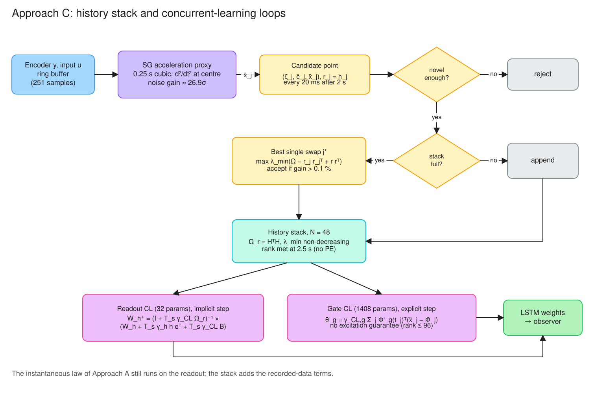
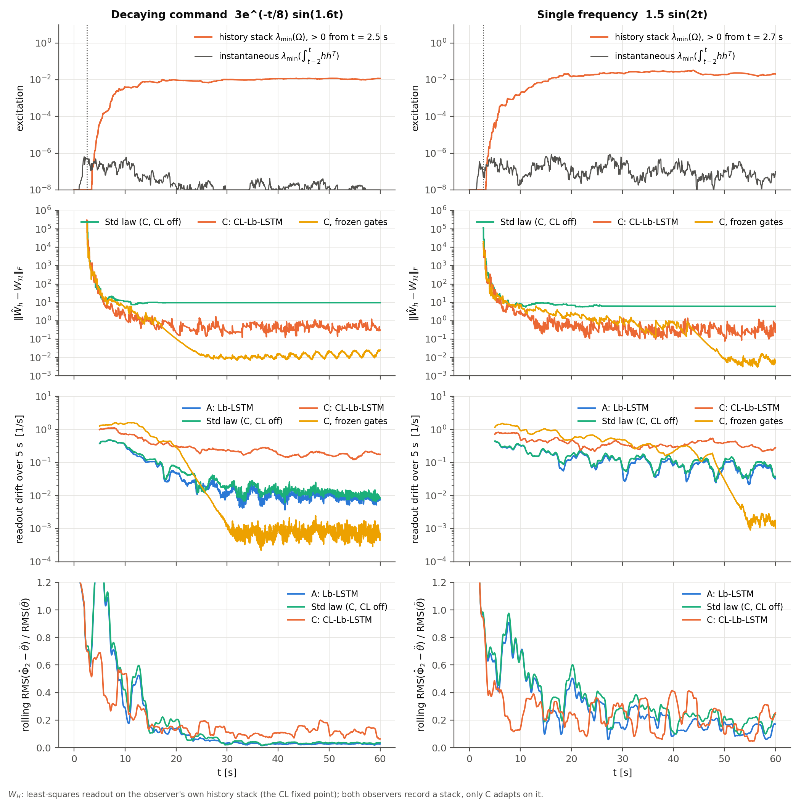
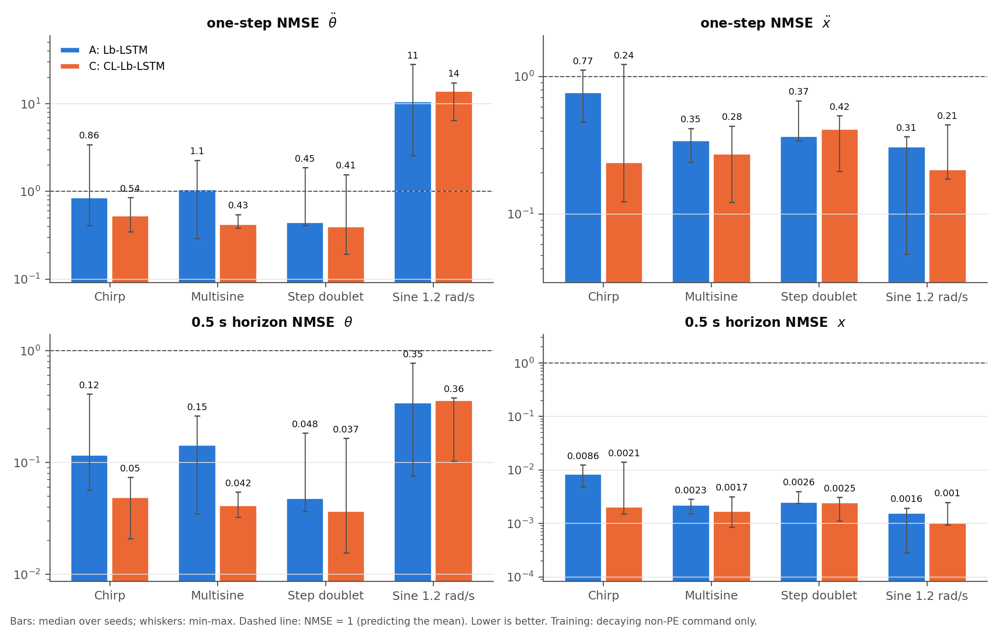
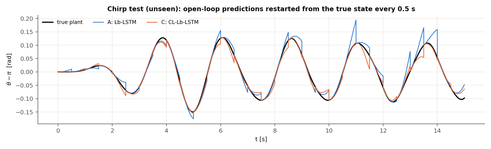

# Approach C: Concurrent-Learning Lyapunov-Based LSTM Observer (CL-Lb-LSTM)

[](#)
[](#)
[](#11-reproducing-the-results)

This branch extends the black-box Lb-LSTM observer of Approach A (Griffis, Patil, Hart & Dixon,
IEEE L-CSS 2024) with **concurrent learning (CL)**. The rig is the Feedback Instruments 33-936S
digital cart-pendulum. An online *history stack* of recorded operating points is selected to
maximize the minimum singular value of its data matrix. The weights then learn from the
instantaneous observer error and from the stored points at the same time. The aim is to keep
identifying the model after the excitation has died out, which the purely instantaneous law of
Approach A cannot do without persistence of excitation (PE).

**Results at a glance.** Models are trained on one weak-excitation (non-PE) trajectory and
tested open loop on four unseen inputs. Values are medians over 3 seeds; lower is better.

| Test (unseen) | one-step NMSE θ̈  A / **C** | one-step NMSE ẍ  A / **C** | 0.5 s NMSE θ  A / **C** | 0.5 s NMSE x  A / **C** |
|:---|:---:|:---:|:---:|:---:|
| Chirp 0.3–1.2 Hz | 0.863 / **0.538** | 0.772 / **0.240** | 0.118 / **0.050** | 0.0086 / **0.0021** |
| Multisine | 1.070 / **0.432** | 0.346 / **0.276** | 0.145 / **0.042** | 0.0023 / **0.0017** |
| Step doublet | 0.453 / **0.406** | **0.372** / 0.420 | 0.048 / **0.037** | 0.0026 / **0.0025** |
| Sine 1.2 rad/s | **10.87** / 14.26 | 0.311 / **0.213** | **0.349** / 0.364 | 0.0016 / **0.0010** |

- **C is better in 13 of 16 cells, and in all 8 cells of the two multi-frequency tests.**
  On the chirp and the multisine, its 0.5 s pendulum-angle prediction error is 2.4× and 3.5×
  lower than A's.
- **C loses three cells.** It loses cart acceleration on the step doublet, and both
  pendulum-angle metrics on the slow, small-amplitude 1.2 rad/s sine (see §9.3). One C win,
  0.5 s x on the step doublet, is a tie in practice (0.0025 vs 0.0026).
- **The rank condition λ_min(Ω) > 0 is reached 2.5 s into training and holds afterwards.**
  Over the same period the sliding-window excitation of the instantaneous regressor falls to
  about 10⁻⁹, so the trajectory is not PE.
- **The benefit comes from the history stack, not from any other change.** The same observer
  with the CL loop switched off ("Std law") is worse than both A and C on θ̈ in every test.

---

## 1. The persistence-of-excitation bottleneck

An adaptive observer adapts its weights with a gradient of the output error,
$\dot{\hat\theta} = \Gamma\,\Phi'(t)^T e(t)$. Lyapunov analysis
(Approach A, §3 of its README) makes the state-estimation errors converge,
$\|\tilde x_2\| \to 0$. It does not make the parameter error
$\tilde\theta = \theta^\ast - \hat\theta$ converge. Once $e \to 0$, adaptation stops wherever
$\hat\theta$ happens to be. The parameter error then converges to zero only if the regressor is
**persistently exciting**:

$$\int_t^{t+T}\Phi'(\tau)^T\Phi'(\tau)\,d\tau \;\ge\; \beta I > 0 \qquad \forall t \ge 0.$$

For the output layer of the LSTM, $\Phi'_h = I_n \otimes h^T$, so PE requires the hidden-state
trajectory $h(t) \in \mathbb{R}^{16}$ to keep visiting all 16 directions in every window of
length $T$. Normal operating trajectories do not do this:

- **Decaying commands** $u = A e^{-t/\tau}\sin\omega t$ excite the plant only transiently.
  Afterwards $h(t)$ follows a low-amplitude free swing.
- **Single-frequency commands** drive the plant onto one periodic orbit, which spans only a
  thin subspace of feature space.

The top row of Fig. 1 measures this directly. For both commands, the 2 s sliding-window
Gramian $\int_{t-2}^{t}hh^T$ has $\lambda_{\min}$ between 10⁻⁹ and 10⁻⁶ throughout, which in
practice is zero.

## 2. Concurrent learning and the rank condition

Concurrent learning (Chowdhary & Johnson 2010; Chowdhary et al. 2013) replaces the
persistence requirement with a condition on **recorded** data. Let
$\{t_j\}_{j=1}^N$ be a stored set of past instants with regressors $\Phi'_j = \Phi'(t_j)$, and
let $\epsilon_j = \ddot x(t_j) - \hat\Phi(t_j)$ be the current model residual at each of them.
The adaptation law becomes

$$\dot{\hat\theta} = \Gamma\,\Phi'(t)^T e(t) \;+\; \Gamma_{CL}\sum_{j=1}^N \Phi'^T_j\big(\ddot x(t_j) - \hat\Phi(t_j)\big).$$

The second term is the negative gradient of the stack loss
$J = \tfrac12\sum_j\|\ddot x(t_j) - \hat\Phi(t_j)\|^2$. It keeps acting after the trajectory has
stopped exciting the plant.

The requirement moves from the trajectory to the stack. The information matrix

$$\Omega = \sum_{j=1}^N \Phi'^T_j\Phi'_j \;\ge\; \underline\lambda\, I > 0 \qquad\text{(rank condition)}$$

must be positive definite at *some* finite time $t_r$. This is an interval-excitation
requirement: it is met once during a transient, not on every window forever.

### Where the rank condition can hold

$\Omega$ is a sum of $N$ terms of rank at most $n = 2$, so $\operatorname{rank}\Omega \le 2N$.
For the full LSTM parameter vector ($p = 4dL + Ln = 1440$), the condition would need
$N \ge 720$ stored points, each of which must be informative. That is not achievable.

For the **readout** $\theta_h = \mathrm{vec}(W_h)$, the regressor is $\Phi'_{h,j} = I_n \otimes h_j^T$
and

$$\Omega_h = I_n \otimes \sum_j h_j h_j^T = I_n \otimes (H^TH),\qquad H = [h_1,\dots,h_N]^T \in \mathbb{R}^{N\times L},$$

so that $\lambda_{\min}(\Omega_h) = \sigma_{\min}(H)^2$. This needs only $N \ge L = 16$ points.
The rank condition is therefore imposed and monitored on the readout.

Since $\mathrm{rank}\,\Omega \le nN$, the condition needs $nN \ge p$ at the very least. That makes the
choice of parameter set decisive:

| Design | Parameter set | Required stored points |
|:---|:---|:---|
| C, full LSTM | $p = 1440$ | $N \ge 720$ informative points: not achievable |
| **C, as implemented** | Readout only, $p = 32$ | $N \ge 16$; reached 2.5 s into training (§8) |
| D (`feature/approach-d-physics-icl`) | All $p = 15$ parameters of a linear Euler–Lagrange model | Gated on 60 windows and $\lambda_{\min} \ge 10^{-4}$; the gate opens after about 3 s |

Approach D was built to close this gap. Its model is linear in its parameters, so the rank condition
covers every parameter and the true plant lies inside the model class. The gate weights also
receive the CL gradient, computed with the full Jacobian $\Phi'_g(t_j)$, but without an
excitation guarantee (§6.3).

## 3. Architecture


*Diagram 1. Block diagram of the CL-Lb-LSTM observer. Everything outside the dashed path is Approach
A, unchanged: the filter, the feedback $\chi$, the robust term, the LSTM and its instantaneous
law. The dashed path adds the history stack. It records operating points with a Savitzky–Golay
acceleration proxy (§5) and feeds the recorded-data terms into the adaptation (§6). Diagram 2 (§4)
details that path.*

**What is inherited from Approach A.** The filter, the observer feedback $\chi$, the robust
term, the LSTM memory ODEs, the analytical Jacobians (`src/adaptation/jacobian_engine.py`) and
the digital-twin extraction are copied verbatim from `feature/approach-a-blackbox-lstm`.
`CLLbLSTMObserver` subclasses `LbLSTMObserver` and changes only the weight adaptation.
`tests/test_cl_lstm_observer.py` checks that with the CL loop disabled the two observers produce
identical states and weights, to 1e-12.

| Weight block | Instantaneous loop | CL loop | Guarantee |
|:---|:---:|:---:|:---|
| Readout $W_h$ (32 params) | $\gamma_h = 300$ | $\gamma_{CL} = 50$, implicit step | Rank condition monitored; convergence proof in §7 (for fixed features) |
| Gates $W_{c,i,f,o}$ (1408 params) | $\gamma_g = 0$ (off) | $\gamma_{CL,g} = 5$, explicit step | Descent on the stack loss only; rank(Ω) ≤ 96 < 1408 |

## 4. History stack: singular-value-maximizing recording



*Diagram 2. The concurrent-learning data path. Encoder samples in a ring buffer give a delayed,
lag-free acceleration proxy. Candidate points pass a novelty gate. When the stack is full, a
candidate replaces the entry whose removal most increases $\lambda_{\min}(\Omega)$. The stack drives
the implicit readout step, which carries the rank guarantee, and the explicit gate step, which has
none.*

`src/concurrent_learning/history_stack.py`. Each entry stores what is needed to re-evaluate the
network at the recorded operating point, $[\zeta(t_j),\ \hat c(t_j),\ u(t_j),\ x_{meas}(t_j),\ \ddot x(t_j)]$,
together with its regressor row $r_j = h_j$. Given $(\zeta_j, \hat c_j)$, the LSTM cell is a
static map, so the stored point can be re-evaluated exactly at the current weights.

**Policy** (Chowdhary & Johnson, ACC 2011, adapted). For each candidate $r$, arriving at most
every 20 ms after a 2 s warm-up:

1. **Novelty gate.** Reject the candidate if $\|r - r_{last}\| < 0.05\,\|r\|$, where $r_{last}$
   is the last recorded regressor. Near-duplicates from a slowly moving trajectory add no rank.
2. **Stack not full:** append.
3. **Stack full:** evaluate every single swap $j \to r$ in one batched eigen-decomposition,
   $$\lambda_j' = \lambda_{\min}\!\left(\Omega - r_jr_j^T + rr^T\right),\qquad j = 1..N,$$
   and replace $j^\ast = \arg\max_j\lambda'_j$ only if $\lambda'_{j^\ast} > (1 + 10^{-3})\,\lambda_{\min}(\Omega)$.
4. **Rank-deficient phase.** While every swap leaves $\lambda_{\min} = 0$, rank the swaps that
   do not decrease $\lambda_{\min}$ by the D-optimal score $\log\det(\Omega + \delta I)$. This
   drives the stack to full rank.

**Monotonicity lemma.** For fixed regressors, $\lambda_{\min}(\Omega(t))$ is non-decreasing:
every accepted swap increases it, and appends cannot decrease it. Once the rank condition
holds at $t_r$, therefore, $\lambda_{\min}(\Omega(t)) \ge \lambda_{\min}(\Omega(t_r))$ for all
$t \ge t_r$. The switched-system argument in §7 uses exactly this.
`test_lambda_min_never_decreases_once_full` checks it. When the gates adapt, the stored
regressors are re-evaluated at the current gates before every decision. The lemma then holds
between gate updates only.

**Why maximize λ_min.** Selecting on $\sigma_{\min}$ keeps the most linearly independent points
and discards clustered, redundant data. On a stream consisting of an informative burst followed
by a collapsed regressor, the stack's $\lambda_{\min}$ is more than 10³× that of the last-$N$
(FIFO) buffer (`test_svm_selection_beats_fifo_on_decaying_excitation`).

## 5. Acceleration proxy: causal Savitzky–Golay differentiation

The CL residual needs $\ddot x(t_j)$, which is never measured. `SavitzkyGolayAccelerationProxy`
fits a degree-3 polynomial to the last $W = 251$ encoder samples ($T_w = 0.25$ s) by least
squares, then differentiates it twice at the **window centre** $t_c = t - (W-1)/2\cdot T_s$:

$$\hat{\ddot q}(t_c) = c_2^T\,[q(t-(W-1)T_s),\dots,q(t)]^T,\qquad c_2 = 2\,[V^+]_{3,:},\ V_{ki} = \tau_k^{\,i}.$$

- **Causal.** Only past samples are used. The 125 ms delay is harmless because CL learns from
  recorded data anyway. The observer keeps a ring buffer of its own $(\zeta, \hat c, h)$
  snapshots, so each stack entry pairs the proxy with the network input at exactly $t_c$.
- **Unbiased and lag-free.** The centred window is exact for polynomials up to degree 3 and has
  zero phase at $t_c$.
- **Noise.** For i.i.d. encoder noise $\sigma$, the proxy's standard deviation is
  $\sigma\|c_2\| \approx \sigma\sqrt{720\,T_s/T_w^5} = 26.9\,\sigma$ (both values are tested).
  With $\sigma_\theta = 0.5°/\sqrt3$ plus quantization, the proxy's RMS error on the training
  data is 0.14 rad/s² for θ̈ (about 10% of RMS θ̈) and 0.004 m/s² for ẍ (about 2%).
  Substituting the true accelerations at the stack points leaves the stack fit essentially
  unchanged, so proxy noise is not the limiting factor.
- **How it can be avoided.** Integral concurrent learning (Parikh et al. 2019) integrates the
  equations of motion over a window, so each stored entry needs only positions, velocities and
  $\int u$. Approach D does this. Its velocity smoother has noise gain 8.5, against about 260 for a
  second derivative over the same 0.1 s window. For C the proxy was not the binding limit; the
  readout-only rank condition above was.

## 6. Adaptation laws

With $\theta = [\theta_g^T, \theta_h^T]^T$, $H$, $A = [\ddot x_1,\dots,\ddot x_N]^T$ and
$E = A - HW_h$ (the $N\times n$ residual matrix):

### 6.1 Readout (dual loop)

$$\dot W_h = \underbrace{\gamma_h\, h(t)\,e(t)^T}_{\text{instantaneous (Approach A)}} \;+\; \underbrace{\gamma_{CL}\,(B - \Omega_r W_h)}_{\gamma_{CL}\sum_j h_j(\ddot x_j - W_h^Th_j)^T},\qquad \Omega_r = H^TH,\ B = H^TA.$$

The CL term is affine in $W_h$ and stiff: $T_s\gamma_{CL}\lambda_{\max}(\Omega_r)$ can exceed 2.
It is therefore integrated **implicitly** (IMEX Euler):

$$W_h^{+} = (I + T_s\gamma_{CL}\Omega_r)^{-1}\big(W_h + T_s\gamma_h h e^T + T_s\gamma_{CL}B\big).$$

This step is unconditionally stable. Its fixed point is the stack least-squares readout
$W_{\mathcal H} = \Omega_r^{-1}B$, the **CL fixed point**. `test_implicit_readout_step_solves_the_implicit_equation`
verifies the step at $T_s\gamma\lambda_{\max} \gg 2$.

### 6.2 Gates (CL loop only)

$$\dot\theta_g = \gamma_{CL,g}\sum_j \Phi'_g(t_j)^T(\ddot x_j - \hat\Phi_j),\qquad \big[\Phi'^T_g w\big]_j = \mathrm{vec}\!\big(\zeta_j\,(\delta_j \odot \mathrm{tile}(W_h w, 4))^T\big),$$

where $\delta_j$ are the gate sensitivities at $(\zeta_j, \hat c_j)$ (Approach A, §4). The stack
sum reduces to a single product, $\mathrm{vec}(Z^T\,\mathrm{BACK})$, computed in one batched LSTM
pass. It matches the explicit Kronecker Jacobian to 1e-16. The norm bound
$\|\theta\| \le \bar W = 80$ is enforced after each step, as in Approach A.

### 6.3 What the gate loop does and does not guarantee

For a fixed stack, both CL loops are gradient flows of the same stack loss $J$. The readout step
has gain $\gamma_{CL}$ and the gate step $\gamma_{CL,g}$. $J$ is therefore non-increasing under
the CL dynamics alone. There is **no** parameter-convergence guarantee for $\theta_g$. The loop
is a first-order Taylor linearization of a nonlinear-in-parameters model, and rank(Ω) for the
gate block is far below its dimension. Gate learning is kept because it is what makes the model
generalize. With frozen random gates, even the best least-squares readout for those features
predicts the unseen tests worse than Approach A. The price is that the readout keeps tracking a
slowly moving fixed point $W_{\mathcal H}(\theta_g(t))$ instead of settling (§8).

## 7. Stability and convergence: LaSalle–Yoshizawa under concurrent learning

The proofs cover the readout with **fixed features** ($\gamma_g = \gamma_{CL,g} = 0$). This is
the "C, frozen gates" configuration of §8, available as `gamma_cl_gates=0`.

**Setting.** On the compact set of trajectories, write $g(x,u) = W^{\ast T}h + \varepsilon(t)$,
with $\|\varepsilon\| \le \bar\varepsilon$. Here $\varepsilon$ collects the approximation error
and the effect of evaluating the features at $\hat x$. At the stack points,
$\ddot x_j = W^{\ast T}h_j + \varepsilon_j + \delta_j$, with $\delta_j$ the proxy error. Let
$\tilde W = W^\ast - \hat W_h$ and $z = (\tilde x_1, \eta, \nu, r)$. Approach A's filter
algebra (its README, §3) gives, with $P \ge 0$ the RISE auxiliary function (Xian et al. 2004),

$$\dot V_0 + \dot P \le -W_0(z) := -\alpha\big(\|\tilde x_1\|^2 + \|\eta\|^2 + \|\nu\|^2\big) - k_r\|r\|^2,$$

valid when $k_s$ satisfies the RISE integral lemma of Approach A's README (§3.3), i.e. dominates the
bounds on $N = g - \hat\Phi$ and $\dot N/\alpha$ in integral, not pointwise. $N$ is bounded because
projection keeps $\|\hat\theta\| \le \bar W$. The observer is discontinuous
(sgn), so solutions are taken in the Filippov sense, and the nonsmooth LaSalle–Yoshizawa
corollaries of Fischer, Kamalapurkar & Dixon (2013) apply.

### Theorem 1 (instantaneous law: the state converges, the parameters need not)

With $\gamma_{CL} = 0$: $W_0(z(t)) \to 0$, so $\tilde x_1, \tilde x_2 \to 0$, and $\hat\theta$
stays bounded. The readout dynamics are $\dot{\tilde W} = -\gamma_h h e^T$, and since $e \to 0$,
$\dot{\tilde W} \to 0$. LaSalle–Yoshizawa gives no information about $\tilde W$, whose limit set
is every $\tilde W_\infty$ compatible with the trajectory. Concluding $\tilde W \to 0$ requires
PE of $h(t)$. The weights **stall**, wherever the transient leaves them.

### Theorem 2 (concurrent learning: the state and parameters converge together)

Let the rank condition hold from $t_r$ on: $\lambda_{\min}(\Omega_r(t)) \ge \underline\lambda > 0$
for all $t \ge t_r$. The monotonicity lemma of §4 guarantees this with
$\underline\lambda = \lambda_{\min}(\Omega_r(t_r))$. In the interior of the projection ball,

$$\dot{\tilde W} = -\gamma_h h e^T - \gamma_{CL}\Omega_r\tilde W - \gamma_{CL}E_{\mathcal H},\qquad E_{\mathcal H} = \textstyle\sum_j h_j(\varepsilon_j + \delta_j)^T.$$

Take $V_W = \frac{1}{2\gamma_{CL}}\|\tilde W\|_F^2$. Using $\|h\| \le \sqrt L$ (because $|h_i| < 1$)
and letting $c = (\gamma_h/\gamma_{CL})\sqrt L$,

$$\dot V_W \le -\underline\lambda\|\tilde W\|^2 + c\,\|\tilde W\|\,\|e\| + \|E_{\mathcal H}\|\,\|\tilde W\|,$$

with the projection only adding non-positive terms. For the composite
$V = V_0 + P + \beta V_W$, use $\|e\| \le \|\tilde x_1\| + \|\nu\|$ and Young's inequality twice:

$$\dot V \le -\tfrac{\alpha}{2}\big(\|\tilde x_1\|^2 + \|\nu\|^2\big) - \alpha\|\eta\|^2 - k_r\|r\|^2 - \tfrac{\beta\underline\lambda}{2}\|\tilde W\|^2 + \frac{\beta}{\underline\lambda}\sup_t\|E_{\mathcal H}\|^2,\qquad 0 < \beta \le \frac{\alpha\underline\lambda}{4c^2}.$$

1. **Ideal case** ($\varepsilon_j = \delta_j = 0$). $\dot V \le -W(z, \tilde W)$ with $W$
   positive definite in *both* $z$ and $\tilde W$. By LaSalle–Yoshizawa,
   $z \to 0$ **and** $\tilde W \to 0$: the parameters converge to the true readout
   without PE. Once $e$ has converged, the $\tilde W$ subsystem is exponentially stable with rate
   at least $\gamma_{CL}\underline\lambda$.
2. **General case.** The system is uniformly ultimately bounded, and
   $$\limsup_{t\to\infty}\|\tilde W(t)\| \le \frac{\bar e_{\mathcal H} + c\,\limsup\|e\|}{\underline\lambda},\qquad \bar e_{\mathcal H} = \sup\|E_{\mathcal H}\| \le \sqrt L\,N(\bar\varepsilon + \bar\delta).$$
   The ball shrinks as the stack becomes more informative ($\underline\lambda\uparrow$) and as the
   model and proxy errors vanish.
3. **Switching.** $\Omega_r(t)$ and $E_{\mathcal H}(t)$ are piecewise constant, changing at stack
   updates. $V$ is a common Lyapunov function for all of the resulting subsystems, and
   $\underline\lambda$ bounds every one of them. No dwell-time condition is needed.

The theorem is checked directly: with realizable targets, no excitation at all
($y = \hat x$, $u = 0$) and the instantaneous law off, $\|\hat W_h - W^\ast\|$ decays at least
as fast as $e^{-\gamma_{CL}\underline\lambda t}$ and falls by more than 10³
(`test_cl_converges_exponentially_to_true_parameters_without_excitation`). The standard law on
the same data does not move (`test_standard_law_does_not_identify_without_excitation`).

In the tuned configuration, $k_s = 0.2$ lies below the RISE bound (Approach A, §3). The
observer part is therefore UUB rather than asymptotic, and case 2 applies.

## 8. Validation under non-PE excitation

`experiments/run_cl_validation.py`, stage 1 (seed 0, 60 s, encoder noise and quantization on).
The training commands are $3e^{-t/8}\sin(1.6t)$ and $1.5\sin(2t)$, both near the hanging
equilibrium. The initial cart state is chosen so the cart stays centred on the track.



*Fig. 1. Row 1: history-stack $\lambda_{\min}(\Omega)$ against the sliding-window excitation of
the instantaneous regressor. Row 2: distance of each readout to its own CL fixed point
$W_{\mathcal H}$ (every observer records a stack; only C adapts on it). Row 3: readout drift,
$\|\hat\theta_h(t) - \hat\theta_h(t-5\,\mathrm{s})\|/5$. Row 4: online θ̈ model error.*

| | Decaying command | Single frequency |
|:---|:---:|:---:|
| Rank condition met at | 2.53 s | 2.73 s |
| Stack λ_min(Ω) / λ_max(Ω) at 60 s (C) | 0.0117 / 19.2 | 0.0205 / 31.0 |
| Instantaneous 2 s-window λ_min at 60 s | 4.1e-9 | 9.9e-8 |
| Stack decisions (C): appended / replaced / rejected (novelty, no gain) | 48 / 591 / 974, 1281 | 48 / 905 / 958, 983 |
| ‖Ŵ_h − W_H‖ at 60 s: Std law / C / C frozen gates | 9.63 / 0.313 / 0.025 | 6.05 / 0.62 / 0.0051 |
| Median readout drift, t ≥ 40 s [1/s]: Std / C / C frozen gates | 0.012 / 0.172 / 0.00074 | 0.081 / 0.352 / 0.030 |

What Fig. 1 shows:

- **The rank condition holds without PE.** The stack reaches full rank within 3 s, and
  $\lambda_{\min}(\Omega)$ keeps growing to about 10⁻². The instantaneous excitation over the
  same period is 4–7 orders of magnitude smaller.
- **The standard law stalls.** Its drift falls to 0.012/s while it sits 9.6 away from the
  least-squares readout of the data it has itself recorded. This is Theorem 1: the state error
  has converged, so adaptation has stopped.
- **CL with frozen gates converges to a constant.** This is Theorem 2. The readout reaches the
  CL fixed point to within 0.025 (decaying command) and then stops moving (drift 7×10⁻⁴/s).
  Under the single-frequency command, it settles once the stack stops improving, at about 55 s.
- **The deployed configuration (gate CL on) is not constant.** Its readout stays within
  0.3–0.6 of the fixed point, but that fixed point keeps moving as the gates descend the stack
  loss, so the drift is 0.17–0.35/s. This is the trade-off stated in §6.3.
- **CL trades local accuracy for a global model.** In row 4, C's late-phase θ̈ error on the
  training trajectory is higher than A's (0.12 vs 0.03, decaying command). CL fits the diverse
  stored transient; the instantaneous law tracks whatever small-amplitude motion is current.
  §9 shows which of the two generalizes.

## 9. Open-loop predictor benchmark: Approach C vs Approach A

`src/identification/benchmark_predictor.py`, driven by `experiments/run_cl_validation.py` stage 2.

### 9.1 Protocol

1. **Training data.** All observers see the same decaying non-PE trajectory, with the same
   input normalization, $L = 16$ and the same random gate initialization (per seed). The only
   difference between them is the adaptation law.
2. **Models.**
   - **A**: Approach A, the instantaneous law on all 1440 weights, using its validated gains.
   - **C**: this branch's defaults.
   - **Std law**: C with the CL loop disabled (ablation).
3. **Freezing.** Each model is frozen at 60 s. The LSTM is decoupled from the observer feedback
   using Approach A's `LbLSTMDigitalTwin`, reused unchanged.
4. **Test inputs.** Four unseen inputs from the hanging equilibrium: A's step doublet and chirp
   (from rest), a multisine, and a 1.2 rad/s sine. The last two start from a drift-cancelling
   cart state so the true cart never reaches the bumpers, which no twin models.
5. **Seeds.** 3 seeds; each changes the gate initialization and the encoder-noise realization.

### 9.2 Metrics

The **primary** metrics are both normalized as NMSE = MSE / Var(truth). A score of 1 equals
predicting the mean.

- **One-step NMSE of ẍ and θ̈.** $\hat\Phi$ is evaluated on the *true* states, with the LSTM
  memory integrated along them. It measures model error alone.
- **Short-horizon NMSE of x and θ.** Every 0.5 s the twin restarts from the true state (and the
  teacher-forced memory), then runs open loop until the next restart. Errors are scored over all
  windows. This measures multi-step prediction over the horizon a model-based estimator or
  controller would actually use. The θ values are the informative ones: cart displacement over
  0.5 s is small compared with the variance of x over the whole test, so every x score is about
  10⁻³.

**Why full-length free runs are not used as the headline metric.** All the tests run near the
**hanging** equilibrium; the upright one cannot be held by a prescribed open-loop input. There
the linearized plant has poles
$\{0,\ -0.019,\ -0.020 \pm 2.537j\}$. Two things follow:

- **Cart.** The cart is a free double integrator with a very slow damping pole, so any constant
  error in the modelled force integrates twice into position drift.
- **Pendulum.** The pendulum is a lightly damped oscillator ($\zeta \approx 0.008$), so any error
  in its natural frequency accumulates as phase error and is never damped out.

Neither error is removed without output feedback. Over 8–15 s free runs every model's error
grows without bound, and the free-run score depends more on how the errors accumulate than on
how good the model is. There is no positive real pole in this regime. The upright
configuration, with its pole at $+2.52$ s⁻¹, would diverge exponentially, but it is not what is
tested. Full-length free-run NMSE is still recorded in `predictor_benchmark.csv` as a secondary
diagnostic (§9.4).

### 9.3 Results



*Fig. 2. Medians over 3 seeds; whiskers show min–max.*

Medians over 3 seeds; lower is better; the better of A and C is in bold.

| Test | Model | one-step NMSE θ̈ | one-step NMSE ẍ | 0.5 s NMSE θ | 0.5 s NMSE x |
|:---|:---|---:|---:|---:|---:|
| Chirp | A | 0.863 | 0.772 | 0.118 | 0.0086 |
| | **C** | **0.538** | **0.240** | **0.050** | **0.0021** |
| | Std law | 1.597 | 0.759 | 0.215 | 0.0083 |
| Multisine | A | 1.070 | 0.346 | 0.145 | 0.0023 |
| | **C** | **0.432** | **0.276** | **0.042** | **0.0017** |
| | Std law | 2.011 | 0.373 | 0.270 | 0.0024 |
| Step doublet | A | 0.453 | **0.372** | 0.048 | 0.0026 |
| | **C** | **0.406** | 0.420 | **0.037** | **0.0025** |
| | Std law | 1.016 | 0.386 | 0.110 | 0.0026 |
| Sine 1.2 rad/s | A | **10.87** | 0.311 | **0.349** | 0.0016 |
| | **C** | 14.26 | **0.213** | 0.364 | **0.0010** |
| | Std law | 22.40 | 0.289 | 0.716 | 0.0015 |



*Fig. 3. Chirp test, seed 0: 0.5 s open-loop predictions restarted from the true state.*

**Strength: multi-frequency tracking.** On the chirp and the multisine, C wins every metric. Its
one-step θ̈ error is 1.6× (chirp) and 2.5× (multisine) lower than A's, and its 0.5 s θ error is
2.4× and 3.5× lower. These inputs sweep or mix frequencies that the training trajectory visited
only during its transient. The history stack retains that transient; A's instantaneous law used
it only while it lasted.

**Trade-offs.**
- **Step doublet, cart acceleration.** A predicts ẍ better (0.372 vs 0.420). C is still better
  on θ̈ and on the 0.5 s θ prediction for this input.
- **Slow 1.2 rad/s sine, pendulum channel.** A is better on θ̈ (10.9 vs 14.3) and on 0.5 s θ
  (0.349 vs 0.364). This test drives the pendulum far below resonance, with small θ̈
  (RMS 0.13 rad/s²), so every model's θ̈ NMSE is far above 1. It resembles the low-amplitude
  late phase of the training run that the instantaneous law tracks (Fig. 1, row 4). The stack,
  selected for diversity, gives that regime little weight.
- **Seed spread.** The spread across seeds is wide for both methods (Fig. 2 whiskers). With
  3 seeds, the step-doublet θ̈ and 0.5 s x differences are within the spread.

**Ablation.** With the CL loop off, the same observer is worse than A on θ̈ in every test
(1.9–2.2× A's one-step θ̈ NMSE). The gain comes from the history stack and the gate loop it
drives, not from freezing the gates or from any other change to the observer.

### 9.4 Secondary diagnostic: full-length free runs

Medians over 3 seeds, full test horizon of 8–15 s:

| Free-run NMSE (x / θ) | Step doublet | Chirp | Multisine | Sine 1.2 rad/s |
|:---|:---:|:---:|:---:|:---:|
| A | 0.33 / 1.77 | 3.95 / 1.53 | 6.98 / 5.10 | 5.73 / 83.9 |
| C | 2.14 / 11.7 | 5.27 / 0.78 | 436 / 2095 | 175 / 8564 |
| Std law | 0.60 / 1.56 | 2.97 / 1.72 | 6.14 / 4.78 | 4.21 / 41.8 |

Almost every entry exceeds 1: long open-loop runs of this marginally stable plant are not
predictive for any model (§9.2). C's twin is nonetheless **less robust in long free runs** on the
multisine and sine tests, where its errors grow by orders of magnitude. The gate loop fits the
stored points well, but it does not constrain the twin's own closed-loop dynamics away from them.
The only free-run win for C is θ on the chirp. Anyone planning to use the frozen C model as a
long-horizon simulator should treat this as a real limitation.

## 10. Configuration (defaults of `CLLbLSTMObserverConfig`)

| Parameter | Default | Role |
|:---|:---:|:---|
| `alpha, k_r, k_s, b_c, b_h, gamma_out` | 4, 8, 0.2, 5, 5, 300 | Approach A observer gains, unchanged |
| `gamma_gates` | 0 | Instantaneous gate law (A uses 30); off in C |
| `gamma_cl` | 50 | Readout CL gain (implicit step) |
| `gamma_cl_gates` | 5 | Gate CL gain (explicit step); 0 gives the frozen-gate configuration of Theorem 2 |
| `cl_normalize_outputs` | False | Optional weighting $\Lambda = \mathrm{diag}(1/\mathrm{Var}\,\ddot x_i)$ of the CL residuals. It performed worse on the benchmark and is off. |
| `stack_capacity` | 48 | $N \ge L$ is required for the rank condition |
| `record_start, record_interval` | 2 s, 20 ms | Warm-up (observer transient) and candidate spacing |
| `novelty_tol, min_rel_improvement` | 0.05, 1e-3 | Recording-policy thresholds (§4) |
| `sg_window, sg_order` | 0.25 s, 3 | Acceleration proxy (§5) |
| `w_bar` | 80 | $\|\theta\|$ bound; about 19 of it is the random gate initialization |

These defaults were chosen with the 3-seed benchmark itself, among a small set of variants
(frozen or CL-driven gates, gate gain 1–20, output weighting on or off, capacity 48–160). The
test inputs were fixed before that choice and were not changed afterwards. The benchmark is
therefore a validation set, not an untouched hold-out, and the margins in §9 should be read that
way.

## 11. Reproducing the results

```bash
# Unit tests (60): history stack, CL observer, proxy, Jacobians, Approach A engine, testbed
python -m pytest -q

# Full validation: 14 training runs in parallel (about 80 s on 8 cores), figures and CSVs
python experiments/run_cl_validation.py --seeds 3

# Benchmark only (per-seed CSV + median table)
OMP_NUM_THREADS=1 python -m src.identification.benchmark_predictor --seeds 3
```

The validation script sets `OMP_NUM_THREADS=1` itself. Parallel runs without it oversubscribe
BLAS threads and run many times slower.

| File | Contents |
|:---|:---|
| `src/concurrent_learning/history_stack.py` | History stack, SVD-maximizing recording policy, rank diagnostics |
| `src/concurrent_learning/scenarios.py` | Non-PE training commands, drift-cancelling initial states, unseen test suite |
| `src/observers/cl_lstm_observer.py` | `CLLbLSTMObserver`, dual-loop law, IMEX readout step, batched LSTM and Jacobian, SG proxy |
| `src/identification/benchmark_predictor.py` | A vs C training, twin extraction, one-step and short-horizon metrics |
| `experiments/run_cl_validation.py` | Stage 1 (Fig. 1) and stage 2 (Figs. 2–3, tables) |
| `tests/test_history_stack.py`, `tests/test_cl_lstm_observer.py` | Approach C unit tests |
| `src/adaptation/`, `src/observers/blackbox_lstm.py`, `src/identification/extract_model.py`, `src/simulation/open_loop.py` | Approach A engine, verbatim from `feature/approach-a-blackbox-lstm` |

## 12. Limitations

- **Scope of the proof.** The convergence proof (§7) covers the readout with fixed features. The
  deployed configuration adapts the gates through the CL loop, which improves generalization but
  has no parameter-convergence guarantee and keeps the readout moving.
- **Evidence base.** Three seeds, a single training trajectory, and simulation only (the
  dead-zone/stiction model is off, as in Approach A's identification study).
- **Free-run robustness.** C's frozen twin is less robust than A's in long free runs (§9.4).
- **Stack conditioning.** $\lambda_{\max}/\lambda_{\min}$ of the stack is about 10³. Weak
  feature directions stay poorly identified, which caps how closely $W_{\mathcal H}$ can match
  the ideal readout.

## References

- G. Chowdhary and E. Johnson, "Concurrent learning for convergence in adaptive control without persistency of excitation," in *Proc. 49th IEEE Conference on Decision and Control*, pp. 3674–3679, 2010.
- G. Chowdhary and E. Johnson, "A singular value maximizing data recording algorithm for concurrent learning," in *Proc. American Control Conference*, pp. 3547–3552, 2011.
- G. Chowdhary, T. Yucelen, M. Mühlegg, and E. Johnson, "Concurrent learning adaptive control of linear systems with exponentially convergent bounds," *International Journal of Adaptive Control and Signal Processing*, 2013.
- R. Kamalapurkar, B. Reish, G. Chowdhary, and W. E. Dixon, "Concurrent learning for parameter estimation using dynamic state-derivative estimators," *IEEE Transactions on Automatic Control*, 2017.
- A. Parikh, R. Kamalapurkar, and W. E. Dixon, "Integral concurrent learning: Adaptive control with parameter convergence using finite excitation," *International Journal of Adaptive Control and Signal Processing*, vol. 33, no. 12, pp. 1775–1787, 2019, doi:10.1002/acs.2945.
- N. Fischer, R. Kamalapurkar, and W. E. Dixon, "LaSalle–Yoshizawa corollaries for nonsmooth systems," *IEEE Transactions on Automatic Control*, vol. 58, no. 9, pp. 2333–2338, 2013.
- B. Xian, D. M. Dawson, M. S. de Queiroz, and J. Chen, "A continuous asymptotic tracking control strategy for uncertain nonlinear systems," *IEEE Transactions on Automatic Control*, vol. 49, no. 7, pp. 1206–1211, 2004, doi:10.1109/TAC.2004.831148.
- G. Joshi, J. Virdi, and G. Chowdhary, "Asynchronous deep model reference adaptive control," in *Proc. Conference on Robot Learning (CoRL)*, 2020.
- E. J. Griffis, O. S. Patil, R. G. Hart, and W. E. Dixon, "Lyapunov-based long short-term memory (Lb-LSTM) neural network-based adaptive observer," *IEEE Control Systems Letters*, vol. 8, pp. 97–102, 2024, doi:10.1109/LCSYS.2023.3348706.
- A. Savitzky and M. J. E. Golay, "Smoothing and differentiation of data by simplified least squares procedures," *Analytical Chemistry*, vol. 36, no. 8, pp. 1627–1639, 1964.

**Diagrams.** Diagrams 1–2 are Excalidraw element lists in `figures/diagrams/src/*.json`;
`python figures/diagrams/src/render_diagrams.py` regenerates the SVGs and the editable `.excalidraw`
scenes.
