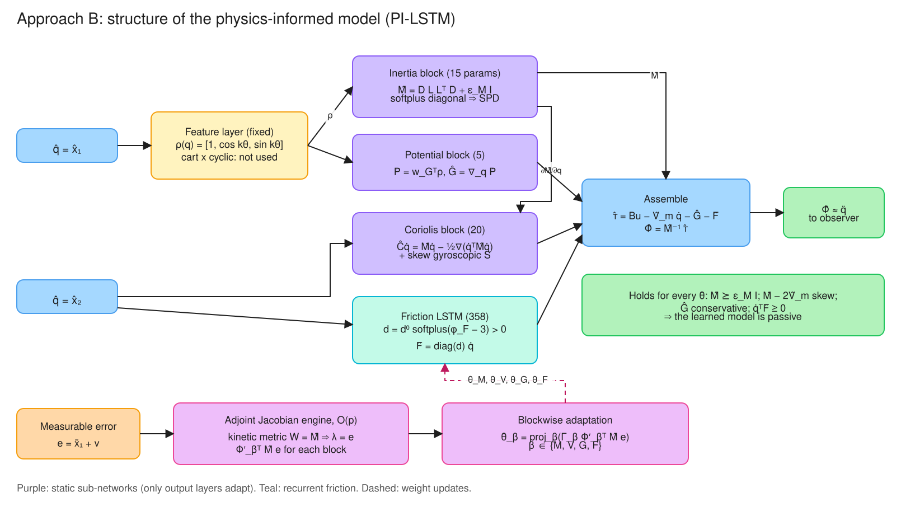
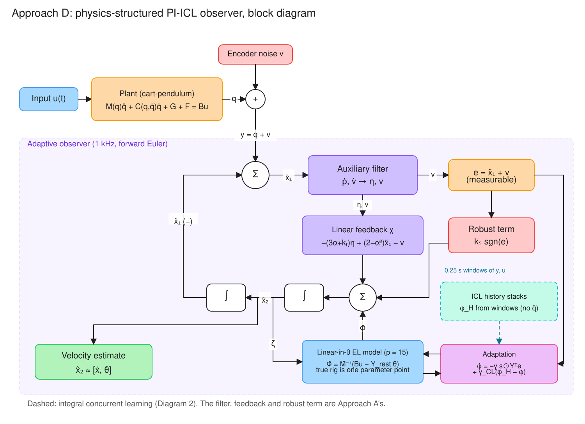
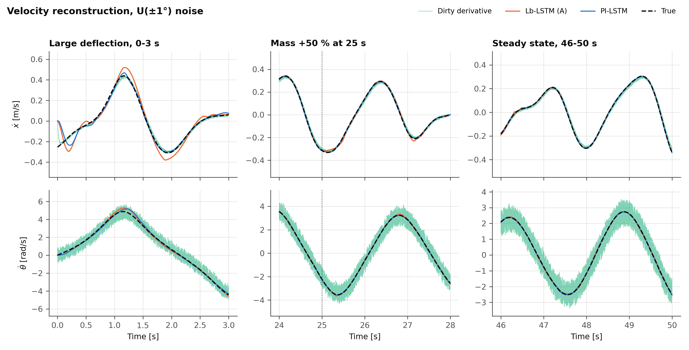
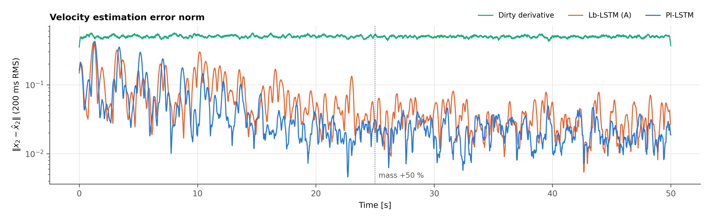
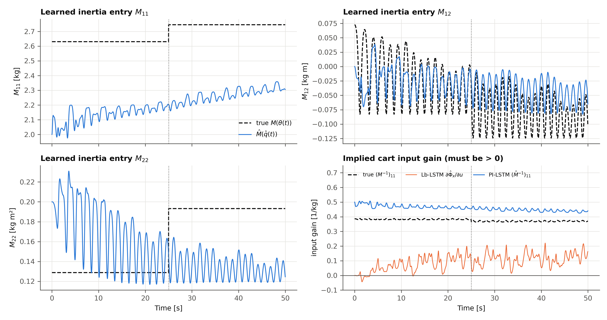
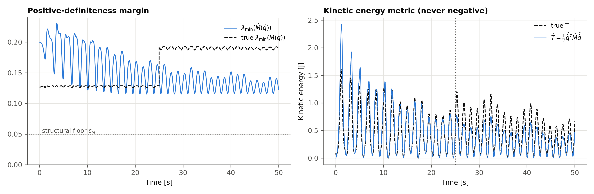
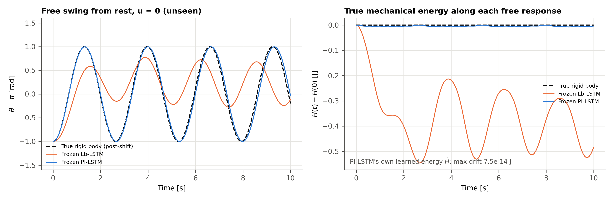
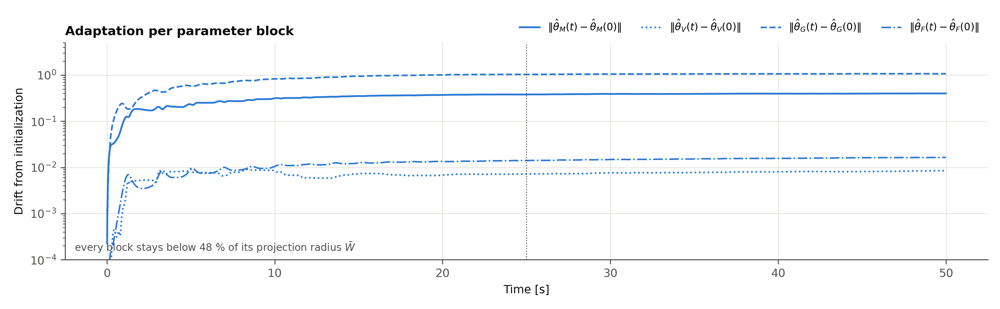

# Approach B: Physics-Informed Lb-LSTM (PI-LSTM) Adaptive Observer

[](#)
[](#)
[](#13-reproducing-the-results)

This branch implements a Lyapunov-based **physics-informed** LSTM state observer in the
spirit of **Hart, Griffis, Patil & Dixon (2024)**. It runs on the Feedback Instruments 33-936S
cart-pendulum testbed. Approach A (`feature/approach-a-blackbox-lstm`) learns the whole
acceleration field $g(x,u)$ as a black box. Approach B instead learns the four terms of the
Euler–Lagrange equation,

$$M(q)\ddot q + V_m(q,\dot q)\dot q + G(q) + F(\dot q) = Bu,$$

with sub-networks whose **parametrization** enforces the mechanical invariants. The
invariants hold for *every* parameter value, so they hold throughout the adaptation
transient, not only at convergence:

| Invariant | How it is enforced | Holds for |
|:---|:---|:---|
| $\hat M = \hat M^T \succeq \epsilon_M I$ | modified Cholesky $\hat M = LL^T + \epsilon_M I$, softplus diagonal | all $\theta_M$ |
| $z^T(\dot{\hat M} - 2\hat V_m)z = 0$ | $\hat V_m$ from Christoffel symbols of $\hat M$, plus a skew gyroscopic term | all $\theta_M, \theta_V$ |
| $\hat G$ conservative | $\hat G = \nabla_q \hat P$, gradient of a learned potential | all $\theta_G$ |
| $\dot q^T\hat F \ge 0$ | $\hat F = \mathrm{diag}(d_i)\dot q$, $d_i = d^0_i\,\mathrm{softplus}(\cdot) > 0$ | all $\theta_F$ |
| $\hat M, \hat P$ independent of the cart position $x$ | $x$ is a cyclic coordinate of the learned Lagrangian | all $\theta$ |

Together these make the learned model **passive**: $\frac{d}{dt}(\hat T + \hat P) \le \dot q^TBu$.



*Diagram 1. Structure of the PI-LSTM. Fixed harmonic features of the configuration feed the inertia
and potential blocks. The Coriolis force follows from the inertia by the Christoffel construction,
and a recurrent block learns a dissipative friction. The blocks are assembled into
$\hat\Phi = \hat M^{-1}\hat\tau$. The invariants in the green box hold for every parameter value.
Learning (dashed) uses only the measurable error $e$, through an adjoint Jacobian in the kinetic
metric (§6).*

**Relation to Hart et al. (2024) [1].** [1] is a *tracking controller*. Its adaptation laws and its
$\mathrm{sgn}$ term use $r = \dot e + \alpha e$ with $e = q - q_d$, which is measurable under
full-state feedback. Carried into an observer, $r$ contains the unmeasured velocity error, so this
branch adapts on the measurable error $e = \tilde q + \nu$ of Approach A's filter, and its
robustness rests on Approach A's integral (RISE) argument instead (§5). [1] also lists
positive-definiteness of the learned inertia as future work. Here it holds by construction for
every parameter value (§3).

All updates are analytical ODEs in NumPy, with no autograd. The Jacobians of all four
parameter blocks match central finite differences to about $10^{-9}$.

**Results in brief.** Scenario: 50 s; $\theta(0) = 0.5$ rad from upright; U(±1°) encoder
noise; pendulum mass +50 % at $t = 25$ s. Details in §9.

| | Black-box Lb-LSTM (A) | **PI-LSTM (B)** |
|:---|---:|---:|
| Steady $\dot x$ RMSE (35–50 s), median of 5 seeds | 0.0061 m/s | **0.0025 m/s** |
| Steady $\dot\theta$ RMSE (35–50 s), median of 5 seeds | 0.041 rad/s | **0.020 rad/s** |
| Post-shift $\dot\theta$ RMSE (25–30 s), median of 5 seeds | 0.047 rad/s | **0.020 rad/s** |
| Peak $\lvert\dot\theta\text{ error}\rvert$ right after the mass step (25–27 s) | 0.106 rad/s | **0.047 rad/s** |
| Peak $\lvert\dot\theta\text{ error}\rvert$ in the initial transient (0–2 s), median of 5 seeds | **0.43 rad/s** | 0.46 rad/s |
| Samples with physically impossible input gain, $(\hat M^{-1})_{11} \le 0$ | 0.7–7.0 % | **0 %** (structural) |
| Frozen model, free swing on unseen data: $\theta$ RMSE | 0.61 rad | **0.07 rad** |
| Frozen model: true energy lost in a 0.56 J swing | up to 0.55 J (spurious) | < 0.01 J |
| Parameters | 1440 | **398** |

- **What the structure buys.** It halves the steady-state velocity error. It recovers from
  the parameter step twice as fast. The frozen model is a usable, energy-consistent digital
  twin.
- **What it does not buy.** It does not reduce the *initial* peaking (§9.5). Inertia
  identification is incomplete: $\hat M$ has 16 % relative error at 50 s, and $\hat M_{22}$
  does not track the post-shift increase (§9.4).

---

## 1. Problem setting

For the rig, the coordinates are $q = [x,\ \theta]^T$ and the input is $u = F$ (with $n = 2$,
$m = 1$). Only $q$ is measured, $y = q + v$, and $\dot q$ must be estimated. Approach B uses
**structural** knowledge only:

- the plant is an Euler–Lagrange system;
- the joint types: $x$ is prismatic, $\theta$ is revolute;
- the input matrix $B = [1,\ 0]^T$: the force acts on the cart;
- the track is level, so $x$ is cyclic;
- the order of magnitude of the inertia (§3.4).

It uses **no** parameter values: no $M$, $m$, $l$, $I$, $g$, $b$ or $d$.

## 2. Euler–Lagrange invariants

For a mechanical system with Lagrangian $\mathcal L = \tfrac12\dot q^TM(q)\dot q - P(q)$:

- **(P1)** $M(q) = M(q)^T \succ 0$. The kinetic energy $T = \tfrac12\dot q^TM\dot q$ is a
  positive-definite metric.
- **(P2)** With $V_m$ built from the Christoffel symbols of $M$, the matrix $\dot M - 2V_m$
  is skew-symmetric. So $\dot q^T(\tfrac12\dot M - V_m)\dot q = 0$: Coriolis and centripetal
  forces do no work.
- **(P3)** $G = \nabla_q P$ is conservative.
- **(P4)** Friction is dissipative: $\dot q^TF \ge 0$.
- **(P5)** Power balance: $\dot H = \dot q^T(Bu - F) \le \dot q^TBu$ for $H = T + P$. The
  system is passive from $u$ to $B^T\dot q$.

An unconstrained approximator of $\ddot q$ satisfies none of these. Its implied inertia can
be indefinite, and its free response can create or destroy energy. §9.3 measures both
effects for Approach A.

## 3. Inertia sub-network: modified Cholesky parametrization

`src/observers/pilstm_network.py::cholesky_inertia`

$$\hat M(q) = L(q)L(q)^T + \epsilon_M I,\qquad L = D\tilde L,\qquad
\tilde L_{ii} = \mathrm{softplus}(a_{ii}),\quad \tilde L_{ij} = a_{ij}\ (i>j),\quad a = W_M^T\rho(q),$$

where $D = \mathrm{diag}(d_i) \succ 0$ is a fixed row scale (§3.4) and $\rho(q)$ is the
feature layer (§3.3).

### 3.1 Proofs

**Proposition 1 (symmetry and uniform positive-definiteness).** For every $W_M$ and every
$q$: $\hat M = \hat M^T$, $\lambda_{\min}(\hat M) \ge \epsilon_M$, and
$\lVert\hat M^{-1}\rVert_2 \le 1/\epsilon_M$.

*Proof.* $(LL^T)^T = LL^T$. For any $z$,
$z^T\hat Mz = \lVert L^Tz\rVert^2 + \epsilon_M\lVert z\rVert^2 \ge \epsilon_M\lVert z\rVert^2$.
Hence $\lambda_{\min} \ge \epsilon_M$ and $\lVert\hat M^{-1}\rVert_2 = 1/\lambda_{\min} \le 1/\epsilon_M$. ∎

The softplus diagonal makes $L$ nonsingular ($\det L = \prod_i d_i\tilde L_{ii} > 0$), so
$LL^T \succ 0$ already. The $\epsilon_M I$ term adds a margin that is **uniform in the
parameters**: softplus can approach 0, so $\lambda_{\min}(LL^T)$ alone has no parameter-free
lower bound. Consequently, $\hat\Phi = \hat M^{-1}\hat\tau$ is always well defined, and no
adaptation transient can produce a singular inertia.

**Proposition 2 (no loss of generality).** The map $L \mapsto LL^T + \epsilon_MI$, over
lower-triangular $L$ with positive diagonal, is a bijection onto
$\{M = M^T : M - \epsilon_MI \succ 0\}$.

*Proof.* Every symmetric positive-definite matrix $M - \epsilon_MI$ has a unique Cholesky
factor with positive diagonal. Softplus maps $\mathbb R$ onto $(0,\infty)$, so every such
factor is reached. ∎

So the constraint excludes only physically impossible inertias (and those lighter than
$\epsilon_M$). $\epsilon_M = 0.05$, while the rig's true $\lambda_{\min}(M) \approx 0.126$.

**Proposition 3 (upper bound).** With the harmonic features of §3.3, $\lVert\rho\rVert^2 = 1 + K$
for one revolute joint. So $\lvert a_r\rvert \le \lVert W_M\rVert\sqrt{1+K} \le \bar W_M\sqrt{1+K}$
under the projection of §6, and $\hat M$ is bounded above by an explicit
$\bar M(\bar W_M, D)$. The adapted inertia therefore lives in the compact set
$\epsilon_MI \preceq \hat M \preceq \bar MI$.

### 3.2 Configuration derivatives

The Christoffel symbols and the adaptation law both need $\partial\hat M/\partial q_k$:

$$\frac{\partial L_r}{\partial q_k} = g_r'(a_r)\,W_{M,r}^T\frac{\partial\rho}{\partial q_k},\qquad
\frac{\partial\hat M}{\partial q_k} = \frac{\partial L}{\partial q_k}L^T + L\frac{\partial L}{\partial q_k}^T,$$

with $g_r = d_i\,\mathrm{softplus}$ on the diagonal and $g_r = d_i\cdot\mathrm{id}$ below
it. `tests/test_pilstm.py` checks $\partial\hat M/\partial q$ against finite differences.

### 3.3 Feature layer

$$\rho(q) = \big[\,1,\ \xi(q),\ \tanh(V_0^T\xi(q) + b_0)\,\big],\qquad
\xi(q) = \big[\cos k\theta,\ \sin k\theta\big]_{k=1..K}\ \ (\text{revolute}),\quad s(x - \mu)\ \ (\text{prismatic}).$$

The first layer is fixed; only the output layers $W_M$, $W_V$ and $w_G$ adapt. This keeps
$\partial^2\hat M/\partial q\,\partial\theta_M$, which the Christoffel Jacobian needs
(§6), in closed form.

- **Default:** $K = 2$ harmonics and no random tanh units. For the rig this gives 5 features.
- **Why harmonics.** They are orthogonal over a revolution, so the adaptation is well
  conditioned.
- **Measured alternative.** A random tanh layer (24 units, $K = 1$) makes the gravity block
  adapt 2–3× more slowly and worsens the post-shift $\dot\theta$ error 2.3× (§9.6).
- **Capacity.** `n_features > 0` adds random tanh capacity for mechanisms outside the
  harmonic span.

### 3.4 Dimensionless row scale and the inertia prior

On the rig, $M_{11} \approx 2.6$ kg and $M_{22} \approx 0.13$ kg·m², a 20× spread. With
$D = I$, a single adaptation gain $\gamma_M$ is simultaneously too slow for the cart row
and too fast for the pendulum row.

Setting $D = \mathrm{diag}(\sqrt{m^0_i})$, where $m^0$ is the inertia prior, makes $W_M$
dimensionless. $DL$ is still lower-triangular with a positive diagonal, so Propositions
1–3 are unchanged. The row scale folds into $g'$ and $g''$, so the Jacobian engine is
unchanged too.

The initial parameters give $\hat M(q;\theta(0)) = \mathrm{diag}(m^0)$ for all $q$. The
default $m^0 = (2.0, 0.2)$ is an order-of-magnitude, datasheet-level prior. It is 24 % and
55 % off the true pre-shift values, and 27 % and 3 % off the post-shift values. §9.6
reports $m^0 = (1, 0.1)$ and $(5, 0.5)$ as well.

### 3.5 Cyclic coordinates

On a level track, $x$ does not appear in $\mathcal L$. The configuration features therefore
embed only the non-cyclic coordinates, so $\hat M$, $\hat P$ and $S$ are invariant to $x$
**by construction**, and $\hat G_x \equiv 0$. By Noether's theorem, the learned model then
conserves the cart momentum $(\hat M\dot q)_1$ whenever $u = 0$ and $\hat F = 0$.

In the final configuration this prior makes little numerical difference (§9.6). It mattered
earlier in development: with random features and $D = I$, $x$-dependent inertia produced
spurious Christoffel forces that destabilized adaptation.

## 4. Coriolis, gravity and friction sub-networks

### 4.1 Skew-symmetry by construction (Christoffel symbols)

$$\hat C_{ij}(q,\dot q) = \sum_k \Gamma_{ijk}\dot q_k,\qquad
\Gamma_{ijk} = \tfrac12\left(\frac{\partial\hat M_{ij}}{\partial q_k} + \frac{\partial\hat M_{ik}}{\partial q_j} - \frac{\partial\hat M_{jk}}{\partial q_i}\right).$$

**Proposition 4.** For every $\theta_M$, $N := \dot{\hat M} - 2\hat C$ is skew-symmetric.

*Proof.* With $\dot{\hat M}_{ij} = \sum_k \partial_k\hat M_{ij}\,\dot q_k$:

$$N_{ij} = \sum_k\left(\partial_k\hat M_{ij} - \partial_k\hat M_{ij} - \partial_j\hat M_{ik} + \partial_i\hat M_{jk}\right)\dot q_k
= \sum_k\left(\partial_i\hat M_{jk} - \partial_j\hat M_{ik}\right)\dot q_k.$$

Swapping $i \leftrightarrow j$ flips the sign, so $N^T = -N$. The proof uses only symmetry
and differentiability of $\hat M$, and Proposition 1 guarantees both for every parameter
value. ∎

- **Implementation.** The code evaluates the equivalent vector form
  $\hat C\dot q = \dot{\hat M}\dot q - \tfrac12\nabla_q(\dot q^T\hat M\dot q)$.
- **Check against the true rig.** For the true $M(\theta)$ this reproduces
  $C = \begin{bmatrix}0 & -ml\dot\theta\sin\theta\\ 0 & 0\end{bmatrix}$.
- **Tests.** The tests check the matrix against a brute-force Christoffel sum over
  finite-difference derivatives, and check $z^TNz = 0$ for random parameters.
- **Measured along the trajectory.** $\max\lvert z^TNz\rvert/\lVert z\rVert^2 = 7\times10^{-17}$.

**Gyroscopic block $\theta_V$.** The Christoffel term is fully determined by $\theta_M$.
The separate block $\theta_V$ parametrizes

$$S(q,\dot q) = \sum_{i<j} s_{ij}\,(E_{ij} - E_{ji}),\qquad s_{ij} = W_{V,ij}^T\big(\rho(q)\otimes\dot q\big),$$

and $\hat V_m = \hat C + S$. $S$ is skew, so $\dot{\hat M} - 2\hat V_m = N - 2S$ remains
skew-symmetric, and $\dot q^TS\dot q = 0$: the extra force does no work. It is quadratic
in $\dot q$, like a real Coriolis force. It can represent power-neutral forces outside the
Christoffel family, such as gyroscopic coupling. The rig has none, and $\theta_V$ indeed
stays near 0: its drift from initialization is below 0.01 (Fig. 6).

### 4.2 Conservative gravity

$$\hat P(q) = w_G^T\rho(q),\qquad \hat G(q) = \nabla_q\hat P = D\rho(q)^Tw_G.$$

$\hat G$ is a gradient, so it is curl-free for every $w_G$, and it is linear in $w_G$. On
the rig's true potential $P = mgl\cos\theta$, the idealized test (true $M$, 1° noise)
converges to $w_{G,\cos\theta} = 0.808$ against the true $mgl = 0.812$.

### 4.3 Dissipative recurrent friction

A continuous-time LSTM with the same cell as Approach A (§2 of its README) runs on
$\zeta_F = [s\odot\dot q,\ \hat h_F,\ 1]$. Its readout $\phi_F = W_h^Th$ sets a diagonal,
velocity- and history-dependent damping:

$$\hat F = \mathrm{diag}(d)\,\dot q,\qquad d_i = d^0_i\,\mathrm{softplus}(\phi_{F,i} - 3) > 0
\ \ \Rightarrow\ \ \dot q^T\hat F = \textstyle\sum_i d_i\dot q_i^2 \ge 0.$$

Viscous, Coulomb and Stribeck laws all have this form, with
$d_i(v) = F_i(v)/v \ge 0$. The LSTM memory lets $d_i$ depend on the velocity history, so it
can capture dynamic friction and belt hysteresis *to the extent that these are dissipative*.

- **The price.** Pre-sliding hysteresis that temporarily returns energy (as in LuGre bristle
  dynamics) cannot be represented.
- **Unconstrained option.** `dissipative_friction=False` gives $\hat F = \phi_F$. Its
  learned friction injected power in **58 %** of samples (§9.6). The dissipative form gives
  0 %.

### 4.4 Power balance of the learned model

**Proposition 5.** Along the learned dynamics
$\hat M\ddot q + \hat V_m\dot q + \hat G + \hat F = Bu$, the learned energy
$\hat H = \tfrac12\dot q^T\hat M\dot q + \hat P$ satisfies
$\dot{\hat H} = \dot q^TBu - \dot q^T\hat F \le \dot q^TBu$, for every $\theta$.

*Proof.*

$$\dot{\hat H} = \dot q^T\hat M\ddot q + \tfrac12\dot q^T\dot{\hat M}\dot q + \nabla\hat P^T\dot q
= \dot q^T(Bu - \hat V_m\dot q - \hat G - \hat F) + \tfrac12\dot q^T\dot{\hat M}\dot q + \hat G^T\dot q
= \dot q^T(Bu - \hat F) + \tfrac12\dot q^T(\dot{\hat M} - 2\hat V_m)\dot q.$$

The last term vanishes by Proposition 4, and $\dot q^T\hat F \ge 0$ by §4.3. ∎

- **Consequence.** The frozen PI-LSTM is passive. With $u = 0$ it can never gain energy,
  and with $u = 0$, $\hat F = 0$ it conserves $\hat H$ exactly.
- **Numerical check.** On the adapted model (RK4, 1 ms, 10 s free swing),
  $\max\lvert\hat H(t) - \hat H(0)\rvert = 7.5\times10^{-14}$ J (§9.3).

## 5. Observer

`src/observers/pilstm_observer.py`

The observer is Approach A's structure with the black box replaced by the structured model:



*Diagram 2. Block diagram of the PI-LSTM observer. The filter, the feedback $\chi$ and the robust
term are Approach A's. Only the model block (Diagram 1) and the blockwise adaptation law differ.*

$$\dot{\hat q} = \hat{\dot q},\qquad
\dot{\hat{\dot q}} = \hat\Phi + k_s\,\mathrm{sgn}(e) + \chi,\qquad
\hat\Phi = \hat M^{-1}(\hat q)\big[Bu - \hat V_m(\hat q,\hat{\dot q})\hat{\dot q} - \hat G(\hat q) - \hat F\big].$$

The auxiliary filter $(p,\nu,\eta,e)$ and the feedback $\chi$ are identical to Approach A:

$$\eta = p - (\alpha+k_r)\tilde q,\quad \dot p = -(k_r+2\alpha)p - \nu + ((\alpha+k_r)^2+1)\tilde q,\quad
\dot\nu = p - \alpha\nu - (\alpha+k_r)\tilde q,\quad e = \tilde q + \nu,$$

$$\chi = -(3\alpha+k_r)\eta + (2-\alpha^2)\tilde q - \nu.$$

The corrected $(2-\alpha^2)$ coefficient is derived in Approach A's README, §3. With the
unmeasurable filtered error $r = \tilde{\dot q} + \alpha\tilde q + \eta$ and
$V_0 = \tfrac12(\lVert\tilde q\rVert^2 + \lVert\eta\rVert^2 + \lVert\nu\rVert^2 + \lVert r\rVert^2)$:

$$\dot V_0 = -\alpha(\lVert\tilde q\rVert^2 + \lVert\eta\rVert^2 + \lVert\nu\rVert^2) - k_r\lVert r\rVert^2 + r^T\big(\ddot q - \hat\Phi - k_s\,\mathrm{sgn}(e)\big).$$

Nothing in the filter requires the velocity.

**Stability sketch.** This is honest about what the structure changes. Let
$N = \ddot q - \hat\Phi$. As in Approach A, if $\hat\theta$ stays in a compact set
(guaranteed by projection, §6) and $N, \dot N$ are bounded along the trajectory, the RISE
integral lemma (Approach A's README, §3.3) gives asymptotic convergence when $k_s$ exceeds its bound,
$\max\{\zeta_1+\zeta_2,\ \zeta_1+\zeta_3/\alpha\}$. With the kinetic metric of §6 the adaptation
cancels $\alpha e^T\hat M\Phi'\tilde\theta$ rather than $\alpha e^T\Phi'\tilde\theta$. The difference,
$\alpha e^T(I - \hat M)\Phi'\tilde\theta$, is bounded and adds its bound to the second entry of that
maximum.
Otherwise it gives uniform ultimate boundedness. The default $k_s = 0.2$ is below the
bound, so the experiments run in the UUB regime, as in A.

The structure changes the bound on $\hat\Phi$ in two opposite ways:

- **Tighter.** By Propositions 1 and 3, $\lVert\hat M^{-1}\rVert \le 1/\epsilon_M$, and
  $\hat G$ and $\hat F$ are bounded on compact sets, uniformly over the projection balls.
  Every learned term has a physical interpretation and a certified bound.
- **Looser.** The Christoffel term is **quadratic** in $\hat{\dot q}$:
  $\lVert\hat C\hat{\dot q}\rVert \le k_C\lVert\hat{\dot q}\rVert^2$. Approach A's
  $\hat\Phi = W_h^T h$ is instead globally bounded, because $\lVert h\rVert_\infty \le 1$.
  The PI-LSTM's boundedness argument is therefore **semi-global**, not global: a large
  velocity-estimate transient can feed itself through the learned Coriolis term. The true
  plant has the same quadratic term, so this is the price of representing it faithfully.
  §8 shows this failure mode with the Euclidean-metric gradient.

## 6. Jacobian engine and blockwise adaptation

`src/adaptation/pilstm_jacobian_engine.py`

$\theta = [\theta_M, \theta_V, \theta_G, \theta_F]$ has 398 parameters on the rig: 15, 20,
5 and 358. Every block adapts simultaneously:

$$\dot{\hat\theta}_\beta = \mathrm{proj}_\beta\big(\Gamma_\beta\,\Phi_\beta'^T W e\big),\qquad \lVert\hat\theta_\beta\rVert \le \bar W_\beta,\qquad \beta \in \{M, V, G, F\},$$

with Approach A's smooth projection applied per block.

**Adjoint form.** $\hat\Phi = \hat M^{-1}\hat\tau$, so
$\Phi'_\beta = \hat M^{-1}(\partial\hat\tau/\partial\theta_\beta - (\partial\hat M/\partial\theta_\beta)\hat\Phi)$.
With the adjoint vector $\lambda = \hat M^{-1}We$:

$$\Phi_\beta'^TWe = \frac{\partial}{\partial\theta_\beta}\Big[\lambda^T\hat\tau - \lambda^T\hat M\hat\Phi\Big]_{\lambda,\hat\Phi\ \text{held}}.$$

This is evaluated in $O(p)$ without forming $\Phi'$:

| Block | $\Phi_\beta'^TWe$ |
|:---|:---|
| $G$ | $-D\rho\,\lambda$ |
| $V$ (pair $ij$) | $-(\lambda_i\dot q_j - \lambda_j\dot q_i)\,(\rho\otimes\dot q)$ |
| $F$ | $\Phi_F'^T(-\lambda\odot\partial\hat F/\partial\phi_F)$, via Approach A's Kronecker product form |
| $M$ (entry $r$) | $-(Z + K)_r\,g_r'\rho - \sum_k Y_{k,r}\big(g_r''\,\beta_{rk}\,\rho + g_r'\,\partial_k\rho\big)$ |

The inertia block is the only nontrivial one. $\hat M$ enters both through $\hat M^{-1}$
and through the Christoffel vector
$\lambda^T\hat C\dot q = \sum_k a_k^T\,\partial_k\hat M\,\dot q$, with
$a_k = \dot q_k\lambda - \tfrac12\lambda_k\dot q$. That gives

$$K = (\lambda\hat\Phi^T + \hat\Phi\lambda^T)L,\qquad
Z = \sum_k(\dot q\,a_k^T + a_k\dot q^T)\,\partial_kL,\qquad
Y_k = a_k\dot q^TL + \dot q\,a_k^TL,$$

with $\beta_{rk} = W_{M,r}^T\partial_k\rho$. The second-order term
$\partial(\partial_kL_r)/\partial W_r = g_r''\beta_{rk}\rho + g_r'\partial_k\rho$ is why the
feature layer is kept fixed.

`tests/test_pilstm.py` checks all four blocks against central finite differences (for both
friction forms), and checks the fast product against the explicit $\Phi'^TWe$.

**Error metric $W$** (`metric=`):

| `metric` | $W$ | $\lambda$ | Gradient of |
|:---|:---|:---|:---|
| `"euclidean"` | $I$ | $\hat M^{-1}e$ | $\tfrac12\lVert e\rVert^2$ |
| `"kinetic"` (default) | $\hat M$ | $e$ | $\tfrac12 e^T\hat Me$, the kinetic-energy metric |

Both are descent directions, since $\Phi'^TW\Phi' \succeq 0$, and both keep $\hat\theta$
in the projection balls. They differ in loop gain. The Euclidean law's effective gain
scales as $\hat M^{-2}$: that is $\hat M_{22}^{-2} \approx 60$ for the light pendulum
coordinate, against $\hat M_{11}^{-2} \approx 0.14$ for the cart, a ratio of about 400. It also grows further whenever
adaptation shrinks $\hat M$. The kinetic metric removes one factor of $\hat M^{-1}$ and,
together with the dimensionless row scale of §3.4, balances the two channels. Measured:
the Euclidean law diverges at $t = 3.6$ s on the benchmark (§9.6).

## 7. Discretization

This is identical to Approach A §6. Measurements and inputs are held zero-order between
1 kHz samples, and all observer states are integrated with forward Euler
($n_s = 1$ sub-step). After each step a radial rescale per block keeps the discrete flow
inside $\bar W_\beta$ (a safeguard; in the reported runs every block stays below 48 % of
its radius). The frozen-model rollouts in §9.3 use RK4.

## 8. Design decisions and what failed

These notes record the development path, because each fix is itself a statement about
physics-informed adaptation.

1. **First attempt: 24 random tanh features, $D = I$, Euclidean gradient,
   $\hat M(0) = \mathrm{diag}(1, 0.1)$.** The observer diverged at 0.13 s. The Euclidean
   adjoint $\lambda = \hat M^{-1}e$ amplifies the pendulum channel about 100×, so the gain
   that suits a black-box readout is 50–100× too large here.
2. **Gains reduced.** The observer was stable, but gravity was never learned
   ($\lVert w_G\rVert \approx 0.3$). The gradient direction was correct: with the true $M$
   inserted, $w_G$ converged to $mgl$. The cause was coupling. With $\hat M_{11}$ wrong, the
   cart channel carries a large $u$-correlated error, which the $x$-features of $\hat P$
   tried to absorb. Meanwhile unlearned gravity drove $\hat M_{22}$ toward instability.
   A trace showed $\hat M_{12}$ jumping from −0.15 to −0.70 within 250 ms, fed by the
   $\dot q^2$ Christoffel term (the semi-global issue of §5).
3. **Fixes, each physically motivated:**
   - the cyclic cart coordinate (§3.5);
   - the kinetic-energy metric (§6);
   - harmonic instead of random features (§3.3);
   - the dimensionless Cholesky row scale (§3.4).

   After these, the observer is stable for every prior and seed tried.
4. **Dissipative friction** (§4.3). This came from auditing the first full run, where
   unconstrained friction injected power in 58 % of samples.

The Approach A baseline was re-tuned on this scenario too: input scales, $\gamma_h$,
$\gamma_g$ and $L$. Its published defaults, with the same data-driven normalization, were
within noise of its best, so they are used unchanged.

## 9. Simulation results

### 9.1 Scenario

`python experiments/run_pilstm_validation.py --seeds 5 --ablations`

The whole run takes about 2.5 min.

- **Large deflection.** $\theta(0) = 0.5$ rad from **upright**, in the plant's convention.
  The pendulum falls and swings almost full circle: $\theta \in [0.5, 5.8]$ rad and
  $\lvert\dot\theta\rvert$ up to 5 rad/s. This exercises $\hat M(\theta)$ and $\hat P(\theta)$
  over their whole domain.
- **Noise.** U(±1.0°) encoder noise on $\theta$, twice the testbed default, plus ±0.2 mm
  cart noise and 4096-count quantization.
- **Sudden parameter shift.** At $t = 25$ s the pendulum becomes 50 % heavier: $m$ and $I$
  are both scaled by 1.5 (same geometry, denser rod; `--mass-only` keeps $I$). The true
  $M_{22}$ jumps from 0.129 to 0.193, the amplitude of $M_{12}$ from 0.083 to 0.124, and
  $mgl$ from 0.81 to 1.22.
- **Excitation.** Open-loop $u = 2\sin 3t + 1.2\cos 6t$. The cart starts at the
  drift-cancelling velocity $-2/(3(M+m))$. Approach A's $1.5$ rad/s excitation drives the
  cart into the ±0.5 m bumpers once the mass step breaks the momentum balance. With this
  excitation the cart stays within ±0.16 m.
- **Observer inputs.** Encoder data and the *commanded* force. Both LSTMs are normalized
  from the first 5 s of encoder data.

### 9.2 Velocity reconstruction (noise seed 42)

| RMSE / peak | PI-LSTM | Lb-LSTM (A) | Dirty derivative |
|:---|---:|---:|---:|
| $\dot x$, transient 0–5 s [m/s] | 0.0348 | 0.0469 | **0.0198** |
| $\dot\theta$, transient 0–5 s [rad/s] | **0.147** | 0.158 | 0.502 |
| $\dot x$, pre-shift 15–25 s | **0.0026** | 0.0147 | 0.0161 |
| $\dot\theta$, pre-shift 15–25 s | **0.0265** | 0.0590 | 0.502 |
| $\dot x$, post-shift 25–30 s | **0.0038** | 0.0103 | 0.0131 |
| $\dot\theta$, post-shift 25–30 s | **0.0244** | 0.0375 | 0.496 |
| $\dot x$, steady 35–50 s | **0.0026** | 0.0057 | 0.0149 |
| $\dot\theta$, steady 35–50 s | **0.0225** | 0.0340 | 0.496 |
| peak $\lvert\dot\theta\text{ err}\rvert$, 0–2 s | 0.470 | **0.441** | 1.14 |
| peak $\lvert\dot\theta\text{ err}\rvert$, 25–27 s | **0.047** | 0.106 | 1.17 |
| chatter ratio $\dot\theta$ (steady) | **1.06** | 1.07 | 140 |

Online model fit (35–50 s), as NMSE of $\hat\Phi$ against the true acceleration:

| | PI-LSTM | Lb-LSTM (A) |
|:---|---:|---:|
| $\ddot x$ | 0.044 | 0.095 |
| $\ddot\theta$ | 0.0011 | 0.0052 |




**Robustness over seeds 1–5**, where the seed sets the noise realization and both
observers' initialization. Values are median [min, max]; neither observer diverged in any
run.

| Metric | PI-LSTM | Lb-LSTM (A) |
|:---|:---|:---|
| $\dot x$ RMSE, steady | **0.0025** [0.0025, 0.0026] | 0.0061 [0.0041, 0.0092] |
| $\dot\theta$ RMSE, steady | **0.020** [0.020, 0.022] | 0.041 [0.032, 0.043] |
| $\dot\theta$ RMSE, post-shift 25–30 s | **0.020** [0.018, 0.023] | 0.047 [0.042, 0.069] |
| peak $\lvert\dot\theta\text{ err}\rvert$, 0–2 s | 0.46 [0.44, 0.47] | **0.43** [0.40, 0.45] |
| samples with $(\hat M^{-1})_{11} \le 0$ | **0 %** [0, 0] | 1.6 % [0.7, 7.0] |

The PI-LSTM's seed-to-seed spread is 5–50× smaller than Approach A's.

### 9.3 Physical plausibility and energy

| Along the 50 s trajectory | PI-LSTM | Lb-LSTM (A) |
|:---|---:|---:|
| $\min_t\lambda_{\min}(\hat M(\hat q))$ (floor $\epsilon_M = 0.05$) | 0.115 | n/a (no $\hat M$) |
| $\min_t\hat T$ | 0 (at $\hat{\dot q} = 0$) | n/a |
| $\max\lvert z^T(\dot{\hat M} - 2\hat V_m)z\rvert/\lVert z\rVert^2$ | $7\times10^{-17}$ | n/a |
| friction injects power | 0 % of samples | n/a |
| implied input gain $\partial\hat\Phi_x/\partial u \le 0$ | **0 %** | **5.7 %** |
| median $\lVert\partial\hat\Phi/\partial u - M^{-1}B\rVert / \lVert M^{-1}B\rVert$ (steady) | 0.19 | 0.88 |

**Why the input gain is the right comparison.** The black box has no inertia matrix, but
for any Euler–Lagrange plant, $\partial\ddot q/\partial u = M^{-1}B$. Its first entry
$(M^{-1})_{11} > 0$ because the inverse of a positive-definite matrix has a positive
diagonal. A black box that predicts $\partial\hat\Phi_x/\partial u \le 0$ is predicting
that pushing the cart forward accelerates it backward: a negative effective mass.
Approach A does this in 5.7 % of samples, and its implied gain is off by 88 % even in
steady state. The PI-LSTM's is off by 19 %, and positive by construction.




**Frozen models on an unseen free swing.** Weights are frozen at 50 s. Each model is
released from rest at $\theta = \pi - 1$ with $u = 0$ for 10 s and compared with the true
post-shift rigid body (friction removed).

| Frozen model | $\theta$ RMSE | True energy along the response |
|:---|---:|:---|
| PI-LSTM | **0.070 rad** | stays within 0.01 J of the truth |
| Lb-LSTM (A) | 0.613 rad | **loses up to 0.55 J of the 0.56 J swing** |

The black box encodes a spurious, configuration-dependent dissipation. The PI-LSTM's own
energy $\hat H$ is conserved to $7.5\times10^{-14}$ J, as Proposition 5 requires.



### 9.4 Resilience to the parameter shift

**Velocity estimation.** After the +50 % mass step, the PI-LSTM's $\dot\theta$ error peaks
at 0.047 rad/s, versus 0.106 for A. Its 25–30 s RMSE (0.024) is already at its
steady-state level. There is no transient peaking, because nothing in the structured
model can jump: $\hat M$ is bounded, $\hat G$ is bounded, and the adaptation of each block
is rate-limited by its projection. See Fig. 6, where no block's drift steps at 25 s.

**Identification is only partial:**

- **$\hat M_{11}$ (cart + pendulum mass).** It rises steadily, 2.0 → 2.30 kg over 50 s,
  but is still 16 % below the true 2.745 kg at the end. Cart-mass learning is slow at
  $\gamma_M = 5$; $\gamma_M \ge 30$ diverges.
- **$\hat M_{22}$ does not track the step (0.129 → 0.193).** The θ channel constrains the
  ratio $\hat P/\hat M_{22}$ well: $\ddot\theta$ NMSE is 0.001. The absolute scale of
  $M_{22}$ is visible only through the weak $M_{12}$ coupling to $\ddot x$. This is an
  identifiability limit of the open-loop excitation, not of the parametrization: with the
  true pre-shift inertia as prior, $\hat M$ error falls to 4 % (§9.6). The learned
  $\hat M_{22}$ also varies spuriously with $\theta$: by up to ±0.05 early on and ±0.015
  at the end, where the truth is constant.
- **$\hat M_{12}(\theta)$.** It has the right shape and sign ($\propto\cos\theta$), with
  about 60 % of the post-shift amplitude.



### 9.5 Initial peaking

The PI-LSTM does **not** reduce the peak velocity error in the first 2 s: 0.47 rad/s versus
0.44 rad/s, and this holds for every seed. At $t = 0$, $\hat M$, $\hat P$ and $\hat F$ are
still the uninformed prior. Gravity, the dominant $\ddot\theta$ term (up to 6 rad/s²), is
entirely unmodelled. The initial transient is governed by the filter gains $(\alpha, k_r)$
and the zero initial velocity estimate, which both observers share.

The structure bounds the model terms, but it cannot supply knowledge the prior lacks.
Cutting the initial peak needs a better prior (for example a rough $mgl$) or higher filter
gains.

### 9.6 Ablations

Same trajectory, noise seed 42. `--ablations`.

| PI-LSTM variant | Diverged | $\dot x$ steady | $\dot\theta$ steady | $\dot\theta$ post-shift | $\hat M$ rel. err @ 50 s |
|:---|:---|---:|---:|---:|---:|
| **default** (prior diag(2, 0.2)) | no | 0.0026 | 0.0225 | 0.0244 | 0.163 |
| prior diag(1, 0.1) | no | 0.0083 | 0.0233 | 0.0256 | 0.263 |
| prior diag(5, 0.5) | no | 0.0039 | 0.0265 | 0.0300 | 0.302 |
| prior = true $M(\pi/2)$, pre-shift | no | 0.0019 | 0.0226 | 0.0248 | 0.043 |
| inertia frozen at prior ($\gamma_M = 0$) | no | 0.0090 | 0.0266 | 0.0271 | 0.276 |
| **Euclidean-metric gradient** | **at 3.6 s** | – | – | – | – |
| $x$ not cyclic | no | 0.0024 | 0.0226 | 0.0252 | 0.164 |
| random tanh features, no 2nd harmonic | no | 0.0020 | 0.0329 | 0.0564 | 0.054 |
| no friction adaptation | no | 0.0026 | 0.0225 | 0.0244 | 0.163 |
| unconstrained friction $\hat F = W_h^Th$ | no | 0.0026 | 0.0249 | 0.0272 | 0.164 |

- **Metric.** The kinetic-energy metric is what makes the design work at all.
- **Inertia adaptation.** It is what gives the 3.5× better cart-velocity error: compare
  the frozen-inertia row.
- **Prior.** Every prior tried, from diag(1, 0.1) to diag(5, 0.5), is stable and beats
  Approach A on $\dot\theta$.
- **Harmonic features.** They matter for velocity estimation (2.3× on the post-shift error).
  Random features happen to give a better $\hat M$, so capacity and conditioning trade off.
- **Friction.** Adapting it has no measurable effect on accuracy here: the rig's true
  friction is tiny ($b = 0.05$, $d = 0.005$). The dissipative form is justified by physics
  and by the passive twin of §4.4, and it is slightly better than the unconstrained form
  on accuracy too.
- **Actuator effects.** `--actuator-effects` adds the PCI-1711 dead-zone and 0.35 N Coulomb
  friction. The dead-zone bias pushes the open-loop cart into a bumper, so the scenario
  becomes non-smooth. In that stress run the PI-LSTM stayed ahead on $\dot\theta$ (steady
  0.025 vs 0.052). Both observers were equally poor on $\dot x$ (about 0.033), because
  neither can see the input dead-zone. The diag(5, 0.5) prior diverged at 16 s in that run.

## 10. Comparison with unconstrained black-box estimators

| | Black-box Lb-LSTM (A) | PI-LSTM (B) |
|:---|:---|:---|
| Hypothesis class | any $g(x,u)$ that a 16-cell LSTM can represent | Euler–Lagrange systems |
| Prior knowledge | relative degree | + EL structure, joint types, $B$, cyclic $x$, inertia scale |
| Parameters on the rig | 1440 | 398 |
| Implied inertia | may be indefinite (5.7 % of samples) | $\succeq \epsilon_M I$ always |
| Learned model energy | uncontrolled (frozen twin lost up to 0.55 J of a 0.56 J swing) | passive; conserved exactly with $u = 0$, $F = 0$ |
| Bound on $\hat\Phi$ | global, $\lVert W_h\rVert\sqrt L$ | certified per term, but quadratic in $\hat{\dot q}$ (semi-global) |
| Sensitivity to gain choice | forgiving (tanh saturation) | needs the kinetic metric and dimensionless scaling |
| Transfers to non-EL plants | yes | no |

## 11. Resilience against parameter variations: why structure helps

A +50 % mass step changes $M$, $P$ and the coupling at once. For the black box it is a
change in an arbitrary function of $(x, u, h)$, and relearning spreads across all 1440
weights. Its implied input gain wanders without constraint, including through negative
values.

For the PI-LSTM, the same step is a change of a few physically meaningful coefficients.
Those coefficients live in a compact set of plausible models
($\epsilon_M \preceq \hat M \preceq \bar M$, conservative $\hat G$, dissipative $\hat F$),
so every intermediate model during re-adaptation is itself a valid mechanical system. That
is why the post-shift error does not peak (§9.4).

The limitation is identifiability. The observer adapts toward whatever EL model reproduces
the measured *positions*. When the excitation does not separate $M_{22}$ from $mgl$, the
learned $\hat M_{22}$ stays wrong while the ratio, and hence the velocity estimate, is
right.

## 12. Limitations and open items

1. **Incomplete inertia identification** (§9.4). $\hat M$ ends with 16 % relative error,
   and $M_{22}$ does not track the shift. The cause was later identified on
   `feature/approach-d-physics-icl` (its README, §3). The pendulum row of the equations of motion
   has no input, so it is homogeneous. With noisy regressors, fitting it shrinks the row's scale
   towards zero (errors-in-variables attenuation), while the ratio $mgl/(I+ml^2)$ survives, which
   is exactly the "right ratio, wrong scale" seen here. Approach D normalizes that row and adds
   integral concurrent learning, and it identifies the inertia to 0.19 %.
2. **No initial-transient improvement** (§9.5).
3. **The stability argument is semi-global** because of the quadratic Coriolis term (§5).
   Proposition 1's $1/\epsilon_M$ bound does not by itself prevent velocity-estimate
   escape.
4. **The static sub-networks have fixed feature layers.** Only their output layers adapt,
   whereas the friction LSTM adapts fully. Adapting the feature layers would need
   third-order terms in the inertia Jacobian.
5. **Dissipative friction** cannot represent energy-returning pre-sliding hysteresis.
6. **All results are simulation.** The robust gain $k_s$ runs below the RISE bound (UUB
   regime), as in Approach A.

## 13. Reproducing the results

```bash
pip install -r requirements.txt
pytest -q                                                   # 53 tests
python experiments/run_pilstm_validation.py --seeds 5 --ablations   # about 2.5 min; figures/approach_b/*.png
python experiments/run_pilstm_validation.py --actuator-effects      # dead-zone / Coulomb stress run
```

| File | Contents |
|:---|:---|
| `src/observers/pilstm_network.py` | Harmonic/random feature layer with analytic $\partial\rho/\partial q$; Cholesky inertia; Christoffel $\hat C$ and gyroscopic $S$; potential gravity; dissipative recurrent friction; `PILSTMNetwork` (forward pass, energy, skew-residual diagnostics); `PILSTMLayout`. |
| `src/adaptation/pilstm_jacobian_engine.py` | Adjoint Jacobian-transpose products per block, including the second-order Christoffel term; explicit $\Phi'$ for tests; Euclidean and kinetic metrics; `PILSTMAdaptationLaw` with blockwise gains and projection. |
| `src/observers/pilstm_observer.py` | `PILSTMObserver`, `PILSTMObserverConfig`: auxiliary filter, $\chi$, robust term, Euler integration, physics diagnostics. Same interface as `LbLSTMObserver`. |
| `experiments/run_pilstm_validation.py` | Extreme-condition benchmark; plausibility audit; frozen-model free swing; seeds; ablations; figures. |
| `tests/test_pilstm.py` | 19 tests: feature and $\partial\hat M/\partial q$ finite differences; SPD and skew-symmetry for random parameters; brute-force Christoffel check; cyclic invariance; energy conservation; dissipativity; blockwise Jacobians against finite differences; projection; observer tracking with invariants. |
| `src/observers/blackbox_lstm.py`, `src/adaptation/jacobian_engine.py`, `src/simulation/open_loop.py`, and their tests | Approach A baseline, copied unchanged from `feature/approach-a-blackbox-lstm` for the comparison. The PI-LSTM reuses A's LSTM cell, Kronecker Jacobian and smooth projection. |
| `src/observers/physics_informed_lstm_observer.py` | Earlier prototype on this branch. It uses the *known* nominal $M$, $C$, $G$ and a residual LSTM. It is superseded by the modules above and kept for reference. Note that its Lyapunov argument cancels terms in the unmeasured velocity error $e_v$, while its adaptation law uses the position error, so that law does not follow from the stated $V$. |

## References

1. R. G. Hart, E. J. Griffis, O. S. Patil, and W. E. Dixon, "Lyapunov-based physics-informed long short-term memory (LSTM) neural network-based adaptive control," *IEEE Control Systems Letters*, vol. 8, pp. 13–18, 2024, doi:10.1109/LCSYS.2023.3347485.
2. E. J. Griffis, O. S. Patil, R. G. Hart, and W. E. Dixon, "Lyapunov-based long short-term memory (Lb-LSTM) neural network-based adaptive observer," *IEEE Control Systems Letters*, vol. 8, pp. 97–102, 2024, doi:10.1109/LCSYS.2023.3348706.
3. B. Xian, D. M. Dawson, M. S. de Queiroz, and J. Chen, "A continuous asymptotic tracking control strategy for uncertain nonlinear systems," *IEEE Transactions on Automatic Control*, vol. 49, no. 7, pp. 1206–1211, 2004, doi:10.1109/TAC.2004.831148.
4. N. Fischer, R. Kamalapurkar, and W. E. Dixon, "LaSalle–Yoshizawa corollaries for nonsmooth systems," *IEEE Transactions on Automatic Control*, vol. 58, no. 9, pp. 2333–2338, 2013.
5. E. Lavretsky and K. A. Wise, *Robust and Adaptive Control with Aerospace Applications*. London: Springer, 2013.
6. J.-J. E. Slotine and W. Li, "On the adaptive control of robot manipulators," *International Journal of Robotics Research*, vol. 6, no. 3, pp. 49–59, 1987.

**Diagrams.** Diagrams 1–2 are Excalidraw element lists in `figures/diagrams/src/*.json`;
`python figures/diagrams/src/render_diagrams.py` regenerates the SVGs and the editable `.excalidraw`
scenes.
