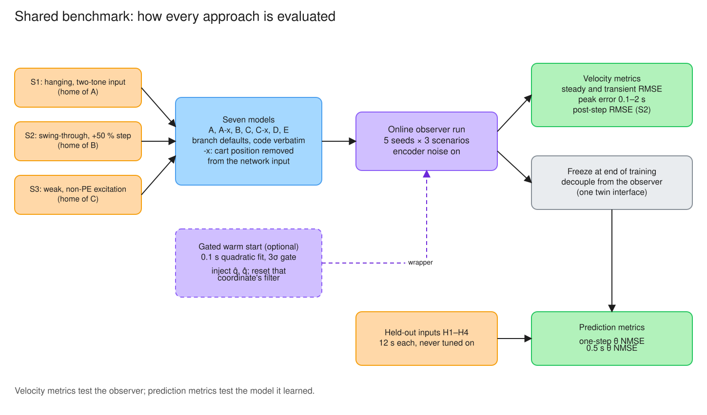
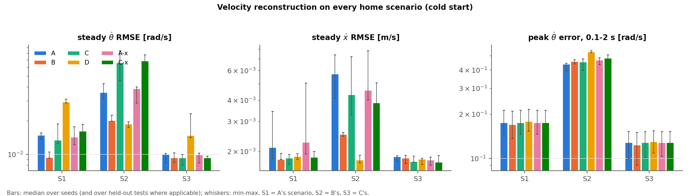
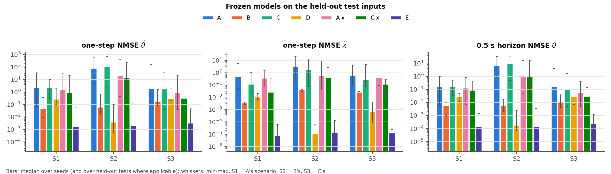
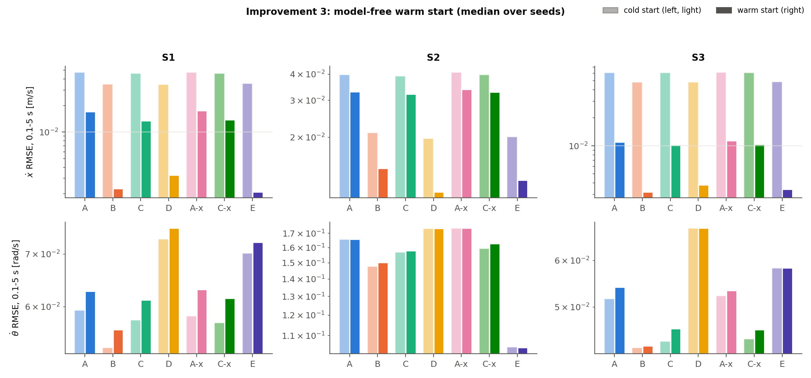

# Shared Benchmark: Approaches A, B, C and D Side by Side

[](#)
[](#6-reproducing-the-results)

Each approach branch validates its method on its own scenario, so their numbers cannot be
compared directly. This branch runs all four approaches on every branch's home scenario, with
the same seeds and the same metrics, plus a held-out test set that no branch was tuned on. It
also evaluates two improvements that apply across approaches.

- **Improvement 1**, the harness itself.
- **Improvement 2**, removing the cart position from the black-box inputs.
- **Improvement 3**, a model-free warm start.

The four approaches run unchanged, with their branch defaults. Their code is copied verbatim
from the approach branches:

| | Approach | Code | Branch |
|:---|:---|:---|:---|
| A | Black-box Lb-LSTM | `src/observers/blackbox_lstm.py` | `feature/approach-a-blackbox-lstm` |
| B | Physics-informed PI-LSTM | `src/observers/pilstm_*.py` | `feature/approach-b-physics-informed` |
| C | Concurrent-learning Lb-LSTM | `src/observers/cl_lstm_observer.py` | `feature/approach-c-concurrent-learning` |
| D | Physics-structured integral CL (PI-ICL) | `src/observers/pi_icl_observer.py`, `el_linear_model.py` | `feature/approach-d-physics-icl` |

C's point-regressor history stack is kept as `src/concurrent_learning/point_history_stack.py`,
because D's block-regressor stack has a different interface. Only that import line changed in C's
files.

## 1. Protocol


*Diagram 1. The observer structure shared by all four approaches. They differ only in the learned
model block and in the adaptation law. The dashed history stack exists in C and D. Each approach
branch's README has its own block diagram and model flow chart.*



*Diagram 2. How every approach is evaluated. The six models run online on the three training
scenarios, which gives the velocity metrics. Each is then frozen, decoupled from its observer and
driven by held-out inputs, which gives the prediction metrics. The gated warm start (§5) is an
optional wrapper around the online run.*

**Training scenarios.** Each is the validation scenario of one branch, reproduced exactly
(`src/benchmark/scenarios.py`):

| | Home of | Setting | Noise |
|:---|:---|:---|:---|
| S1 | A | Hanging pendulum, $u = 2\sin 1.5t + 1.2\cos 3t$, $\theta_0 = \pi - 0.4$, 50 s | U(±0.5°) |
| S2 | B | Swing-through from 0.5 rad off upright, $u = 2\sin 3t + 1.2\cos 6t$, pendulum mass and inertia +50 % at 25 s, 50 s | U(±1°) |
| S3 | C | Weak excitation (non-PE) $u = 3e^{-t/8}\sin 1.6t$, hanging, 60 s | U(±0.5°) |

**Held-out test inputs.** These four inputs were defined for this benchmark before any result
existed, and no branch was tuned on them:

- H1: a filtered square wave.
- H2: a random-phase multisine on frequencies absent from every training input.
- H3: a slow chirp from 0.1 to 0.6 Hz.
- H4: a pulse train.

Each runs for 12 s from the hanging equilibrium, starting at the drift-cancelling cart state
(the cart never reaches a bumper), on the plant each model ended its training on. For S2 that
is the post-step plant.

**Normalization.** A and C receive the data-driven input normalization that Approach B's
benchmark gave Approach A: offsets and scales from the first 5 s of encoder data. B and D need
none.

**Metrics.** 5 seeds per scenario; each seed changes the noise realization and the
initialization.

- **Velocity reconstruction:**
  - RMSE of $\dot x$ and $\dot\theta$ over the transient (0.1–5 s) and the steady window (last 15 s).
  - Peak $\dot\theta$ error over 0.1–2 s.
  - Post-step RMSE (S2 only).
- **Held-out prediction.** Each model is frozen at the end of training and decoupled from its
  observer (`src/benchmark/models.py`, one twin interface for all four).
  - One-step NMSE of $\ddot x$ and $\ddot\theta$ on the true states.
  - 0.5 s short-horizon NMSE of $x$ and $\theta$, restarting from the true state every 0.5 s.
  - Long free runs are not scored: the plant is marginally stable near the hanging
    equilibrium, so they diverge for every model (Approach C's README, §9.2).

## 2. Results: velocity reconstruction (cold start)

Median over 5 seeds of the steady-window RMSE (last 15 s). No run diverged.

| | S1 θ̇ [rad/s] | S2 θ̇ | S3 θ̇ | S1 ẋ [m/s] | S2 ẋ | S3 ẋ | S2 post-step θ̇ |
|:---|---:|---:|---:|---:|---:|---:|---:|
| A | 0.0149 | 0.0359 | 0.0100 | 0.0021 | 0.0057 | 0.0019 | 0.0462 |
| B | **0.0094** | 0.0202 | **0.0094** | **0.0018** | 0.0025 | 0.0018 | 0.0218 |
| C | 0.0135 | 0.0662 | **0.0094** | **0.0018** | 0.0043 | **0.0017** | 0.0787 |
| D | 0.0295 | **0.0187** | 0.0148 | 0.0019 | **0.0018** | 0.0018 | **0.0179** |



- **B is the most reliable velocity estimator.** It is best or tied on the two hanging scenarios
  and a close second on S2.
- **D is best on S2 but worst on θ̇ in S1.** S2 is its design scenario, where the whole
  configuration space is swept. The hanging scenarios carry little information about the
  pendulum scale (Approach D's README, §3): with swings of ±0.4 rad the coupling signal is weak,
  so D's pendulum-row parameters stay loose. The effect is visible on S1, where D's θ̇ RMSE is
  3× B's.
- **C's history stack hurts on S2.** Its stored windows predate the mass step and C has no change
  detector, so it clings to the old plant (post-step θ̇ RMSE 0.079 vs A's 0.046).

### 2.1 Transient behaviour and recovery from the plant change

Median over 5 seeds. Post-step RMSE is over 25–30 s of S2, right after the +50 % mass and inertia
step.

| | θ̇ RMSE 0.1–5 s, S1 | S2 | S3 | Peak θ̇ error 0.1–2 s, S1 | S2 | S3 | Post-step θ̇ RMSE, S2 |
|:---|---:|---:|---:|---:|---:|---:|---:|
| A | 0.059 | 0.166 | 0.052 | 0.176 | **0.439** | 0.129 | 0.0462 |
| A-x | 0.058 | 0.174 | 0.052 | 0.176 | 0.469 | 0.129 | 0.0516 |
| B | **0.053** | **0.148** | **0.043** | **0.170** | 0.459 | **0.124** | 0.0218 |
| C | 0.058 | 0.157 | 0.044 | 0.176 | 0.456 | 0.129 | 0.0787 |
| C-x | 0.057 | 0.160 | 0.044 | 0.176 | 0.483 | 0.129 | 0.0890 |
| D | 0.073 | 0.174 | 0.068 | 0.180 | 0.533 | 0.130 | **0.0179** |

- **Every learned observer has a start-up transient.** The peak error is 0.12–0.53 rad/s, against
  steady RMSE of 0.009–0.07 rad/s.
  - It is not high-gain peaking: no gain is scaled up.
  - It is a *model-learning* transient, lasting until $\hat\Phi$ has adapted.
  - Weight projection bounds the weights, not this transient.
  - The warm start of §5 removes the cart part of it, but not the pendulum part.
- **Recovery after the step ranks by structure.**
  - D is best: it detects the change and re-identifies.
  - B is second.
  - C is worst, because its stack still holds pre-step windows.

  In Approach D's own run of S2, the peak θ̇ error in 25–27 s is 0.110 (A), 0.054 (B) and
  0.045 rad/s (D).
- **D pays for identification with the largest initial transient** (0.533 rad/s on S2). It starts
  from a weak prior with a small instantaneous gain, and concurrent learning switches on only once
  the rank gate opens, about 3 s in.

## 3. Results: held-out prediction

Median over the 4 held-out inputs × 5 seeds.

| | One-step θ̈ NMSE S1 | S2 | S3 | 0.5 s θ NMSE S1 | S2 | S3 |
|:---|---:|---:|---:|---:|---:|---:|
| A | 2.33 | 80.7 | 1.84 | 0.161 | 6.49 | 0.170 |
| B | **0.046** | 0.061 | **0.179** | **0.0055** | 0.0058 | **0.012** |
| C | 2.41 | 108.7 | 1.80 | 0.159 | 9.44 | 0.096 |
| D | 0.268 | **0.0039** | 0.301 | 0.026 | **0.0002** | 0.031 |
| A-x | 1.67 | 20.4 | 0.917 | 0.129 | 1.11 | 0.057 |
| C-x | 0.884 | 14.4 | 0.326 | 0.085 | 0.887 | 0.029 |



- **Structure generalizes; black boxes do not.**
  - The two physics-structured models (B, D) are 1–4 orders of magnitude better than A and C on
    inputs they never saw.
  - After S2, A's and C's θ̈ NMSE runs to 80–110, worse than predicting the mean. They learned
    whatever the swing-through visited, including the cart position (§4), and extrapolate badly
    near the hanging equilibrium.
- **D after S2 is the best model in the whole benchmark.** θ̈ NMSE is 0.004 and 0.5 s θ NMSE is
  0.0002: it is effectively the true rigid-body model, identified from rich data.
- **B wins after hanging-only data.** On S1 and S3, B's model generalizes better than D's. D's
  extra structure (linear parameters, no friction network) buys exact identification only when
  the data are informative enough.
- **Among the black boxes, C-x generalizes best.** It combines concurrent learning with
  improvement 2 and beats both A variants on every scenario.

## 4. Improvement 2: remove the cart position from the black-box inputs

The dynamics do not depend on the cart position $x$: it is a cyclic coordinate. B and D build
this in. A and C see $x$ as an input, so a test that visits cart positions the training did not
forces them to extrapolate in a direction the true dynamics ignore. The fix is to set $x$'s
input scale to 0 (the A-x and C-x variants).

**Why it matters.** The rig's Lagrangian does not depend on $x$: $\partial\mathcal L/\partial x = 0$.
So $M$, $C$, $G$, and the acceleration field $g$ are invariant under translations of the cart, but
nothing makes an unconstrained network invariant too. Setting $s_x = 0$ imposes the translation
symmetry exactly. The observer still uses $\hat x$ in its error signals; only the *model input* loses it.

**Ratio of original to x-free median NMSE** (above 1 means the x-free model is better):

| | S1 | S2 | S3 |
|:---|---:|---:|---:|
| A / A-x, one-step θ̈ NMSE | 1.40× | 3.96× | 2.01× |
| C / C-x, one-step θ̈ NMSE | 2.73× | 7.53× | 5.51× |
| A / A-x, 0.5 s θ NMSE | 1.25× | 5.86× | 3.01× |
| C / C-x, 0.5 s θ NMSE | 1.87× | 10.65× | 3.28× |

Per-seed differences:

| Change (x-free minus original), median over seeds | S1 | S2 | S3 |
|:---|:---:|:---:|:---:|
| A-x vs A: one-step θ̈ NMSE | −1.79 (better in 3/5 seeds) | −131 (5/5) | −3.99 (4/5) |
| C-x vs C: one-step θ̈ NMSE | −1.65 (4/5) | −94.6 (5/5) | −3.11 (5/5) |
| A-x vs A: 0.5 s θ NMSE | −0.023 | −3.68 | −0.027 |
| C-x vs C: 0.5 s θ NMSE | −0.093 | −6.59 | −0.119 |
| A-x / C-x vs original: steady θ̇ RMSE | −0.0005 / +0.0003 | −0.0023 / −0.0022 | +0.0001 / +0.0001 |

- **Held-out prediction improves in 26 of 30 (model, scenario, seed) cases.** The median
  one-step θ̈ NMSE falls by 1.4–7.5×. The largest gain is after S2, where the swing-through's
  cart positions were furthest from the tests'.
- **Online velocity estimation is unchanged.** The observer's feedback compensates for the model
  either way; the input change matters when the model runs on its own.
- **One line, no downside observed.** The change is a single input scale, and it should be the
  default for any black-box model of a system with cyclic coordinates.

## 5. Improvement 3: model-free warm start

Every observer starts from $\hat q = y(0)$ and $\hat{\dot q} = 0$. In all three scenarios the
cart starts moving, at the drift-cancelling velocity, while the pendulum starts at rest.
`src/benchmark/warm_start.py` wraps any observer:

1. **Run the observer normally from the first sample**, and buffer the first 0.1 s of encoder data.
2. **Fit.** Fit a quadratic and differentiate it at the last sample (a causal Savitzky–Golay
   end-point estimate).
3. **Gate.** For each coordinate, test whether the fitted velocity is significant:
   $|\dot q_{fit}| > 3\sigma_v$, with $\sigma_v$ taken from the fit residual.
4. **Inject.** For significant coordinates only, overwrite the position and velocity estimates
   with the fit, and re-initialize that coordinate's auxiliary filter exactly as at start-up
   ($p = (\alpha + k_r)\tilde q$, $\nu = 0$).

Nothing else is touched: not the other coordinate, not the LSTM memories, not the weights. The
wrapper amounts to a new initial condition for part of the observer state, so every stability
argument still applies.

**Why position, velocity and filter are reset together.**

- **Velocity only:** injecting only the velocity leaves the position estimate and the filter
  states inconsistent with it, and the cart error re-grows to about 0.2 m/s.
- **Whole observer:** resetting the whole observer at 0.1 s discards the adaptation done so far and
  restarts the filter transient. The pendulum channel then gets worse (θ̇ RMSE up to +16 %, peak up
  to +27 %).
- **This design:** resetting one coordinate's position, velocity and filter keeps the cart error
  below 0.02 m/s after injection.

**Result.** Warm / cold ratio of the median over 5 seeds (below 1 = warm start is
better):

| | ẋ RMSE 0.1–5 s | Peak ẋ error 0.1–2 s | θ̇ RMSE 0.1–5 s | Peak θ̇ error 0.1–2 s | Steady θ̇ RMSE |
|:---|:---:|:---:|:---:|:---:|:---:|
| S1 (all 6 models) | 0.07–0.37 | 0.04–0.21 | 1.03–1.08 | 1.12–1.14 | 0.90–1.07 |
| S2 | 0.56–0.83 | 0.27–0.65 | 1.00–1.02 | 0.98–1.00 | 0.95–1.00 |
| S3 | 0.07–0.18 | 0.05–0.11 | 1.00–1.05 | 1.00 | 0.99–1.01 |

- **Cart channel: large, consistent gains.** The transient error falls 1.2–15× and the peak
  1.5–27×. B and D gain most, because once their state is right their models hold it.
- **Pendulum channel: neutral on S2 and S3, slightly worse on S1.** On S1 it is 3–8 % worse
  (peak 12–14 %). The pendulum is not reset there, so the loss is indirect. The likely cause is
  that the large initial cart error acts as early excitation for the adaptation laws, and removing
  it slows the first second of model learning. This is a real trade-off.
- **What the warm start cannot fix.** The pendulum's early transient (peaks 0.12–0.53 rad/s)
  comes from the *unlearned model*. Only faster model learning reduces it, and no approach here
  does that within the first 2 s.
- **Steady state is unaffected.** The largest difference is 10 %, in C-x on S1; everything else
  is within ±8 %.



*Each panel shows cold start (light) against warm start (solid), per model.*

## 6. Reproducing the results

```bash
python -m pytest -q                                     # 113 tests
python experiments/run_shared_benchmark.py --seeds 5    # 180 runs, about 15 min on 8 cores
python experiments/run_shared_benchmark.py --plots-only # redraw figures from results/shared_benchmark/*.csv
python experiments/run_shared_benchmark.py --warm-only --workers 2  # rerun only the warm-start runs (about 9 min)
```

| File | Contents |
|:---|:---|
| `src/benchmark/scenarios.py` | S1–S3 (each branch's home scenario) and the held-out inputs H1–H4 |
| `src/benchmark/models.py` | Model registry (A, A-x, B, C, C-x, D), shared normalization, twin adapters, prediction metrics |
| `src/benchmark/warm_start.py` | Significance-gated state injection (improvement 3) |
| `experiments/run_shared_benchmark.py` | The benchmark; CSVs in `results/shared_benchmark/`, figures in `figures/shared_benchmark/` |
| `figures/diagrams/` | Diagrams 1–2 as SVG and editable `.excalidraw`; sources in `src/*.json`, regenerate with `python figures/diagrams/src/render_diagrams.py` |
| `tests/test_shared_benchmark.py` | Harness tests (twin exactness with true parameters, x-free inputs, warm-start injection and gate) |

## 7. Caveats

- **Simulation only.** The actuator dead-zone and stiction are off, as in every branch. The
  held-out inputs are near the hanging equilibrium.
- **Each approach runs its own branch defaults.** Those were tuned on its home scenario, so each
  approach has a home advantage on one of S1–S3. The held-out inputs are the unbiased part of
  the comparison.
- **C has no change detector.** Its S2 numbers reflect that. D's detector could be added to C.
- **Seed spread is wide for the black boxes.** The figure whiskers span up to two orders of
  magnitude on S2. Report medians together with their ranges.
