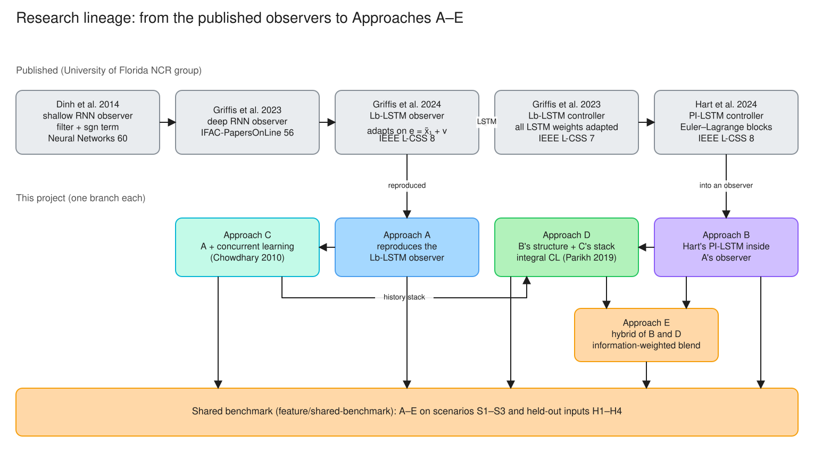
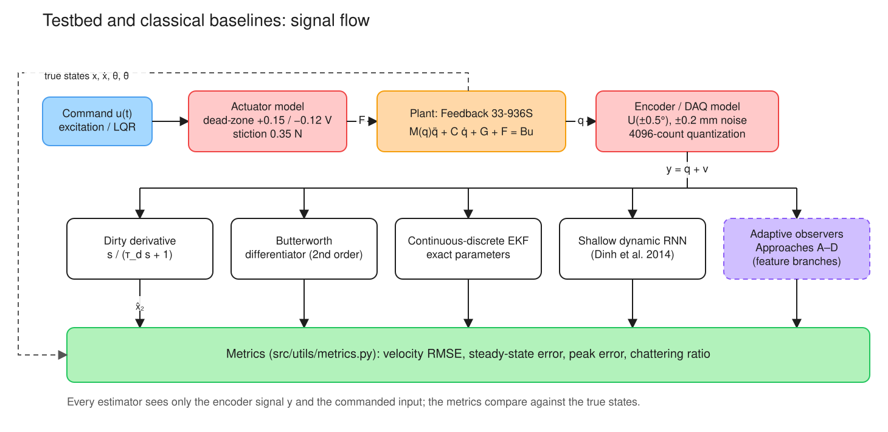

# Lyapunov-Based LSTM Adaptive Observers for Underactuated Cart-Inverted Pendulum Systems

[](https://www.python.org/downloads/)
[](https://opensource.org/licenses/MIT)
[](#)
[](#)
[](#)

---

## 1. Executive Summary & Research Vision

This repository hosts a scientific control and machine learning research platform investigating **Lyapunov-Based Long Short-Term Memory (Lb-LSTM) Continuous Adaptive Observers** for nonlinear state reconstruction and real-time dynamic model identification. 

The experimental benchmark system is the industry-standard **Feedback Instruments 33-936S Digital Cart-Inverted Pendulum Rig**, interfaced via an **Advantech PCI-1711 DAQ card**. In real-world operation, control engineers only have access to discrete, quantized, and noisy optical encoder positions ($x, \theta$). Direct analytical differentiation (e.g., dirty derivatives or high-gain observers) causes extreme noise amplification and high-frequency chattering, degrading closed-loop stabilization and actuator lifespan.

This project formulates **continuous-time neural adaptive observers** whose weight adaptation laws are analytically derived using **Lyapunov stability theory**. Unlike black-box deep learning models that execute discrete unconstrained backpropagation through time, our observers run **continuous analytical ordinary differential equations (ODEs)** evaluated in real time via high-performance NumPy/Numba routines with strict mathematical guarantees of uniform ultimate boundedness (UUB) or asymptotic convergence.

---

## 2. Theoretical Problem Statement

Consider the generalized underactuated Euler-Lagrange mechanical system:

$$\mathbf{M}(q)\ddot{q} + \mathbf{C}(q, \dot{q})\dot{q} + \mathbf{G}(q) + \mathbf{F}_f(\dot{q}) + \mathbf{\Delta}(q, \dot{q}, t) = \mathbf{B} u$$

with generalized coordinates $q = [x, \theta]^T \in \mathbb{R}^2$, actuator control force $u = F \in \mathbb{R}$, and state vector $\mathbf{x} = [x, \dot{x}, \theta, \dot{\theta}]^T = [x_1, x_2, x_3, x_4]^T \in \mathbb{R}^4$.

### Sensor Constraints and Unmeasured Velocity
Only configuration positions are measured through digital optical encoders:

$$y(t) = \begin{bmatrix} x_m(t) \\ \theta_m(t) \end{bmatrix} = \mathbf{H} \mathbf{x}(t) + \mathbf{v}(t) = \begin{bmatrix} x(t) \\ \theta(t) \end{bmatrix} + \begin{bmatrix} v_x(t) \\ v_\theta(t) \end{bmatrix}$$

where:
1. **Optical Encoder Noise**: $v_\theta \sim \mathcal{U}(-0.5^\circ, +0.5^\circ)$ and $v_x \sim \mathcal{U}(-0.2\text{ mm}, +0.2\text{ mm})$.
2. **Quantization**: Quadrature counters on the PCI-1711 DAQ discretize position ($4096\text{ counts/m}$ for cart, $4096\text{ counts/rev}$ for pendulum).
3. **Asymmetric Dead-Zone & Stiction**: Drive amplifier exhibits an asymmetric voltage deadband ($+0.15\text{ V}$ forward, $-0.12\text{ V}$ reverse) and static breakaway friction ($F_{\text{stiction}} \approx 0.35\text{ N}$).
4. **Unmodeled Nonlinear Dynamics**: $\mathbf{\Delta}(q, \dot{q}, t)$ captures cable drag, track irregularities, and velocity-dependent stiction.

**Objective**: Reconstruct full state $\hat{\mathbf{x}} = [\hat{x}, \hat{\dot{x}}, \hat{\theta}, \hat{\dot{\theta}}]^T$ and identify unknown vector fields while eliminating velocity chattering and guaranteeing bounded estimation error $\lim_{t \to \infty} \|\mathbf{x}(t) - \hat{\mathbf{x}}(t)\| \le \epsilon$.

---

## 3. Mathematical Ground Truth: Feedback Instruments 33-936S Rig

The equations of motion are sourced directly from the **Feedback Instruments 33-936S manufacturer manual**:

$$\begin{aligned}
(M + m)\ddot{x} + b\dot{x} + m l \ddot{\theta}\cos(\theta) - m l \dot{\theta}^2\sin(\theta) &= F \\
(I + m l^2)\ddot{\theta} - m g l \sin(\theta) + m l \ddot{x}\cos(\theta) + d\dot{\theta} &= 0
\end{aligned}$$

### Matrix Formulation

$$\begin{bmatrix} M + m & m l \cos\theta \\ m l \cos\theta & I + m l^2 \end{bmatrix} \begin{bmatrix} \ddot{x} \\ \ddot{\theta} \end{bmatrix} = \begin{bmatrix} F - b\dot{x} + m l \dot{\theta}^2\sin\theta \\ m g l \sin\theta - d\dot{\theta} \end{bmatrix}$$

$$\mathbf{M}(\theta) = \begin{bmatrix} M + m & m l \cos\theta \\ m l \cos\theta & I + m l^2 \end{bmatrix}$$

$$\det(\mathbf{M}(\theta)) = (M + m)(I + m l^2) - (m l \cos\theta)^2 > 0 \quad \forall \theta \in \mathbb{R}$$

Because $\det(\mathbf{M}(\theta)) \ge (M+m)(I+ml^2) - m^2 l^2 > 0$, the mass matrix is **strictly symmetric positive-definite** everywhere in state space.

### Analytic Forward Accelerations

$$\begin{aligned}
\ddot{x} &= \frac{(I + m l^2)\left[F - b\dot{x} + m l \dot{\theta}^2\sin\theta\right] - (m l \cos\theta)\left[m g l \sin\theta - d\dot{\theta}\right]}{\det(\mathbf{M}(\theta))} \\
\ddot{\theta} &= \frac{-(m l \cos\theta)\left[F - b\dot{x} + m l \dot{\theta}^2\sin\theta\right] + (M + m)\left[m g l \sin\theta - d\dot{\theta}\right]}{\det(\mathbf{M}(\theta))}
\end{aligned}$$

### Verified Plant Parameter Specifications

| Parameter | Symbol | Nominal Value | Units | Description |
|:---|:---:|:---:|:---:|:---|
| Cart Mass | $M$ | `2.4` | $\text{kg}$ | Linear carriage mass |
| Pendulum Mass | $m$ | `0.23` | $\text{kg}$ | Cylindrical rod mass |
| Center of Mass | $l$ | `0.36` | $\text{m}$ | Pivot to center of mass distance |
| Pendulum Inertia | $I$ | `0.099` | $\text{kg}\cdot\text{m}^2$ | Moment of inertia about the centre of mass (about the pivot: $I + ml^2$) |
| Cart Damping | $b$ | `0.05` | $\text{N}\cdot\text{s/m}$ | Track viscous damping |
| Joint Damping | $d$ | `0.005` | $\text{N}\cdot\text{m}\cdot\text{s/rad}$ | Pivot bearing viscous friction |
| Gravity | $g$ | `9.81` | $\text{m/s}^2$ | Gravitational acceleration |
| Max Force | $F_{\text{max}}$ | `20.0` | $\text{N}$ | Drive amplifier force saturation ($\pm 10\text{V}$) |
| Track Limits | $x_{\text{lim}}$ | `0.5` | $\text{m}$ | Hard end-stop bumper travel limit ($\pm 0.5\text{m}$) |

### Exact Analytical Jacobians $\mathbf{A}(\mathbf{x}, u)$ and $\mathbf{B}(\mathbf{x})$

For continuous Extended Kalman Filtering and linearized control, the continuous-time system Jacobian $\mathbf{A} = \frac{\partial f}{\partial \mathbf{x}} \in \mathbb{R}^{4 \times 4}$ and input vector $\mathbf{B} = \frac{\partial f}{\partial u} \in \mathbb{R}^{4 \times 1}$ are derived in closed form:

$$\mathbf{A} = \begin{bmatrix}
0 & 1 & 0 & 0 \\
0 & \frac{\partial \ddot{x}}{\partial \dot{x}} & \frac{\partial \ddot{x}}{\partial \theta} & \frac{\partial \ddot{x}}{\partial \dot{\theta}} \\
0 & 0 & 0 & 1 \\
0 & \frac{\partial \ddot{\theta}}{\partial \dot{x}} & \frac{\partial \ddot{\theta}}{\partial \theta} & \frac{\partial \ddot{\theta}}{\partial \dot{\theta}}
\end{bmatrix}, \quad
\mathbf{B} = \begin{bmatrix}
0 \\
\frac{I + m l^2}{\det(\mathbf{M})} \\
0 \\
\frac{-m l \cos\theta}{\det(\mathbf{M})}
\end{bmatrix}$$

All partial derivatives are unit-tested against central finite differences to $10^{-5}$ precision in `tests/test_plant.py`.

---

## 4. Research Lineage



*Diagram 1. The published observers and controllers this project builds on (grey), and the four
approaches developed on the feature branches. Each approach README carries its own block
diagrams.*

The observers studied here descend from one line of work at the University of Florida's
Nonlinear Controls and Robotics group. Each step keeps the same observer skeleton:

- an auxiliary dynamic filter that manufactures a measurable error;
- a learned acceleration model;
- a robust $\mathrm{sgn}$ term.

Each step changes the model class and, with it, the adaptation law.

1. **Dinh, Kamalapurkar, Bhasin & Dixon (2014) [1]** introduced the skeleton. A shallow dynamic
   (recurrent) neural network estimates the unknown dynamics online, and a dynamic filter estimates
   the unmeasurable state. A Lyapunov analysis proves asymptotic convergence, validated in
   simulation and experiment on a **two-link robot manipulator**. This is the "Shallow Dynamic RNN"
   baseline of §5.
2. **Griffis, Patil, Makumi & Dixon (2023) [2]** replaced the shallow network with a **deep**
   recurrent network. Its adaptation law is driven by a filtered estimation error, which removes the
   full-state-feedback requirement.
3. **Griffis, Patil, Hart & Dixon (2024) [4]** moved the continuous-time LSTM of [3] into the
   observer of [1]. In an observer the true estimation error is not measurable, so the weights adapt
   on the measurable auxiliary error $e = \tilde x_1 + \nu$, which satisfies $r = \dot e + \alpha e$.
   On a two-link manipulator the RMS velocity error fell by 41.13 % against the adaptive shallow RNN
   of [1] (0.2270 vs 0.3856 deg/s). **Approach A reproduces this observer.**
4. **Hart, Griffis, Patil & Dixon (2024) [5]** made the LSTM **physics-informed**: separate
   DNN + LSTM blocks estimate the inertia, Coriolis, potential and dissipation terms of the
   Euler–Lagrange equation. It is a tracking **controller**, not an observer. It reports 0.0185 rad
   RMS tracking error, 33.76 % better than a physics-informed DNN baseline, and it lists
   positive-definiteness of the learned inertia as future work. **Approach B carries this structure
   into A's observer and enforces that positive-definiteness by construction.**

> **Controller versus observer.** [3] and [5] adapt on $r = \dot e + \alpha e$ with
> $e = q - q_d$. That signal is measurable under full-state feedback. In an observer, $r$ contains
> the unmeasured velocity error, so every law and robustness argument must be rewritten in terms of
> the measurable $e$. The corrected argument is in Approach A's README (§3).

**Table 1. The published lineage.**

| | Dinh et al. 2014 [1] | Griffis et al. 2023 [2] | Griffis et al. 2024 [4] | Hart et al. 2024 [5] |
|:---|:---|:---|:---|:---|
| Venue | *Neural Networks* 60 | IFAC-PapersOnLine 56(2) | IEEE L-CSS 8 | IEEE L-CSS 8 |
| Task | State observer | State observer | State observer | Tracking controller |
| Learned model | Shallow dynamic NN | Deep RNN | Continuous-time LSTM, all weights adapted | Euler–Lagrange-structured DNN + LSTM blocks |
| Signal driving adaptation | Implementable filter signals | Filtered estimation error | $e = \tilde x_1 + \nu$ | $r = \dot e + \alpha e$ (measurable in control) |
| Guarantee claimed | Asymptotic | Asymptotic | Asymptotic, semi-global | Asymptotic tracking, semi-global |
| Benchmark | Two-link robot (simulation and experiment) | Numerical simulation | Two-link robot (simulation) | Two-link robot (simulation) |

[1], [4] and [5] all use a fully actuated manipulator. The underactuated cart–pendulum used here
is a new setting for this family, and it exposes an identifiability failure that cannot occur when
every coordinate is actuated (Approach D's README, §3).

**Table 2. How the four approaches extend the lineage.** All four share the filter, feedback and
robust term of Approach A. They differ in the learned model and in how it adapts.

| | Model $\hat\Phi$ | Parameters | Adaptation | Rank condition imposed on | Needs $\ddot q$ | True parameters exist |
|:---|:---|---:|:---|:---|:---:|:---:|
| **A** Black-box Lb-LSTM | Continuous-time LSTM | 1440 | $\mathrm{proj}(\Gamma\Phi'^Te)$ | — | no | no |
| **B** Physics-informed PI-LSTM | Cholesky $\hat M \succeq \epsilon_M I$, Christoffel $\hat V_m$, $\hat G = \nabla\hat P$, dissipative $\hat F$ | 398 | Blockwise, kinetic metric | — | no | no |
| **C** Concurrent-learning Lb-LSTM | As A | 1440 | A's law + history stack [9], [10] | Readout only (32 of 1440) | yes (Savitzky–Golay proxy) | no |
| **D** Physics-structured integral CL | Linear-in-parameters EL model | 15 | Instantaneous + integral CL [11] | **All** 15 | **no** | **yes** |

---

## 5. Architectural Comparison Matrix



*Diagram 2. Signal flow of the testbed on this branch. The actuator and encoder models sit between the commanded input and the measurement. Every estimator, classical or adaptive, sees only the encoder signal and the commanded input. The metrics compare its velocity estimate with the true state.*

| Estimator Paradigm | Formulation Type | Stability Guarantee | Prior Model Required | PE Condition Needed? | Noise & Chattering Robustness | Real-Time Latency | Primary Weakness |
|:---|:---:|:---:|:---:|:---:|:---:|:---:|:---|
| **Dirty Derivative Filter** | 1st-order linear filter $\frac{s}{\tau_d s + 1}$ | Asymptotically stable filter poles | None | No | **Extremely Poor** (Chattering Ratio $> 18\times$) | $< 1\ \mu\text{s}$ | Massive high-frequency noise amplification; unmitigated phase lag |
| **Butterworth Differentiator** | 2nd-order bandpass filter $\frac{10^4 s}{s^2 + 70.7s + 10^4}$ | Hurwitz transfer function | None | No | **Moderate** (Chattering Ratio $\approx 3.0\times$) | $< 2\ \mu\text{s}$ | Fixed bandwidth trades phase delay against high-frequency cutoff |
| **Continuous-Discrete EKF** | Non-linear Riccati ODE + discrete update | Local exponential stability under small noise | Exact physical parameters $(M, m, l, I, b, d)$ | No | **Good** (Chattering Ratio $\approx 2.9\times$) | $\approx 25\ \mu\text{s}$ | Sensitive to unmodeled stiction & parameter drift |
| **Shallow Dynamic RNN** (Dinh et al., 2014) | Continuous RNN + Lyapunov leakage | Semi-global Uniform Ultimate Boundedness (UUB) | Nominal plant structure | No (bounded weights) | **High** (Chattering Ratio $\approx 1.0\times$) | $\approx 15\ \mu\text{s}$ | Limited representation capacity for long-term state dependencies |
| **Approach A: Black-Box Lb-LSTM** (`feature/approach-a...`) | Continuous-time LSTM ODE + Lyapunov update | Asymptotic if $k_s$ meets the RISE bound; uniformly ultimately bounded (UUB) as tuned | Black-box acceleration model | No | **Superior** (internal gating memory smooths transients) | $\approx 45\ \mu\text{s}$ | Unconstrained acceleration space can produce transient physical violations |
| **Approach B: Physics-Informed PI-LSTM** (`feature/approach-b...`) | Structural Cholesky inertia $\mathbf{L}\mathbf{L}^T + \mathbf{C}$ skew-symmetry | As A (asymptotic above the RISE bound, UUB as tuned); the learned model is passive by construction | Structural Euler-Lagrange properties | No | **Maximum** (physically constrained state space) | $\approx 60\ \mu\text{s}$ | Requires structural coordinate projection |
| **Approach C: Concurrent Learning Lb-LSTM** (`feature/approach-c...`) | Lb-LSTM + Rank-conditioned History Stack | As A for the state; with fixed gates, the readout converges to a neighbourhood of its stack least-squares fixed point | History stack of rich state-action pairs | **Relaxed** (No persistent excitation of trajectory required) | **Maximum** (fast convergence without continuous excitation) | $\approx 80\ \mu\text{s}$ | History stack management overhead and rank verification |
| **Approach D: Physics-Structured Integral CL** (`feature/approach-d...`) | Linear-in-parameters Euler–Lagrange model + integral concurrent learning | State and parameters converge with exact windows; UUB with noise | Euler–Lagrange structure, joint types, input matrix | **Relaxed** (rank condition on all 15 parameters) | **High** (best steady velocity error when the data sweep the configuration space) | not measured | Larger initial transient; pendulum parameters loose with hanging-only data |

The guarantee column states what the Lyapunov analysis actually delivers. Asymptotic convergence needs the robust gain $k_s$ above the RISE bound. Every tuned configuration runs below it, because a larger $k_s$ injects encoder noise, so the practical result is uniform ultimate boundedness. The derivation is in Approach A's README, §3.

---

## 6. Repository Architecture & Isolated Feature Branches

The project maintains a clean **isolated branch architecture**: one branch per approach, plus a shared benchmark:

```
├── main (Shared Testbed, Plant Truth, Noise Model, Baselines, Metrics)
│
├── feature/approach-a-blackbox-lstm
│   └── Continuous-time Lb-LSTM observer approximating the complete acceleration vector field.
│
├── feature/approach-b-physics-informed
│   └── PI-LSTM enforcing positive-definite inertia L(q)L(q)^T and Coriolis skew-symmetry.
│
├── feature/approach-c-concurrent-learning
│   └── Lb-LSTM augmented with an online history stack for parameter convergence without PE.
│
├── feature/approach-d-physics-icl
│   └── Linear-in-parameters Euler-Lagrange model with integral concurrent learning (no acceleration).
│
└── feature/shared-benchmark
    └── All four approaches on every branch's scenario, plus held-out inputs.
```

### Main Branch Directory Structure

```
├── .gitignore
├── pyproject.toml
├── requirements.txt
├── README.md
├── src/
│   ├── plant/
│   │   ├── pendulum_plant.py       # Feedback 33-936S non-linear ODE plant & Jacobians
│   │   └── sensor_noise.py         # PCI-1711 DAQ noise, stiction, and quantization
│   ├── baselines/
│   │   └── classical_estimators.py # Dirty Derivative, Butterworth, EKF, Shallow RNN
│   ├── utils/
│   │   └── metrics.py              # RMSE, steady-state norm, peak overshoot, THD, Chattering
│   └── simulation/
│       └── benchmark_runner.py     # LQR closed-loop testbed & signal excitation runner
├── tests/
│   ├── test_plant.py               # Dynamics, Jacobians (analytical vs numerical), energy
│   ├── test_sensor_noise.py        # Noise bounds, quantization, stiction deadband
│   ├── test_baselines.py           # Estimator tracking, convergence, and boundedness
│   └── test_metrics.py             # Validation of RMSE, THD, and Chattering metrics
├── scripts/
│   ├── run_benchmarks.py           # Command-line benchmark execution
│   └── visualize_baselines.py      # Publication-quality figure generation
├── figures/
│   ├── baseline_estimation_comparison.png
│   └── diagrams/                   # Diagrams 1-2: SVG, editable .excalidraw, and their sources
└── Adaptive Neural Network Observers Review.pdf   # Original survey; errata in §9
```

---

## 7. Quickstart Guide

### 7.1 Environment Setup

Create and activate a virtual environment with Python $\ge 3.10$:

```bash
# Clone the repository
git clone https://github.com/sidharthaxy/LSTM-RNN-observer-design.git
cd LSTM-RNN-observer-design

# Create virtual environment
python3 -m venv .venv
source .venv/bin/activate

# Install scientific dependencies and test suite
pip install -r requirements.txt
```

> **Note on Machine Learning Dependencies**: Core observer updates do **not** depend on PyTorch or TensorFlow. All continuous Lyapunov update laws are analytical differential equations evaluated in real time via high-speed NumPy and SciPy routines.

### 7.2 Running the Test Suite

Run the full pytest suite (19 unit tests validating plant dynamics, numerical Jacobians, sensor noise, estimators, and metrics):

```bash
pytest -v
```

### 7.3 Running Benchmarks

Execute the automated benchmark across all four baseline estimators under PCI-1711 DAQ noise and asymmetric stiction:

```bash
python scripts/run_benchmarks.py
```

Sample Benchmark Output (5000 time steps @ 1 kHz):

```text
================================================================================
FEEDBACK INSTRUMENTS 33-936S CART-INVERTED PENDULUM BENCHMARK TESTBED
Running Baseline Estimator Comparisons under PCI-1711 DAQ Noise & Stiction...
================================================================================

[+] Benchmark Completed across 4 Estimators (5000 time steps @ 1 kHz):
    - True plant states: x, x_dot, theta, theta_dot
    - Measurements: Optical Encoders with uniform noise & quantization
    - Non-linear effects: Asymmetric stiction deadband [+0.15V, -0.12V]

                     Cart_Pos_RMSE [m]  Cart_Vel_RMSE [m/s]  Theta_RMSE [rad]  Theta_Dot_RMSE [rad/s]  Vel_Chattering_Ratio  AngVel_Chattering_Ratio
Estimator                                                                                                                                           
Dirty_Derivative              0.000134             0.014140          0.005065                0.243687             18.964493              3545.064559
Butterworth_Diff              0.000134             0.004776          0.005065                0.135140              3.026037               547.372044
Continuous_EKF                0.000043             0.002251          0.001531                0.073982              2.911799               377.432751
Shallow_Dynamic_RNN           0.000149             0.000322          0.000782                0.003743              0.999903                10.893497

================================================================================
```

### 7.4 Generating Benchmark Plots

Generate publication-quality figures comparing ground truth trajectories against estimator outputs:

```bash
python scripts/visualize_baselines.py
```

Output saved to `figures/baseline_estimation_comparison.png`.

---

## 8. Navigating Research Branches

To inspect and run each approach, switch to its feature branch:

```bash
# Approach A: Unconstrained Continuous Black-Box Lb-LSTM
git checkout feature/approach-a-blackbox-lstm

# Approach B: Physics-Informed PI-LSTM (Positive-Definite Inertia & Skew-Symmetry)
git checkout feature/approach-b-physics-informed

# Approach C: Concurrent Learning Lb-LSTM (History Stack without Persistent Excitation)
git checkout feature/approach-c-concurrent-learning

# Approach D: Physics-Structured Observer with Integral Concurrent Learning (PI-ICL)
git checkout feature/approach-d-physics-icl

# Shared benchmark: all four approaches side by side
git checkout feature/shared-benchmark
```

Each branch maintains its own dedicated implementation, Lyapunov stability analysis, block diagrams, and standalone `README.md`.

---

## 9. Errata to the Survey (`Adaptive Neural Network Observers Review.pdf`)

The survey in this branch is a narrative of the lineage in §4. An equation-by-equation audit
found three gaps in its stability argument, several claims that our results contradict, and
citations that cannot be used. Each correction was checked symbolically or numerically, and each
is resolved in the README where it belongs.

### 9.1 Technical corrections

| Survey location | Defect | Resolution |
|:---|:---|:---|
| Eq. (35) | The adaptation law $\mathrm{proj}(\Gamma\Phi'^Tr)$ uses $r$, which contains the unmeasured velocity error, so it cannot be implemented | Approach A README §3.2: $\dot{\hat\theta} = \mathrm{proj}(\Gamma\Phi'^Te)$ with the measurable $e = \tilde x_1 + \nu$ |
| Eqs. (34)–(36) | Robustness argued with $\mathrm{sgn}(r)$, while the observer injects $\mathrm{sgn}(e)$ | Approach A README §3.3: RISE integral lemma, $P(t) \ge 0$, and gain condition |
| Eq. (11) vs (32) | Feedback coefficients inconsistent with the unweighted Lyapunov function | Approach A README §3: $\chi$ with $(2-\alpha^2)$ and $-\nu$, verified symbolically |
| Eq. (27) | Output-gate Jacobian missing the factor $(z^T\otimes I_{l_2})$ | Approach A README §4 |
| Eqs. (26)–(29) | Static-map Jacobian presented as the exact sensitivity | Approach A README §4 caveat |
| Eq. (19) | $\bar c$, $\bar h$ used before being defined | Approach A README §2 defines them first |
| Eq. (44), EKF | The prediction $P_{k\mid k-1} = F_kPF_k^T + Q_k$ used the continuous Jacobian | Use the discrete transition $F_k \approx I + T_s\,\partial f/\partial x\rvert_{\hat x_k}$, or integrate the continuous Riccati equation between samples (as this branch's continuous-discrete EKF does) |
| Eq. (45), HGO | "Noise amplification $1/\epsilon^N$" unqualified | For an $N$-th order high-gain observer, the $i$-th state estimate carries noise gain $O(\epsilon^{-(i-1)})$ [12]; velocity is $O(1/\epsilon)$. Peaking of the $i$-th state is also $O(\epsilon^{-(i-1)})$ |
| Eq. (42) | $(J + ml^2)\ddot\theta$ implies $J$ about the centre of mass | Consistent. The plant's $I$ is the centroidal inertia (§3), now labelled so in the code |
| Model-class sentence | Implied Dinh et al. used the cart–pendulum | [1], [4], [5] use a two-link manipulator (Table 1) |
| Not covered | Underactuated identifiability, rank attainability, discretization, input design | Approach D README §3; Approach C README §2; Approach A README §6; shared-benchmark README §4 |

### 9.2 Claims revisited

| Claim in the survey | What we measured, or what the sources say | Corrected statement |
|:---|:---|:---|
| "Peaking eliminated via Lyapunov-bounded weight projection" | Peak $\dot\theta$ error of 0.12–0.53 rad/s in 0.1–2 s for every learned observer, against steady RMSE of 0.009–0.07 (shared benchmark) | No *high-gain* peaking, because gains are not scaled up. A model-learning transient remains until the weights adapt. |
| "Deterministic asymptotic/exponential convergence" | Asymptotic only above the RISE bound, and every tuned configuration runs below it. No exponential result is derived | Asymptotic under the gain condition; UUB as tuned in practice. |
| "If PE holds, $\tilde\Theta \to 0$: exact identification" | LSTM ideal weights are neither unique nor exact. Approach C's readout reaches only a neighbourhood of its least-squares fixed point. Approach D identifies $M+m$ and $ml$ to within 1 % | $\tilde\Theta$ converges to a neighbourhood that scales with $\bar\varepsilon$. Exact identification needs a realizable model and an attainable rank condition. |
| "Identifies and cancels nonlinear friction online via memory cells" | Untested here (dead-zone and stiction off), and no source given | Expected, not demonstrated. |
| "40–70 % error reduction relative to classical baselines" (survey ref. 20) | Ref. 20 is *Neural Map* (deep RL), unrelated. The lineage reports 41.13 % vs a shallow RNN observer [4] and 33.76 % vs a physics-informed DNN [5]; neither is a classical baseline. A shallow RNN with the *exact* nominal model beats the black-box Lb-LSTM (Approach A) | Report the two published figures with their actual baselines. |
| "Lb-KAN reduces approximation error ~20 %" (survey ref. 19) | Ref. 19 is a ResNet adaptive-control paper | Removed pending a primary source. |

### 9.3 Citations removed from the survey

- Refs. 5, 8, 10–12 and 14–18 pointed to lab pages or to Google Scholar, ResearchGate, DBLP or
  OpenReview profiles. They are replaced by the primary papers [1]–[5].
- Ref. 24 (Wikipedia) is replaced by [15], [16].
- Refs. 7 (flip-flop memory, neuroscience), 9 (Lur'e–Postnikov soft sensor), 19 (ResNet adaptive
  control) and 20 (*Neural Map*) were cited for claims they do not support. They are removed
  together with those claims.

---

## References

Each entry was checked against the publisher record, IEEE Xplore, or the paper itself. DOIs are
given where confirmed.

1. H. T. Dinh, R. Kamalapurkar, S. Bhasin, and W. E. Dixon, "Dynamic neural network-based robust observers for uncertain nonlinear systems," *Neural Networks*, vol. 60, pp. 44–52, 2014.
2. E. J. Griffis, O. S. Patil, W. A. Makumi, and W. E. Dixon, "Deep recurrent neural network-based observer for uncertain nonlinear systems," *IFAC-PapersOnLine*, vol. 56, no. 2, pp. 6851–6856, 2023.
3. E. J. Griffis, O. S. Patil, Z. I. Bell, and W. E. Dixon, "Lyapunov-based long short-term memory (Lb-LSTM) neural network-based control," *IEEE Control Systems Letters*, vol. 7, pp. 2976–2981, 2023, doi:10.1109/LCSYS.2023.3291328.
4. E. J. Griffis, O. S. Patil, R. G. Hart, and W. E. Dixon, "Lyapunov-based long short-term memory (Lb-LSTM) neural network-based adaptive observer," *IEEE Control Systems Letters*, vol. 8, pp. 97–102, 2024, doi:10.1109/LCSYS.2023.3348706.
5. R. G. Hart, E. J. Griffis, O. S. Patil, and W. E. Dixon, "Lyapunov-based physics-informed long short-term memory (LSTM) neural network-based adaptive control," *IEEE Control Systems Letters*, vol. 8, pp. 13–18, 2024, doi:10.1109/LCSYS.2023.3347485.
6. B. Xian, D. M. Dawson, M. S. de Queiroz, and J. Chen, "A continuous asymptotic tracking control strategy for uncertain nonlinear systems," *IEEE Transactions on Automatic Control*, vol. 49, no. 7, pp. 1206–1211, 2004, doi:10.1109/TAC.2004.831148.
7. O. S. Patil, A. Isaly, B. Xian, and W. E. Dixon, "Exponential stability with RISE controllers," *IEEE Control Systems Letters*, vol. 6, pp. 1592–1597, 2022.
8. N. Fischer, R. Kamalapurkar, and W. E. Dixon, "LaSalle–Yoshizawa corollaries for nonsmooth systems," *IEEE Transactions on Automatic Control*, vol. 58, no. 9, pp. 2333–2338, 2013.
9. G. Chowdhary and E. Johnson, "Concurrent learning for convergence in adaptive control without persistency of excitation," in *Proc. 49th IEEE Conference on Decision and Control*, pp. 3674–3679, 2010.
10. G. Chowdhary and E. Johnson, "A singular value maximizing data recording algorithm for concurrent learning," in *Proc. American Control Conference*, pp. 3547–3552, 2011.
11. A. Parikh, R. Kamalapurkar, and W. E. Dixon, "Integral concurrent learning: Adaptive control with parameter convergence using finite excitation," *International Journal of Adaptive Control and Signal Processing*, vol. 33, no. 12, pp. 1775–1787, 2019, doi:10.1002/acs.2945.
12. H. K. Khalil, *High-Gain Observers in Nonlinear Feedback Control*, Advances in Design and Control. Philadelphia, PA: SIAM, 2017, ISBN 978-1-61197-485-0.
13. J.-B. Pomet and L. Praly, "Adaptive nonlinear regulation: Estimation from the Lyapunov equation," *IEEE Transactions on Automatic Control*, vol. 37, no. 6, pp. 729–740, 1992.
14. E. Lavretsky and K. A. Wise, *Robust and Adaptive Control with Aerospace Applications*. London: Springer, 2013.
15. B. E. Paden and S. S. Sastry, "A calculus for computing Filippov's differential inclusion with application to the variable structure control of robot manipulators," *IEEE Transactions on Circuits and Systems*, vol. 34, no. 1, pp. 73–82, 1987.
16. D. Shevitz and B. Paden, "Lyapunov stability theory of nonsmooth systems," *IEEE Transactions on Automatic Control*, vol. 39, no. 9, pp. 1910–1914, 1994.
17. S. Hochreiter and J. Schmidhuber, "Long short-term memory," *Neural Computation*, vol. 9, no. 8, pp. 1735–1780, 1997.
18. A. Savitzky and M. J. E. Golay, "Smoothing and differentiation of data by simplified least squares procedures," *Analytical Chemistry*, vol. 36, no. 8, pp. 1627–1639, 1964.
19. S. Van Huffel and J. Vandewalle, *The Total Least Squares Problem: Computational Aspects and Analysis*. Philadelphia, PA: SIAM, 1991.
20. J.-J. E. Slotine and W. Li, "On the adaptive control of robot manipulators," *International Journal of Robotics Research*, vol. 6, no. 3, pp. 49–59, 1987.
21. Feedback Instruments Ltd., *Digital Pendulum Control Experiments (33-936S)*, Crowborough, UK.
22. H. K. Khalil, *Nonlinear Systems*, 3rd ed. Upper Saddle River, NJ: Prentice Hall, 2002.

**Diagrams.** Diagrams 1–2 are defined as Excalidraw element lists in `figures/diagrams/src/*.json`.
`python figures/diagrams/src/render_diagrams.py` regenerates the SVGs and the editable
`.excalidraw` scenes.
