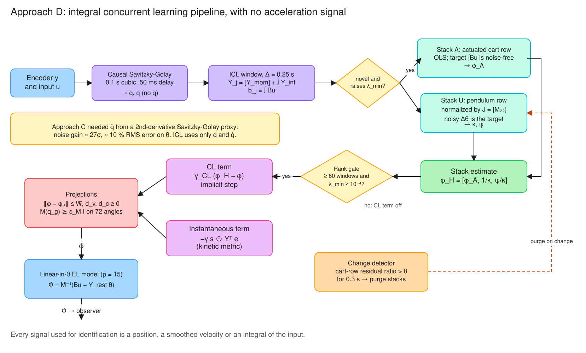
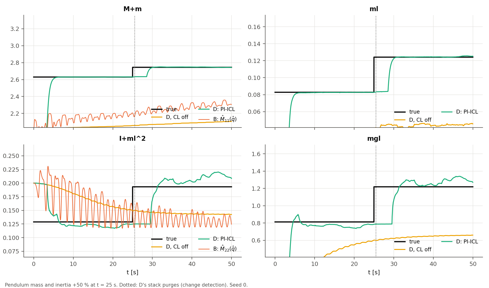
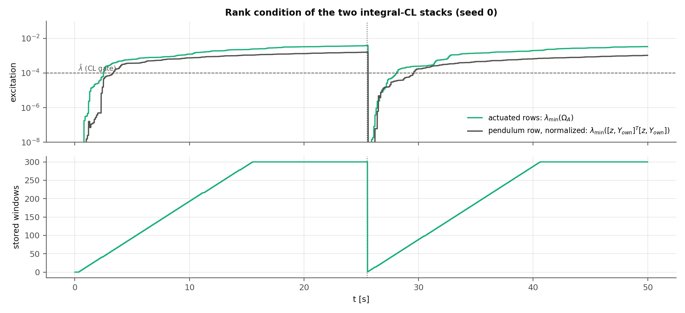
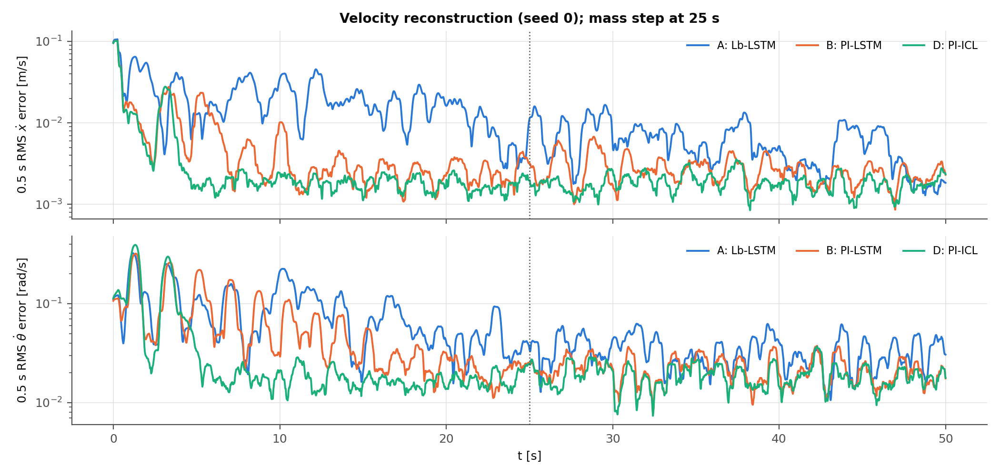
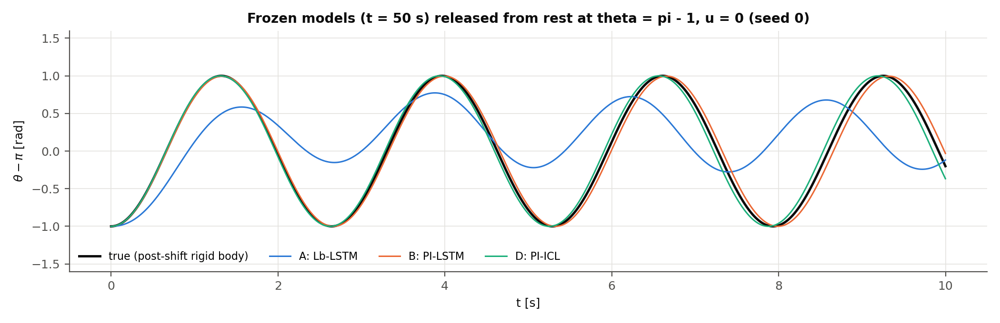

# Approach D: Physics-Structured Observer with Integral Concurrent Learning (PI-ICL)

[](#)
[](#)
[](#11-reproducing-the-results)

Approach D combines the two ideas that worked best in Approaches B and C:

- **From B**, the Euler–Lagrange structure of the model. The inertia is symmetric and positive
  definite, the Coriolis term comes from the Christoffel symbols, gravity is the gradient of a
  potential, friction is dissipative, and the cart position is cyclic.
- **From C**, concurrent learning. A history stack of recorded data identifies the model after
  the excitation that produced that data is gone.

To make the two fit, every sub-model is written **linearly** in its parameters. The rank
condition then applies to the *whole* parameter vector, and the true rig is representable
exactly. The stack stores *integration windows*, not points, so no acceleration estimate is ever
needed (integral CL).


*Diagram 1. Block diagram of the PI-ICL observer. The filter, the feedback $\chi$ and the robust term
are Approach A's. The model is a linear-in-parameters Euler–Lagrange model (§1). The dashed path is
integral concurrent learning, detailed in Diagram 2 (§4).*

Approach B's README lists incomplete inertia identification as its main open problem: 16 % error,
and $\hat M_{22}$ does not follow a change of the pendulum. Approach D identifies all four rigid-body
parameters and re-identifies them after the plant changes.

**Results at a glance.** Approach B's own extreme-condition scenario and metrics: a 50 s run
starting 0.5 rad from upright, ±1° encoder noise, and pendulum mass and inertia +50 % at 25 s.
Medians over 5 seeds.

| | A: Lb-LSTM | B: PI-LSTM | **D: PI-ICL** | D, CL off |
|:---|---:|---:|---:|---:|
| θ̇ RMSE, pre-shift 15–25 s [rad/s] | 0.060 | 0.030 | **0.019** | 0.106 |
| θ̇ RMSE, post-shift 25–30 s | 0.046 | 0.022 | **0.018** | 0.093 |
| θ̇ RMSE, steady 35–50 s | 0.036 | 0.020 | **0.019** | 0.061 |
| ẋ RMSE, steady 35–50 s [m/s] | 0.0057 | 0.0025 | **0.0018** | 0.0055 |
| Peak θ̇ error after the step, 25–27 s | 0.110 | 0.054 | **0.045** | 0.196 |
| Peak θ̇ error, initial transient 0–2 s | **0.440** | 0.459 | 0.533 | 0.533 |
| Inertia error $\lVert\hat M - M\rVert/\lVert M\rVert$ @ 50 s | — | 16.3 % | **0.19 %** | 21.9 % |
| Online θ̈ model NMSE, steady | 0.0062 | 0.0010 | **0.0005** | 0.0216 |

- **Velocity estimation.** D is the best of the four in every steady and post-shift window. The
  seed ranges do not overlap: D's worst steady θ̇ RMSE (0.0196) is below B's best (0.0199).
- **Identification.** The inertia matrix is identified to 0.2–0.3 % instead of 16 %.
  - **Mass and coupling.** M+m and ml are within 1 % before and after the step.
  - **Pendulum inertia and gravity.** I+ml² and mgl are within 4–8 % (median). These two are
    identifiable only through the weak cart–pendulum coupling (§5).
- **Plant change.** The change is detected 0.45–0.50 s after the step in every seed, with no
  false alarms, and the parameters are re-identified about 4 s later.
- **The price.** The initial transient is worse (peak 0.53 vs 0.46 rad/s): D's
  instantaneous gain is small, and the stack needs about 3 s of windows before CL acts.
- **The history stack does the work.** With CL off, the same observer is worse than A.

---

## 1. Model: linear-in-parameters Euler–Lagrange structure

`src/observers/el_linear_model.py`. For $q = [x, \theta]$ and $B = [1, 0]^T$:

$$M(q)\ddot q + C(q,\dot q)\dot q + G(q) + F(\dot q) = Bu$$

$$M(q) = \sum_{e=(i\le j)}\sum_k \theta_{e,k}\,\rho_k(q)\,E_e,\qquad C\dot q = \dot M\dot q - \tfrac12\partial_q(\dot q^TM\dot q),\qquad G = \partial_q P,\ P = \sum_{k\ge1} w_{G,k}\rho_k(q),$$

$$F = \mathrm{diag}(d_v)\,\dot q + \mathrm{diag}(d_c)\tanh(\dot q / v_c),\qquad d_v, d_c \ge 0.$$

The features $\rho(q) = [1, \cos\theta, \sin\theta]$ are Approach B's feature layer, with $x$
cyclic, so it is not embedded. With first harmonics ($K = 1$) there are $p = 15$ parameters. The
constant feature is left out of the potential, because it has zero gradient and would be
unidentifiable.

| Invariant | How it holds |
|:---|:---|
| $M = M^T$ | By construction: the parameters are its unique entries |
| $\dot M - 2C$ skew-symmetric | By construction: Christoffel symbols of $M$ |
| $G$ conservative | By construction: $G = \nabla P$ |
| Power balance $\frac{d}{dt}(T + P) = \dot q^T(Bu - F)$ | Follows from the three rows above |
| $\dot q^TF \ge 0$ (passive friction) | Projection onto $d_v, d_c \ge 0$ (exact, a clip) |
| $M(q) \succeq \epsilon_M I$ | Projection onto a convex set (§4) |
| $M$, $P$ independent of $x$ | By construction (cyclic coordinate) |

Positive-definiteness moves from B's Cholesky parameterization (valid for every $\theta$) to a
projection. This is the price of linearity. The set
$\{\theta : M(q_g;\theta) \succeq \epsilon_M I\}$ over a grid of angles $q_g$ is an intersection
of LMIs, each linear in $\theta$, so it is convex.

**Exactness.** The true rig is one point of this family:
$\theta^\ast = \{m_{11} = M+m,\ m_{12} = ml\cos\theta,\ m_{22} = I + ml^2,\ P = mgl\cos\theta,\ d_v = (b, d)\}$.
It reproduces the plant's accelerations to $10^{-15}$ (`test_true_parameters_reproduce_the_plant`).
*True parameter convergence* therefore has a concrete meaning here, which it cannot have for the
LSTM models of Approaches A–C.

## 2. Integral concurrent learning: no acceleration needed

Every term of the model has an analytic regressor that is linear in $\theta$:

| Regressor | Equals |
|:---|:---|
| Torque $Y(q,\dot q,a)\,\theta$ | $Ma + C\dot q + G + F$ |
| Momentum $Y_{mom}\,\theta$ | $M\dot q$ |
| Integrand $Y_{int}\,\theta$ | $-\tfrac12\partial_q(\dot q^TM\dot q) + G + F$ |

Because $\frac{d}{dt}(M\dot q) - \frac12\partial_q(\dot q^TM\dot q) = M\ddot q + C\dot q$,
integrating the equations of motion over a window $[t-\Delta, t]$ gives the **ICL identity**
(Parikh, Kamalapurkar & Dixon 2019):

$$\underbrace{[Y_{mom}]_{t-\Delta}^{t} + \int_{t-\Delta}^{t}Y_{int}\,d\tau}_{\mathcal Y_j}\ \theta^\ast = \underbrace{\int_{t-\Delta}^{t}Bu\,d\tau}_{b_j}.$$

It needs positions and velocities only. They come from a causal, delayed-centre Savitzky–Golay
smoother: 0.1 s cubic fit, evaluated 50 ms back. For velocity its noise gain is 8.5, against
about 260 for the second derivative over the same window, which Approach C needed. The smoother is **model-free**, so windows
are valid from the first 0.35 s, before the observer itself has converged.

The integral uses the trapezoid rule. The input is exact because the plant holds $u$ over each
sample. On the true trajectory the identity holds to $5\times10^{-5}$
(`test_icl_identity_holds_on_a_trajectory`).

Windows of $\Delta = 0.25$ s are offered every 50 ms to history stacks of 300 windows, using
Approach C's recording policy: a novelty gate, then a swap only if it increases
$\lambda_{\min}$ (`src/concurrent_learning/history_stack.py`, generalized to block regressors).

## 3. Why the pendulum row needs a different regression

Plain least squares on all rows recovers the cart row exactly, but the pendulum-row scale
collapses: $I + ml^2$ comes out as 0.02 instead of 0.129 with the 0.1 s smoother, and 0.003 with a
0.05 s one. Batch fits separate the causes:

| Windows built from | $I+ml^2$ | $mgl$ | $mgl/(I+ml^2)$ |
|:---|---:|---:|---:|
| True states | 0.1288 | 0.812 | 6.31 (exact) |
| Smoothed, noise-free encoder | 0.1288 | 0.812 | 6.31 |
| Smoothed, noisy encoder, plain LS | 0.0197 | 0.118 | 6.0 |
| Smoothed, noisy encoder, **row-normalized** (fix below) | 0.1299 | 0.788 | 6.07 |

Smoothing is not the problem; noise is. The pendulum row has no input ($B_2 = 0$), so its
equation is **homogeneous**: $\mathcal Y_{2}\theta^\ast = 0$. Least squares with noisy
regressors then shrinks the row towards $\theta = 0$ (errors-in-variables attenuation). Only the
small cart–pendulum coupling term $ml\cos\theta\,\ddot x$ resists, because $ml$ is pinned by the
cart row. The ratio $mgl/(I+ml^2) = \omega^2$ survives; the absolute scale does not. Approach B's
README observed the same limit: "the learned $\hat M_{22}$ stays wrong while the ratio is right".

**Why noise shrinks the row.** Write the noisy regressors as $\hat{\mathcal Y} = \mathcal Y + E$,
with $E$ zero-mean and covariance $\Sigma_E$. Least squares on the homogeneous row minimizes

$$\textstyle\sum_j\lVert\hat{\mathcal Y}_{2,j}\theta\rVert^2 \approx \theta^T\big(\mathcal Y_2^T\mathcal Y_2 + N\Sigma_E\big)\theta,$$

so the noise acts as a Tikhonov penalty that pulls the row's parameters towards $\theta = 0$.
Actuated rows escape this because their target $\int Bu$ is non-zero and noise-free. This failure
cannot occur on the fully actuated two-link manipulators used by the published observers this
project builds on (Dinh 2014; Griffis 2024; Hart 2024). It is specific to underactuated systems.

**Fix: normalize the homogeneous row so the noisy term becomes the target.** Divide the pendulum
row by its leading coefficient $J = [M_{22}]_{const}$. Take the columns it shares with the cart
row (the coupling inertia) from the cart-row estimate $\phi_A$. That leaves

$$\kappa\,z + \sum_{c\ \text{own}}\mathcal Y_{2c}\,\psi_c = -\mathcal Y_{2J},\qquad z = \sum_{c\ \text{shared}}\mathcal Y_{2c}\,\phi_{A,c},\quad \kappa = 1/\phi_J,\quad \psi_c = \phi_c/\phi_J.$$

The noisy momentum term $\mathcal Y_{2J} = \Delta\dot\theta$ is now the **target**, and noise in
the target causes no bias. The regressors are built from positions and from $\dot x$. On this rig the smoothed
$\dot x$ has about 70× less noise (0.001 m/s) than $\dot\theta$ (0.09 rad/s). On the same noisy data this gives
$I+ml^2 = 0.1299$ (true 0.1288) and $mgl = 0.788$ (true 0.812).

The CL target $\phi_H$ has three parts:

- **Cart row:** $\phi_A$, from actuated-row least squares on stack A. The target $\int Bu$ carries
  no noise.
- **Pendulum inertia:** $\phi_J = 1/\kappa$.
- **Remaining pendulum-row columns:** $\phi_J\psi$, from the normalized regression on stack U.

This construction generalizes to any system: actuated rows use ordinary least squares, and each
unactuated row is normalized by its own diagonal inertia and anchored through its coupling with
the actuated rows. If an unactuated row shares no parameter with the actuated rows, its scale is
unobservable, and the constructor refuses it.

## 4. Adaptation law



*Diagram 2. The identification pipeline. Encoder data are smoothed to positions and velocities only
(no $\ddot q$) and integrated over 0.25 s windows into the ICL identity (§2). Windows enter two
history stacks through a novelty and minimum-singular-value test. The actuated row is solved by
ordinary least squares with a noise-free target, and the unactuated row in the normalized form of
§3. The combined estimate $\phi_H$ drives the CL term once the rank gate opens. Projections keep the
inertia positive definite and the friction dissipative. A residual-based detector purges the stacks
after a plant change.*

In scaled parameters $\phi = \theta / s$, where $s$ holds unit scales derived from the inertia
prior:

$$\dot\phi = \underbrace{-\gamma\, s\odot Y(\hat q, \hat{\dot q}, \hat\Phi)^T e}_{\text{instantaneous (B's kinetic metric)}} + \underbrace{\gamma_{CL}\,(\phi_H - \phi)}_{\text{integral CL}},\qquad \hat\Phi = \hat M^{-1}(Bu - Y_{rest}\,\theta).$$

- **Instantaneous term.** Since $\partial\hat\Phi/\partial\theta = -\hat M^{-1}Y(\hat q,\hat{\dot q},\hat\Phi)$,
  this term is the gradient of $\tfrac12 e^T\hat M e$. That is Approach B's kinetic metric, with
  no Jacobian engine needed.
- **CL term.** This is the Newton (information-normalized) form of the classical CL term:
  $\Gamma_{CL}\sum_j\mathcal Y_j^T(b_j - \mathcal Y_j\phi) = \Gamma_{CL}\Omega(\phi_{LS} - \phi)$
  with $\Omega$ normalized away. It is integrated implicitly.
- **Projections**, applied after every step:
  1. $\lVert\phi - \phi_0\rVert \le \bar W$.
  2. $d_v, d_c \ge 0$.
  3. $M(q_g) \succeq \epsilon_M I$ on a 72-point angle grid. Each iteration projects onto the
     supporting half-space $v^TM(q_g)v \ge \epsilon_M$ of the most violated constraint.

  All three are Euclidean in $\phi$. Each is onto a convex set containing $\phi^\ast$, so none of
  them can increase $\lVert\phi - \phi^\ast\rVert$.
- **Rank gate.** $\phi_H$ is used only when every stack holds at least 60 windows and satisfies
  $\lambda_{\min} \ge \bar\lambda = 10^{-4}$: the rank condition with a margin.

**Change detection.** The detector tests how well the cart-row stack model predicts fresh
windows. It compares an EMA (0.5 s) of the new windows' residuals under $\phi_A$ with the stack's
in-sample residual. If the ratio stays above 8 for 0.3 s (outside a 3 s refractory period), all
stacks are purged and refill with post-change data. The cart row is used because its target is
noise-free, and because a change that scales $m$ and $I$ together leaves the normalized pendulum
row *invariant* ($\omega^2$ and $ml/J$ unchanged). Observed ratios: at most 4.9 without a change,
13–22 after the step.

### Stability and convergence (sketch)

Let $\tilde\phi = \phi^\ast - \phi$, and let $V_0 + P$ be Approach A's filter Lyapunov function
with its RISE term (A's README, §3.3; B's §5). Between stack updates $\phi_H$ is constant, and

$$\dot{\tilde\phi} = -\gamma_{CL}\tilde\phi + \gamma_{CL}(\phi^\ast - \phi_H) + \gamma\, s\odot Y^Te.$$

Take $V = V_0 + P + \tfrac{\beta}{2}\lVert\tilde\phi\rVert^2$. The regressors are bounded on
the compact set kept invariant by the projections, so $\lVert s\odot Y^Te\rVert \le c\lVert e\rVert$
with $\lVert e\rVert \le \lVert\tilde x_1\rVert + \lVert\nu\rVert$. Young's inequality then gives

$$\dot V \le -\tfrac{\alpha}{2}(\lVert\tilde x_1\rVert^2 + \lVert\nu\rVert^2) - \alpha\lVert\eta\rVert^2 - k_r\lVert r\rVert^2 - \tfrac{\beta\gamma_{CL}}{2}\lVert\tilde\phi\rVert^2 + \beta\gamma_{CL}\lVert\phi^\ast - \phi_H\rVert^2,\qquad \beta \le \frac{\alpha\gamma_{CL}}{2\gamma^2c^2}.$$

1. **Ideal case** ($\phi_H = \phi^\ast$: noise-free windows and a gated, full-rank stack). $\dot V$
   is negative definite in the state and parameter errors together, so by LaSalle–Yoshizawa both
   converge to zero, with no persistence of excitation. $V$ is common to all stack contents, so
   no dwell-time argument is needed. With a noise-free encoder, the test
   `test_identifies_physical_parameters_without_noise_and_detects_a_change` recovers all four
   rigid-body parameters to within 5 % before and after a +50 % step.
2. **Noisy case.** The system is uniformly ultimately bounded, and
   $\limsup\lVert\tilde\phi\rVert \lesssim \lVert\phi^\ast - \phi_H\rVert$. So the parameter
   error ends up about as large as the error of the stack estimate itself. That error is small
   because the normalized regression puts the noise in the target (§3), and the rank gate
   $\bar\lambda$ bounds how much noise it can amplify.

What the sketch does not cover:

- Projection is applied at discrete steps, and the stack estimate $\phi_H$ changes
  discontinuously when windows are swapped. Both are handled as in Approach C, by the argument
  in item 1 applied at each stack configuration.
- The small errors-in-variables bias that remains on the cart row (ml is attenuated by about 1 %).

## 5. Model order: why $K = 1$

Approach B uses two harmonics. With $K = 2$, D's batch fit is exact before the step, when the
pendulum falls from upright and sweeps most of the circle. After the step, the pendulum only
swings over $\theta \in [1.66, 4.57]$. Over that range the second harmonics are almost
collinear with the first, and noise wrecks the fit:

| Post-step windows (26–50 s), noisy | $I+ml^2$ (true 0.193) | $mgl$ (true 1.218) |
|:---|---:|---:|
| $K = 2$ | 0.936 | 3.15 |
| $K = 1$ | 0.203 | 1.229 |
| $K = 1$, with Coulomb terms | 0.204 | 1.231 |

$K = 1$ is exactly what a rigid pendulum needs, so it is the default. The Coulomb terms are kept
(`coulomb=True`): the simulation has no Coulomb friction, but a lab rig does, and they cost only
conditioning. **Identifiability, not capacity, limits structured models under partial excitation.**
Extra harmonics make sense only when the data sweeps the configuration space.

## 6. Validation on Approach B's scenario

`experiments/run_d_validation.py`. The scenario, trajectory, normalization, B and A runs, and all
metric definitions are imported unchanged from `experiments/run_pilstm_validation.py`.



*Fig. 1 (seed 0). D's physical reading of $\hat\theta$ against the truth. For comparison, B's
$\hat M_{11}$ and $\hat M_{22}$ at $\hat q$ are shown, which oscillate with the swing and never
approach the truth. With CL off, D stays near its prior. The dotted line marks the purge 0.4 s
after the step.*



*Fig. 2 (seed 0). $\lambda_{\min}$ of the actuated stack and of the normalized pendulum-row
regression. Both cross the gate $\bar\lambda$ (dashed) about 3 s after the start and about 3 s
after the purge; CL acts from then on.*

**Identification (5 seeds, median [min, max] relative error of D's physical parameters):**

| | M+m | ml | I+ml² | mgl |
|:---|:---:|:---:|:---:|:---:|
| @ 25 s (before the step) | 0.0 % [0.0, 0.2] | 0.3 % [0.1, 0.7] | 6.3 % [2.2, 8.6] | 6.7 % [2.5, 8.5] |
| @ 50 s (after the step) | 0.2 % [0.0, 0.5] | 0.9 % [0.6, 1.7] | 8.0 % [6.2, 27.3] | 4.3 % [2.5, 23.4] |
| D with CL off, @ 50 s | 23 % | 63 % | 26 % | 46 % |



*Fig. 3 (seed 0). 0.5 s RMS velocity error.*

**Frozen models released from rest** (u = 0, true post-shift rigid body, seed 0; B's protocol):

| | θ RMSE over 10 s | True-energy drift | Learned-energy drift |
|:---|---:|---:|---:|
| A | 0.613 rad | 0.546 J | — |
| B | 0.070 rad | 0.008 J | 0 (structural) |
| **D** | **0.070 rad** | 0.017 J | 0 (structural) |

The swing carries about 0.56 J. D's twin is as accurate as B's. Its slightly larger drift in
true energy reflects its 4–8 % error in $I+ml^2$ and $mgl$.



## 7. What D does not do better

- **The initial transient.** The peak θ̇ error in 0–2 s is 0.53 rad/s, against 0.46 for B and
  0.44 for A. D starts from B's prior with a small instantaneous gain ($\gamma = 2$), and its
  stacks need about 3 s of windows before the gate opens. Larger instantaneous gains made the
  instantaneous law fight the CL target (at $\gamma = 20$ the pre-shift θ̇ RMSE rose to 0.5 rad/s),
  so the transient is the trade-off made.
- **Re-identification delay.** After a detected change, CL waits about 3 s for new data. During
  that time the old parameters stay active, and the velocity estimate is still good (post-shift
  RMSE 0.018).
- **Structure assumptions.** D assumes more structure than B: a linear-in-parameters
  Euler–Lagrange model with known joint types and input matrix. It cannot learn effects outside
  that family. B's friction LSTM, for example, is replaced by viscous plus Coulomb terms.
- **Non-smooth events.** Bumper impacts are not Euler–Lagrange dynamics. In a test variant where
  the cart hits the track end, the detector flags the impact as a change, and the estimates made
  from impact data are wrong until the next purge. Real use should gate windows on track contact.

## 8. Configuration (`PIICLObserverConfig` defaults)

| Parameter | Default | Role |
|:---|:---:|:---|
| `harmonics`, `coulomb` | 1, True | Model order (§5) |
| `inertia_init`, `eps_M` | (2, 0.2), 0.05 | Prior $M = \mathrm{diag}$ (as B); positive-definiteness margin |
| `alpha, k_r, k_s` | 4, 8, 0.2 | Approach A/B filter gains, unchanged |
| `gamma_inst` | 2 | Instantaneous gain (scaled parameters) |
| `gamma_cl` | 2 1/s | Rate of the pull towards $\phi_H$ (implicit step) |
| `icl_window`, `record_interval` | 0.25 s, 50 ms | ICL window $\Delta$; candidate spacing |
| `stack_capacity`, `cl_min_windows`, `lambda_bar` | 300, 60, 1e-4 | Stack size; rank gate |
| `sg_window`, `sg_order` | 0.1 s, 3 | Model-free smoother |
| `detect_ratio`, `detect_tau`, `detect_hold`, `detect_refractory` | 8, 0.5 s, 0.3 s, 3 s | Change detector |

**How these were chosen.** The defaults came from a handful of design runs on seed 0 of this
scenario: stack size 60/150/300, instantaneous gain 0/2/5/20, detector ratio 3/8/10, harmonics
1/2. The 5-seed results above use noise seeds 42–46, so seed 0 (noise seed 42) was also used for
design.

## 9. Relation to Approaches A–C

| | A | B | C | **D** |
|:---|:---|:---|:---|:---|
| Model | Black-box LSTM | EL-structured sub-networks | Black-box LSTM | EL-structured, linear in θ |
| Adaptation | Instantaneous | Instantaneous | Instantaneous + CL (point stack) | Instantaneous + **integral** CL |
| Rank condition on | — | — | Readout (32 of 1440 parameters) | **All** parameters (15) |
| Needs acceleration | no | no | yes (SG proxy) | **no** |
| True parameters exist | no | no | no | **yes** |
| Handles plant change | slowly | partially | no | **detects and re-identifies** |

**What D resolves.** D removes the two limitations that stopped B and C from identifying the rig:

1. **B's scale collapse**, which D removes by normalizing the homogeneous pendulum row (§3).
2. **C's rank deficit and acceleration proxy.**
   - C's rank condition could only be imposed on 32 of 1440 parameters. D's linear
     parameterization makes it attainable on all 15.
   - C's second-derivative proxy had noise gain ≈ 26.9σ and about 10 % RMS error on θ̈. The ICL
     identity (§2) needs no acceleration at all.

The costs are listed in §7:

- a larger initial transient;
- loose pendulum parameters when the excitation stays near the hanging equilibrium;
- a model class that cannot represent effects outside the linear Euler–Lagrange family.

## 10. Files

| File | Contents |
|:---|:---|
| `src/observers/el_linear_model.py` | Linear EL model, all regressors, physical mapping, positive-definiteness projection |
| `src/observers/pi_icl_observer.py` | Observer, two-part stack estimate, rank gate, Newton-form CL, change detection |
| `src/concurrent_learning/history_stack.py` | Block-regressor stack with singular-value-maximizing recording |
| `src/concurrent_learning/savitzky_golay.py` | Causal Savitzky–Golay smoother / differentiator |
| `experiments/run_d_validation.py` | 5-seed benchmark vs A and B, identification, free swing, figures |
| `tests/test_pi_icl.py`, `tests/test_history_stack.py` | Approach D tests (23) |
| `src/observers/pilstm_*.py`, `src/adaptation/*`, `experiments/run_pilstm_validation.py` | Approach B and A code, unchanged from `feature/approach-b-physics-informed` |

## 11. Reproducing the results

```bash
python -m pytest -q                                # 76 tests (Approach B's 53 + D's 23)
python experiments/run_d_validation.py --seeds 5   # about 1 min on 8 cores; figures + CSVs
```

The script sets `OMP_NUM_THREADS=1` for its worker processes.

## References

- R. G. Hart, E. J. Griffis, O. S. Patil, and W. E. Dixon, "Lyapunov-based physics-informed long short-term memory (LSTM) neural network-based adaptive control," *IEEE Control Systems Letters*, vol. 8, pp. 13–18, 2024, doi:10.1109/LCSYS.2023.3347485 (the basis of Approach B).
- E. J. Griffis, O. S. Patil, R. G. Hart, and W. E. Dixon, "Lyapunov-based long short-term memory (Lb-LSTM) neural network-based adaptive observer," *IEEE Control Systems Letters*, vol. 8, pp. 97–102, 2024, doi:10.1109/LCSYS.2023.3348706.
- A. Parikh, R. Kamalapurkar, and W. E. Dixon, "Integral concurrent learning: Adaptive control with parameter convergence using finite excitation," *International Journal of Adaptive Control and Signal Processing*, vol. 33, no. 12, pp. 1775–1787, 2019, doi:10.1002/acs.2945.
- G. Chowdhary and E. Johnson, "A singular value maximizing data recording algorithm for concurrent learning," in *Proc. American Control Conference*, pp. 3547–3552, 2011.
- J.-J. E. Slotine and W. Li, "On the adaptive control of robot manipulators," *International Journal of Robotics Research*, vol. 6, no. 3, pp. 49–59, 1987.
- N. Fischer, R. Kamalapurkar, and W. E. Dixon, "LaSalle–Yoshizawa corollaries for nonsmooth systems," *IEEE Transactions on Automatic Control*, vol. 58, no. 9, pp. 2333–2338, 2013.
- S. Van Huffel and J. Vandewalle, *The Total Least Squares Problem: Computational Aspects and Analysis*. Philadelphia, PA: SIAM, 1991 (errors-in-variables background for §3).
- A. Savitzky and M. J. E. Golay, "Smoothing and differentiation of data by simplified least squares procedures," *Analytical Chemistry*, vol. 36, no. 8, pp. 1627–1639, 1964.

**Diagrams.** Diagrams 1–2 are Excalidraw element lists in `figures/diagrams/src/*.json`;
`python figures/diagrams/src/render_diagrams.py` regenerates the SVGs and the editable `.excalidraw`
scenes.
