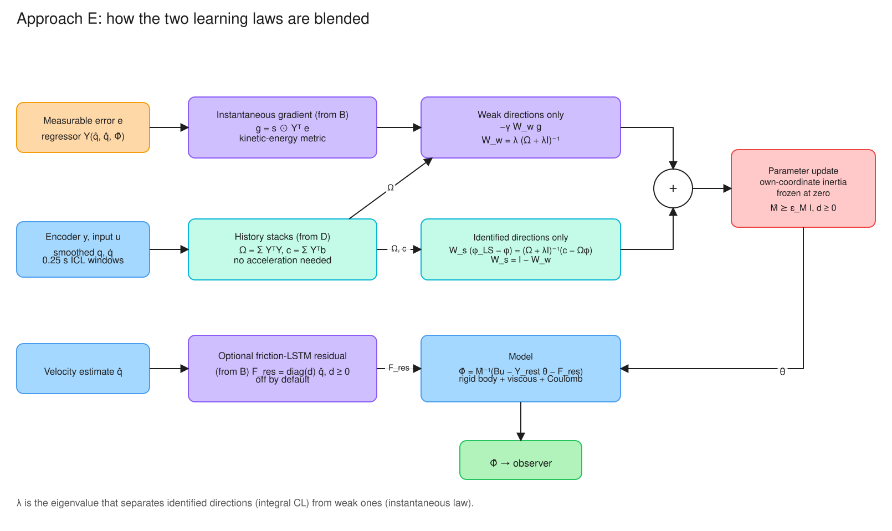
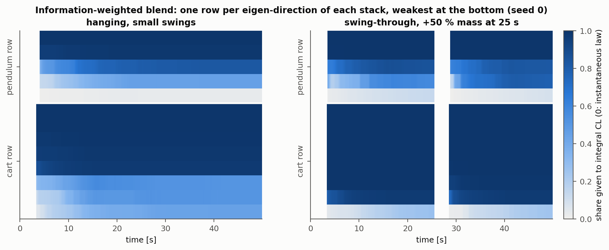
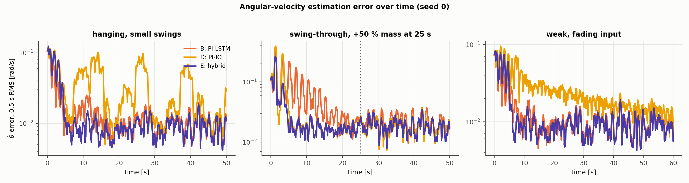
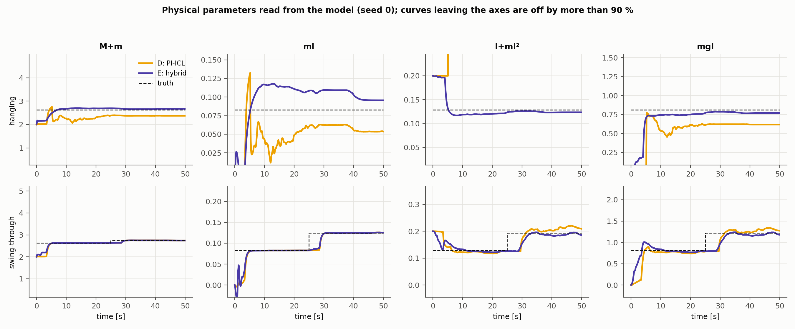

# Approach E: Hybrid of the Physics-Informed LSTM (B) and Integral Concurrent Learning (D)

[](#)
[](#)
[](#9-reproducing-the-results)

The shared benchmark left two approaches ahead of the rest, each with a gap:

- **Approach B** (physics-informed LSTM) was the most reliable velocity estimator, but it never
  identified the true inertia: 16 % error.
- **Approach D** (linear Euler–Lagrange model with integral concurrent learning) identified the
  rig almost exactly when the data were rich. It was the worst on $\dot\theta$ when the pendulum
  only made small swings, and it had the largest start-up error.

Approach E combines them. It keeps D's model and D's integral concurrent learning, and it learns
the way B does wherever the recorded data are too weak to identify a parameter. Three changes to D
make this work:

1. **Own-coordinate inertia freeze** (§2). A joint's diagonal inertia does not depend on its own
   angle. Fixing those coefficients at zero removes a degenerate solution that made D's
   pendulum-row scale run away on small swings.
2. **Information-weighted blend** (§3). Each direction of parameter space goes to integral
   concurrent learning in proportion to the information the stacks hold about it, and to B's
   instantaneous kinetic-metric law for the rest.
3. **No all-or-nothing rank gate.** The blend replaces D's eigenvalue threshold.

**Results at a glance.** Medians over 5 seeds on the home scenarios of Approaches A, B and C
(details in §6).

| | Scenario | B: PI-LSTM | D: PI-ICL | **E: hybrid** |
|:---|:---|---:|---:|---:|
| Steady $\dot\theta$ RMSE [rad/s] | hanging, small swings | 0.0094 | 0.0295 | **0.0088** |
| | swing-through, +50 % mass at 25 s | 0.0202 | 0.0187 | **0.0175** |
| | weak, fading input | 0.0094 | 0.0148 | **0.0088** |
| $\dot\theta$ RMSE over 0.1–5 s | swing-through | 0.148 | 0.174 | **0.105** |
| Peak $\dot\theta$ error, 0.1–2 s | swing-through | 0.459 | 0.533 | **0.381** |
| Inertia error $\lVert\hat M - M\rVert/\lVert M\rVert$, steady | hanging | — | 10.4 % | **0.23 %** |
| | swing-through | — | 0.59 % | **0.26 %** |

- **Velocity estimation.** E has the lowest steady-state error in all three scenarios. The margin
  over B is 6–13 %; over D it is 7 % on the swing-through and 40–70 % on the other two.
- **Identification.** E identifies the inertia matrix to 0.2–0.3 % in every scenario, including
  the hanging ones where D was off by 4–10 %.
- **Start-up.** On the swing-through, the peak error falls from 0.53 (D) and 0.46 (B) to 0.38 rad/s.
- **Where E is not best.** In the first 5 s of the two hanging scenarios, B is still ahead
  (0.053 vs 0.070 and 0.043 vs 0.058 rad/s). See §7.


*Diagram 1. Block diagram of the hybrid observer. The filter, the feedback $\chi$ and the robust
term are Approach A's. The model is D's linear-in-parameters Euler–Lagrange model. The adaptation
block blends the two laws (Diagram 2, §3).*

---

## 1. What comes from each parent

| Ingredient | From | Role in E |
|:---|:---:|:---|
| Auxiliary filter, feedback $\chi$, robust term | A | Unchanged (Approach A's README, §3) |
| Linear-in-parameters Euler–Lagrange model | D | The acceleration model; the true rig is one parameter point |
| Integral concurrent learning: windows, two stacks, row normalization, change detector | D | Identifies every direction the recorded data excite |
| Instantaneous law in the kinetic-energy metric | B | Learns the remaining directions from the current error, at B-like gain |
| Dissipative friction LSTM | B | Optional residual, off by default (§4) |
| Own-coordinate inertia freeze, information-weighted blend | new | §2, §3 |

The model is D's (`src/observers/el_linear_model.py`):

$$M(q)\ddot q + C(q,\dot q)\dot q + G(q) + F(\dot q) = Bu,\qquad \hat\Phi = \hat M^{-1}\big(Bu - Y_{rest}(\hat q,\hat{\dot q})\,\hat\theta - F_{res}\big),$$

with features $\rho(q) = [1, \cos\theta, \sin\theta]$, 15 parameters of which 13 are free (§2), and
$F_{res} = 0$ unless the residual is enabled.

## 2. Why D fails on small swings, and the own-coordinate inertia freeze

D normalizes the unactuated pendulum row by its leading inertia coefficient $J$, the constant
part of $M_{22}$, to stop noise from shrinking the row (D's README, §3). That normalization
assumes the other terms of the row cannot imitate $J$. With the feature $\cos\theta$ in $M_{22}$,
they can. When the pendulum stays near $\theta = \pi$,

$$M_{22}(\theta) = J + c_1\cos\theta \approx J - c_1,$$

so the choice $c_1 \approx J$ makes the pendulum's inertia vanish along the whole trajectory. The
homogeneous row is then satisfied trivially, and $J$ is free to take any value. The regression
finds exactly this solution:

| Hanging scenario, 50 s (seed 0) | $J$ (reported as $I + ml^2$; true 0.129) | $mgl$ (true 0.812) |
|:---|---:|---:|
| D | 2.97 | 0.62 |
| E | 0.124 | 0.771 |

This is the scale collapse of D's §3 again, entering through the features instead of the noise.
The data do not excite the direction that separates $J$ from $c_1$, yet the direction is not
"weak" in the eigenvalue sense, because it is aligned with the regression target. A rank gate
cannot catch it.

**The fix is a physical fact.** The diagonal inertia $M_{ii}$ of a joint in a serial chain is the
inertia of everything outboard of that joint about its axis. It depends on the outboard joint
coordinates, never on $q_i$ itself. For the rig, $M_{22} = I + ml^2$ is a constant. E therefore
fixes at zero every feature coefficient of $M_{ii}$ that depends on $q_i$:

- on the rig these are the $\cos\theta$ and $\sin\theta$ coefficients of $M_{22}$, leaving 13 free
  parameters;
- the frozen parameters enter no stack and receive no gradient;
- the true rig is still inside the model class (`test_own_coordinate_inertia_is_frozen`).

The freeze applies to any serial chain. It would be wrong for a mechanism whose joint inertia
does depend on its own coordinate, such as a closed kinematic loop.

## 3. Information-weighted blend of the two adaptation laws



*Diagram 2. How one adaptation step is formed. The stacks supply the information matrix $\Omega$.
It splits parameter space into identified directions, which integral concurrent learning moves
towards the stack solution, and weak directions, which the instantaneous law moves along the
current error. The two shares always add up to the identity.*

**The two laws.** For a stack with information matrix $\Omega = \sum_j \mathcal Y_j^T\mathcal Y_j$
and cross term $c = \sum_j \mathcal Y_j^T b_j$ (so that $\Omega\phi^\ast = c$ for exact windows):

- D pulls $\phi$ to the least-squares solution at the same rate in every direction:
  $\dot\phi = \gamma_{CL}(\phi_{LS} - \phi)$. This Newton form divides by the eigenvalues of
  $\Omega$, so it amplifies noise in weakly excited directions, and it must sit behind a rank gate.
- B descends the instantaneous error: $\dot\phi = -\gamma\, g$, with $g = s\odot Y^Te$ the gradient
  of the kinetic metric $\tfrac12 e^T\hat Me$. It needs no identifiability, but it only makes the
  model right along the current trajectory.

**The blend.** With a damping constant $\lambda > 0$, define

$$W_s = \Omega(\Omega + \lambda I)^{-1},\qquad W_w = \lambda(\Omega + \lambda I)^{-1} = I - W_s.$$

$W_s$ and $W_w$ share the eigenvectors of $\Omega$. In a direction with eigenvalue $\mu$ their
gains are $\mu/(\mu+\lambda)$ and $\lambda/(\mu+\lambda)$. The adaptation law is

$$\dot\phi = \underbrace{-\gamma\,W_w\,g}_{\text{instantaneous (B), weak directions}} + \underbrace{\gamma_{CL}\,W_s(\phi_{LS} - \phi)}_{\text{integral CL (D), identified directions}},\qquad W_s(\phi_{LS} - \phi) = (\Omega + \lambda I)^{-1}(c - \Omega\phi).$$

- **Identified directions** ($\mu \gg \lambda$) follow D. The instantaneous law is switched off
  there, so it cannot fight the stack estimate.
- **Weak directions** ($\mu \ll \lambda$) follow B. Integral CL does not move them, so noise in
  the stack is not amplified.
- **No gate is needed.** The right-hand form is defined for a singular $\Omega$, and it has no
  component along its null space (`test_damped_step_leaves_unexcited_directions_to_the_instantaneous_law`).
- **The instantaneous gain can be large.** D had to keep $\gamma = 2$, because a larger gain fought
  the stack target. With the two laws acting on complementary directions, E runs $\gamma = 20$.
  Before the stacks hold enough windows, $W_w = I$ and E is a pure instantaneous learner. That is
  what shortens the start-up transient.

**Unactuated rows.** The pendulum row is solved in D's normalized coordinates
$(\kappa, \psi) = (1/\phi_J,\ \phi_c/\phi_J)$. E applies the same damped step there, with the
coupling columns taken from the current $\phi$, and maps the weak-direction projector back to
$\phi$ through the Jacobian of $(\kappa,\psi)\mapsto\phi$.

**Choice of $\lambda$.** On the rig the stack eigenvalues separate into two groups. On small
swings, three directions per stack sit at $10^{-2}$ or below and the rest at $10^{-1}$ or above.
On the swing-through, nearly all are above $10^{-1}$. The default $\lambda = 0.01$ sits at the
boundary. Values from 0.005 to 0.03 give the same steady-state error to within 1 %.



*Fig. 1 (seed 0). The share $\mu/(\mu+\lambda)$ of each eigen-direction given to integral CL. On
small swings (left), several directions stay light: they are left to the instantaneous law for the
whole run. On the swing-through (right), almost everything is identified within seconds. The gap
after 25 s is the stack purge that follows the detected mass change.*

## 4. Optional residual: B's dissipative friction LSTM

`residual=True` adds Approach B's friction block to the model:

$$F_{res} = \mathrm{diag}(d)\,\hat{\dot q},\qquad d_i = d^0_i\,\mathrm{softplus}(\phi_{F,i} - 3) \ge 0,$$

where $\phi_F$ is the readout of an 8-cell continuous-time LSTM on the estimated velocities. It is
adapted by the instantaneous law in the kinetic metric. It can only dissipate
(`test_frozen_parameters_stay_zero_and_residual_dissipates`), so the model stays passive.

It is **off by default**. In every scenario tested, its effect is within the seed-to-seed spread
(§6.3). The simulated rig has only viscous friction, which the linear model already represents
exactly, so the residual has nothing to learn. It is kept for hardware, where friction depends on
history. Two limits should be kept in mind when it is enabled:

- the integral-CL windows do not include $F_{res}$, so the stack estimate treats it as unmodelled;
- it starts as a small extra damping, $0.049\,d^0_i$.

## 5. Stability and convergence (sketch)

Let $V_0 + P$ be Approach A's filter Lyapunov function with its RISE term (A's README, §3.3), and
$\tilde\phi = \phi^\ast - \phi$. For exact windows, $c = \Omega\phi^\ast$, and between stack
updates

$$\dot{\tilde\phi} = -\gamma_{CL}\,W_s\,\tilde\phi + \gamma\,W_w\,g.$$

$W_s$ is symmetric positive semidefinite, with smallest eigenvalue
$\underline\mu/(\underline\mu + \lambda)$ on the span of the identified directions, and
$\lVert W_w\rVert \le 1$. With $V = V_0 + P + \tfrac{\beta}{2}\lVert\tilde\phi\rVert^2$,
$\lVert g\rVert \le c_g\lVert e\rVert$ on the compact set kept invariant by the projections, and
Young's inequality:

$$\dot V \le -\tfrac{\alpha}{2}\big(\lVert\tilde x_1\rVert^2 + \lVert\nu\rVert^2\big) - \alpha\lVert\eta\rVert^2 - k_r\lVert r\rVert^2 - \beta\gamma_{CL}\,\tilde\phi^TW_s\tilde\phi + \beta\gamma c_g\lVert\tilde\phi\rVert\lVert e\rVert.$$

- **State errors.** They behave as in Approaches A–D: asymptotic convergence if $k_s$ meets the
  RISE bound, uniform ultimate boundedness at the tuned $k_s = 0.2$.
- **Identified directions.** The component of $\tilde\phi$ in the range of $W_s$ converges, to
  zero for exact windows and to a neighbourhood set by the stack error under noise. This is D's
  result, restricted to the directions the data support.
- **Weak directions.** No convergence is claimed. $\tilde\phi$ stays bounded by the projection, as
  in B.

What the sketch does not cover:

- the blend in the normalized coordinates $(\kappa,\psi)$ of the unactuated rows, where the
  projector is mapped through a state-dependent Jacobian;
- the jumps of $\Omega$ when windows are swapped or purged;
- the discrete-time projection.

## 6. Validation

`python experiments/run_e_validation.py --seeds 5` (about 20 min on 8 cores).

### 6.1 Scenarios

Each scenario is the home scenario of one earlier approach, so E is tested where each parent is
strong and where it is weak.

| | Home of | Setting | Encoder noise |
|:---|:---|:---|:---|
| hanging | A | Pendulum hanging, $u = 2\sin1.5t + 1.2\cos3t$, $\theta_0 = \pi - 0.4$, 50 s | U(±0.5°) |
| swing-through | B | Released 0.5 rad from upright, $u = 2\sin3t + 1.2\cos6t$, pendulum mass and inertia +50 % at 25 s, 50 s | U(±1°) |
| weak | C | Non-PE input $u = 3e^{-t/8}\sin1.6t$, hanging, 60 s | U(±0.5°) |

Each seed changes the noise realization and the initialization. B and D run with their branch
defaults. No run diverged, and the cart never reached a bumper.

### 6.2 Velocity estimation

Median [min, max] over 5 seeds.

| Steady $\dot\theta$ RMSE [rad/s] | B | D | **E** |
|:---|:---|:---|:---|
| hanging | 0.0094 [0.0093, 0.0105] | 0.0295 [0.0289, 0.0312] | **0.0088** [0.0085, 0.0094] |
| swing-through | 0.0202 [0.0199, 0.0225] | 0.0187 [0.0174, 0.0196] | **0.0175** [0.0168, 0.0187] |
| weak | 0.0094 [0.0085, 0.0103] | 0.0148 [0.0142, 0.0232] | **0.0088** [0.0081, 0.0096] |

| Median over 5 seeds | Scenario | B | D | **E** |
|:---|:---|---:|---:|---:|
| Steady $\dot x$ RMSE [m/s] | hanging | 0.00180 | 0.00187 | **0.00178** |
| | swing-through | 0.00253 | 0.00179 | **0.00173** |
| | weak | 0.00183 | 0.00181 | **0.00175** |
| $\dot\theta$ RMSE, 0.1–5 s | hanging | **0.053** | 0.073 | 0.070 |
| | swing-through | 0.148 | 0.174 | **0.105** |
| | weak | **0.043** | 0.068 | 0.058 |
| Peak $\dot\theta$ error, 0.1–2 s | hanging | **0.170** | 0.180 | 0.175 |
| | swing-through | 0.459 | 0.533 | **0.381** |
| | weak | **0.124** | 0.130 | 0.128 |
| $\dot\theta$ RMSE after the mass step, 25–30 s | swing-through | 0.0218 | 0.0179 | **0.0176** |
| Online $\ddot\theta$ model NMSE, steady | hanging | 0.0026 | 0.168 | **0.0005** |
| | swing-through | 0.0010 | 0.0005 | **0.00002** |
| | weak | **0.0004** | 0.271 | 0.0017 |



*Fig. 2 (seed 0). 0.5 s RMS of the $\dot\theta$ estimation error. On the hanging scenario D's
error returns in bursts, whenever the swing leaves the region where its mis-scaled model happens
to fit. E stays at the noise floor. On the swing-through E reaches the noise floor within about 5 s, B
after about 15 s.*

- **Steady state.** E has the lowest median in every scenario. Its seed range overlaps that of the
  next-best approach each time, so the margin over B, and over D on the swing-through, is small.
  The margin over D on the two small-swing scenarios is not: the ranges are far apart.
- **Plant change.** E detects the mass step in every seed (one stack purge each) and recovers as
  D does.
- **Start-up.** E improves on D everywhere, and on B where the motion is large. On the two
  small-swing scenarios B remains better in the first 5 s (§7).

### 6.3 Identification and ablations

Relative error of the physical parameters read from the model at the end of the run, median
[min, max] over 5 seeds.

| | Scenario | D | **E** |
|:---|:---|:---|:---|
| $I + ml^2$ | hanging | 2200 % | **4.0 %** [0.6, 8.9] |
| | swing-through | 7.9 % [6.2, 27.3] | **4.4 %** [0.9, 16.4] |
| | weak | 2260 % | **1.8 %** [0.4, 6.5] |
| $mgl$ | hanging | 19 % | **3.6 %** [0.4, 8.8] |
| | swing-through | 4.2 % | 4.3 % [1.0, 16.3] |
| | weak | 15 % | **3.1 %** [1.0, 6.6] |
| $M + m$ | hanging | 8.6 % | **2.1 %** |
| | swing-through | 0.2 % | 0.2 % |
| | weak | 0.7 % | 0.7 % |
| Inertia matrix $\lVert\hat M(q) - M(q)\rVert/\lVert M(q)\rVert$, steady | hanging | 10.4 % | **0.23 %** |
| | swing-through | 0.59 % | **0.26 %** |
| | weak | 3.8 % | **0.23 %** |



*Fig. 3 (seed 0). Physical parameters read from the model. Top: hanging scenario, where D's
$I + ml^2$ leaves the axes at 5 s and never returns. Bottom: swing-through, where both follow the
mass step after the stack purge.*

**The coupling inertia $ml$ on small swings.** $M_{12} = c_0 + ml\cos\theta$, and near
$\theta = \pi$ the data fix only $c_0 - ml$. The reading "$ml$" is then off by 31–36 % for both D
and E, while $M_{12}$ itself, and with it the whole inertia matrix, is right to 0.2 %. This split
is not identifiable from small swings. On the swing-through, $ml$ is within 1 %.

**Ablations.** Median over 5 seeds.

| Variant | Steady $\dot\theta$: hanging | swing | weak | $\dot\theta$ RMSE 0.1–5 s, swing | Peak, swing | $I + ml^2$ error, hanging |
|:---|---:|---:|---:|---:|---:|---:|
| **E** | 0.0088 | 0.0175 | 0.0088 | 0.105 | 0.381 | 4.0 % |
| E, no freeze | 0.0452 | 0.0192 | 0.0111 | 0.120 | 0.251 | 2200 % |
| E, no blend (D's law and gate) | 0.0089 | 0.0174 | 0.0088 | 0.189 | 0.553 | 4.0 % |
| E + residual | 0.0088 | 0.0166 | 0.0088 | 0.104 | 0.379 | 4.0 % |

- **The freeze is what fixes small swings.** Without it the hanging error is five times larger and
  the inertia scale runs away, as in D.
- **The blend is what fixes the start-up.** Without it the steady state is unchanged, and the
  swing-through transient returns to D's level.
- **The freeze raises the start-up peak on the swing-through** (0.38 against 0.25 without it).
  The frozen model has less freedom to follow the first fall of the pendulum. The steady-state
  and identification gains outweigh this, but it is a real cost.
- **The residual does not matter here.** Its largest effect, 0.0166 against 0.0175 on the
  swing-through, is inside the seed ranges ([0.0158, 0.0178] against [0.0168, 0.0187]).

## 7. What E does not do better

- **Start-up on small swings.** B's $\dot\theta$ error over the first 5 s is lower on the hanging
  and weak scenarios (0.053 vs 0.070, 0.043 vs 0.058 rad/s). E's instantaneous gain is limited by
  the swing-through, and the peak in the first 2 s is set by the unlearned gravity term for every
  approach.
- **Gain margin.** $\gamma = 20$ is the default. On the swing-through, $\gamma = 30$ is slightly
  better, $\gamma = 60$ doubles the start-up peak, and $\gamma = 120$ diverges at 2 s. The margin
  to instability is about a factor of 3.
- **Tuning data.** $\gamma$ and $\lambda$ were chosen on seed 0 of these three scenarios, which is
  also one of the five evaluation seeds. The numbers above are a validation result. The held-out
  inputs of the shared benchmark (`feature/shared-benchmark`) are the independent test.
- **Unmodelled friction.** The residual could not be shown to help. A clean test of cart-side
  friction outside the viscous family could not be built in open loop either: any such friction
  cancels the drift-compensating start velocity, and the cart reaches a bumper.
- **Structure assumptions.** As in D, the model is a linear-in-parameters Euler–Lagrange system
  with known joint types and input matrix. The freeze adds the serial-chain assumption of §2.
- **Simulation only**, with the actuator dead-zone and stiction off, as in every branch.

## 8. Configuration (`HybridObserverConfig` defaults)

Fields not listed are Approach D's (`PIICLObserverConfig`), unchanged.

| Parameter | Default | Role |
|:---|:---:|:---|
| `gamma_inst` | 20 | Instantaneous gain $\gamma$; acts on weak directions only (D: 2) |
| `lambda_damp` | 0.01 | $\lambda$: eigenvalue separating identified from weak directions |
| `blend` | True | False restores D's Newton CL behind its rank gate |
| `freeze_own_inertia` | True | $M_{ii}$ independent of $q_i$ (§2) |
| `gamma_cl` | 2 1/s | Rate of the integral-CL pull (as D) |
| `cl_min_windows` | 60 | Windows a stack needs before it is used (as D) |
| `residual` | False | B's friction LSTM as a dissipative residual (§4) |
| `residual_hidden`, `residual_offset` | 8, −3 | Residual LSTM width; softplus offset (as B) |
| `gamma_res_gates`, `gamma_res_out`, `w_bar_res` | 5, 20, 20 | Residual adaptation gains and bound (as B) |

With `blend=False` and `freeze_own_inertia=False` the observer reproduces Approach D exactly
(`test_no_blend_no_freeze_reduces_to_approach_d`).

## 9. Reproducing the results

```bash
python -m pytest -q                                 # 83 tests (Approach D's 76 + 7 for the hybrid)
python experiments/run_e_validation.py --seeds 5    # about 20 min on 8 cores; figures + CSVs
RUN_E_QUICK=1 python experiments/run_e_validation.py --seeds 1   # 1 min smoke test of the pipeline
```

| File | Contents |
|:---|:---|
| `src/observers/hybrid_observer.py` | `HybridObserver`, `HybridObserverConfig`, the damped blend step, the frozen twin |
| `experiments/run_e_validation.py` | Three scenarios, B / D / E and the ablations, figures, CSVs in `results/approach_e/` |
| `tests/test_hybrid.py` | Blend algebra, frozen structure, dissipative residual, reduction to D, identification on small swings |
| `figures/diagrams/` | Diagrams 1–2 as SVG and editable `.excalidraw`; sources in `src/*.json`, regenerate with `python figures/diagrams/src/render_diagrams.py` |
| `src/observers/pi_icl_observer.py`, `el_linear_model.py`, `src/concurrent_learning/*` | Approach D, unchanged |
| `src/observers/pilstm_*.py`, `src/adaptation/*` | Approach B and A, unchanged |

## References

- R. G. Hart, E. J. Griffis, O. S. Patil, and W. E. Dixon, "Lyapunov-based physics-informed long short-term memory (LSTM) neural network-based adaptive control," *IEEE Control Systems Letters*, vol. 8, pp. 13–18, 2024, doi:10.1109/LCSYS.2023.3347485 (the basis of Approach B).
- E. J. Griffis, O. S. Patil, R. G. Hart, and W. E. Dixon, "Lyapunov-based long short-term memory (Lb-LSTM) neural network-based adaptive observer," *IEEE Control Systems Letters*, vol. 8, pp. 97–102, 2024, doi:10.1109/LCSYS.2023.3348706.
- A. Parikh, R. Kamalapurkar, and W. E. Dixon, "Integral concurrent learning: Adaptive control with parameter convergence using finite excitation," *International Journal of Adaptive Control and Signal Processing*, vol. 33, no. 12, pp. 1775–1787, 2019, doi:10.1002/acs.2945.
- G. Chowdhary and E. Johnson, "Concurrent learning for convergence in adaptive control without persistency of excitation," in *Proc. 49th IEEE Conference on Decision and Control*, pp. 3674–3679, 2010.
- G. Chowdhary and E. Johnson, "A singular value maximizing data recording algorithm for concurrent learning," in *Proc. American Control Conference*, pp. 3547–3552, 2011.
- B. Xian, D. M. Dawson, M. S. de Queiroz, and J. Chen, "A continuous asymptotic tracking control strategy for uncertain nonlinear systems," *IEEE Transactions on Automatic Control*, vol. 49, no. 7, pp. 1206–1211, 2004, doi:10.1109/TAC.2004.831148.
- S. Van Huffel and J. Vandewalle, *The Total Least Squares Problem: Computational Aspects and Analysis*. Philadelphia, PA: SIAM, 1991.
