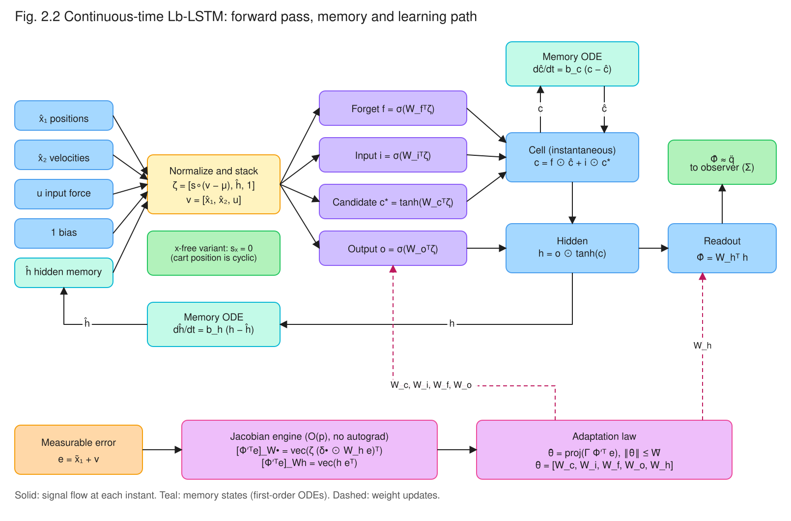
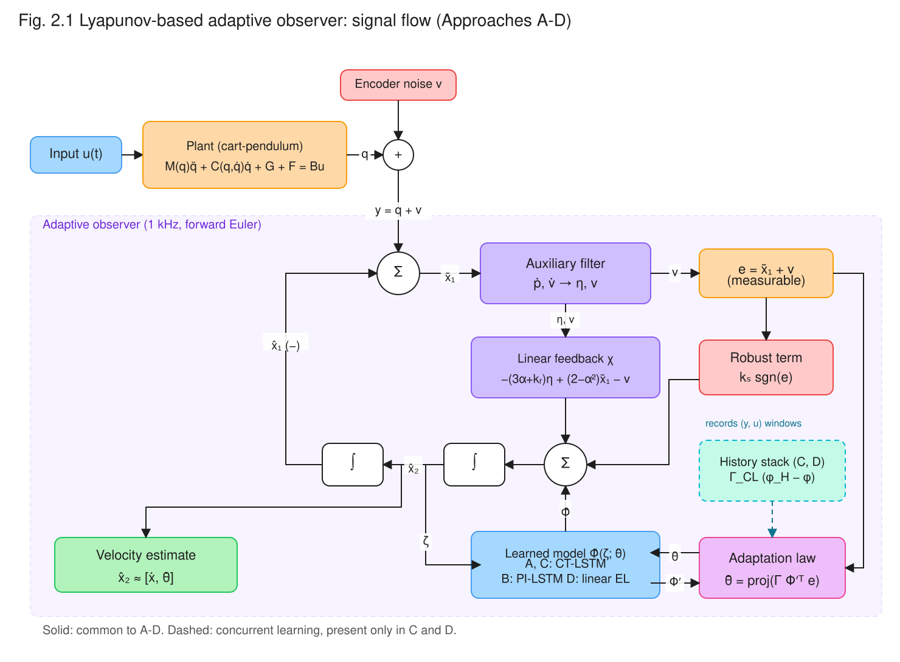
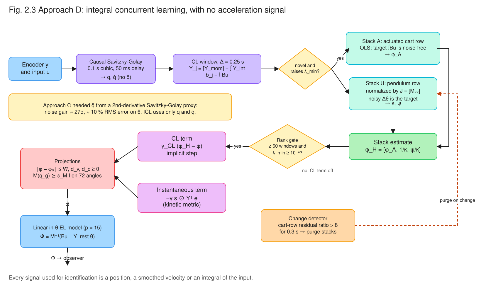

# Chapter 2 — Theoretical Foundations and Empirical Synthesis

*Lyapunov-based adaptive neural observers for uncertain Euler–Lagrange systems, from the
auxiliary-filter observer of Dinh et al. (2014) to the physics-structured integral
concurrent-learning observer (Approach D) of this project.*

This chapter does three things.

1. **It fixes the theory.** It restates the published observer lineage in one consistent notation
   and corrects three errors in the stability argument of our earlier survey:
   - an adaptation law driven by an unmeasurable signal;
   - a robustness step that assumed the sign of that signal;
   - a dimensionally inconsistent LSTM Jacobian.
2. **It tests the theory.** It confronts the corrected theory with a controlled benchmark of four
   observer designs (Approaches A–D) on the Feedback Instruments 33-936S cart–pendulum.
3. **It records the findings the theory did not predict:**
   - cyclic-coordinate inputs;
   - the collapse of parameter scale in underactuated rows;
   - the cost of acceleration proxies.

Every correction in §2.2 was checked symbolically or numerically before it was written down
(Appendix 2.B). Every number in §2.3 is read from the result files of the `feature/shared-benchmark`
and `feature/approach-*` branches. The bibliography in §2.4 cites only peer-reviewed or archival
sources, each checked against the publisher record or the paper itself.

---

## Contents

- [2.1 The observer lineage](#21-the-observer-lineage)
- [2.2 Mathematical rigor and filter formulation](#22-mathematical-rigor-and-filter-formulation)
- [2.3 Empirical realities: benchmarking Approaches A–D](#23-empirical-realities-benchmarking-approaches-ad)
- [2.4 Verified bibliography](#24-verified-bibliography)
- [Appendix 2.A Errata relative to the original survey](#appendix-2a-errata-relative-to-the-original-survey)
- [Appendix 2.B Verification and reproducibility](#appendix-2b-verification-and-reproducibility)

**Notation.**

- $\lVert\cdot\rVert$ is the Euclidean norm and $\lVert\cdot\rVert_1$ the 1-norm.
- $\odot$ is the Hadamard product, $\otimes$ the Kronecker product, and
  $D(a) = \mathrm{diag}(a)$.
- $\mathrm{vec}(\cdot)$ stacks *columns*, so
  $\partial\,\mathrm{vec}(AXB)/\partial\,\mathrm{vec}(X) = B^T \otimes A$.
- $\sigma_g$ is the logistic sigmoid and $\sigma_c = \tanh$.
- $\mathcal K[\cdot]$ is Filippov's differential inclusion [15], and "a.a.t." means almost all $t$.

The survey used different symbols; this chapter uses the following throughout:

| This chapter | Survey | Meaning |
|:---|:---|:---|
| $\tilde x_1 = y - \hat x_1$ | $\tilde x_{N-1}$ | Measurable position estimation error |
| $\nu$ | $\tilde x_f$ | Auxiliary filter output |
| $\eta$ | $\eta$ | Filter signal that replaces $\dot{\tilde x}_1$ |
| $r = \dot{\tilde x}_1 + \alpha\tilde x_1 + \eta$ | $r$ | **Unmeasurable** filtered estimation error |
| $e = \tilde x_1 + \nu$ | — | **Measurable** auxiliary error, with $r = \dot e + \alpha e$ |
| $k_s$ | $\beta_1$ | Gain of the robust $\mathrm{sgn}(\cdot)$ term |

---

## 2.1 The observer lineage

### 2.1.1 Four steps from shallow RNN to physics-informed LSTM

The designs studied here descend from one line of work at the University of Florida's Nonlinear
Controls and Robotics group. Each step keeps the same observer skeleton: an auxiliary dynamic
filter that manufactures a measurable error, a learned acceleration model, and a robust
$\mathrm{sgn}$ term. Each step changes the model class and, with it, the adaptation law.

1. **Dinh, Kamalapurkar, Bhasin & Dixon (2014) [1]** introduced the skeleton. A shallow
   dynamic (recurrent) neural network estimates the unknown dynamics online. A dynamic filter
   estimates the unmeasurable state. A sliding-mode-type term absorbs modelling error and
   disturbance. A Lyapunov analysis proves asymptotic convergence of the state estimates for
   high-order uncertain nonlinear systems, and the method was validated in simulation and
   experiment on a **two-link robot manipulator**.
2. **Griffis, Patil, Makumi & Dixon (2023) [2]** replaced the single-hidden-layer network with a
   **deep** recurrent network. Its nested nonlinearities make real-time weight adaptation hard.
   The paper derives a Lyapunov-based adaptation law for the deep architecture, driven by a
   filtered estimation error, which removes the full-state-feedback requirement. The Lyapunov
   analysis gives asymptotic convergence of the estimation errors. A companion paper [3] developed the
   continuous-time LSTM with Lyapunov-based adaptation of **all** its weights, but for a
   *tracking-control* problem with full-state feedback.
3. **Griffis, Patil, Hart & Dixon (2024) [4]** moved the continuous-time LSTM of [3] into the
   observer of [1]. The paper names the obstacle: in an observer "the observer error is unknown
   and cannot be used in the adaptation laws". It resolves this by driving the law with the
   measurable auxiliary error $e = \tilde x_1 + \nu$, which satisfies $r = \dot e + \alpha e$.
   - A nonsmooth Lyapunov analysis with a RISE-type $P$-function gives asymptotic convergence of
     $\hat x_2 \to x_2$.
   - On a **two-link robot manipulator**, the RMS angular-velocity error fell by 41.13 % against the
     adaptive shallow RNN observer of [1] (0.2270 vs 0.3856 deg/s).
4. **Hart, Griffis, Patil & Dixon (2024) [5]** made the LSTM **physics-informed**. Separate
   DNN + LSTM blocks estimate the inertia, Coriolis, potential and dissipation terms of the
   Euler–Lagrange equation. [5] is a **controller**, not an observer:
   - Tracking a trajectory on a two-link robot, it reports an RMS tracking error of 0.0185 rad,
     33.76 % better than a physics-informed DNN baseline.
   - Its adaptation laws and $\mathrm{sgn}$ term use $r = \dot e + \alpha e$ with
     $e = q - q_d$. That signal **is** measurable under full-state feedback.
   - It lists positive-definiteness of the learned inertia as future work.

The distinction between steps 3 and 4 matters for §2.2. The survey carried the control-setting
argument of [3], [5] (laws in $r$, domination with $\mathrm{sgn}(r)$) into the observer setting of
[1], [4], where $r$ contains the unmeasured velocity error.

**Table 2.1 — The published lineage.**

| | Dinh et al. 2014 [1] | Griffis et al. 2023 [2] | Griffis et al. 2024 [4] | Hart et al. 2024 [5] |
|:---|:---|:---|:---|:---|
| Venue | *Neural Networks* 60 | IFAC-PapersOnLine 56(2) | IEEE L-CSS 8 | IEEE L-CSS 8 |
| Task | State observer | State observer | State observer | Tracking controller |
| Learned model | Shallow dynamic NN | Deep RNN | Continuous-time LSTM, all weights adapted | Euler–Lagrange-structured DNN + LSTM blocks |
| Signal driving adaptation | Implementable filter signals | Filtered estimation error | $e = \tilde x_1 + \nu$ | $r = \dot e + \alpha e$ (measurable in control) |
| Robust term | Sliding-mode | Not examined | $k_s\,\mathrm{sgn}(e)$ | $\mathrm{sgn}(r)$ |
| Guarantee claimed | Asymptotic | Asymptotic | Asymptotic ($x_2 - \hat x_2 \to 0$), semi-global | Asymptotic tracking, semi-global |
| Physical structure | None | None | None | $M$, $V_m$, $G$, $F$ blocks |
| Benchmark | Two-link robot (simulation and experiment) | Numerical simulation | Two-link robot (simulation) | Two-link robot (simulation) |

The three papers whose benchmarks we examined, [1], [4] and [5], all use a fully actuated two-link
manipulator. The underactuated cart–pendulum used in this thesis is therefore a new setting for this
family of methods. §2.3.6 shows that it exposes an identifiability failure that cannot occur when
every coordinate is actuated.

### 2.1.2 How Approaches A–D extend the lineage

**Table 2.2 — The four approaches of this project.** All four share the filter and feedback
structure of §2.2 (Fig. 2.1); they differ in the learned model and in how it adapts.

| | Model $\hat\Phi$ | Parameters | Adaptation | Rank condition imposed on | Needs $\ddot q$ | True parameters exist |
|:---|:---|---:|:---|:---|:---:|:---:|
| **A** Black-box Lb-LSTM ([4] reproduced) | Continuous-time LSTM, $L = 16$ | 1440 | $\mathrm{proj}(\Gamma\Phi'^Te)$ | — | no | no |
| **B** Physics-informed PI-LSTM ([5] carried into an observer) | EL-structured: Cholesky $\hat M \succeq \epsilon_M I$, Christoffel $\hat V_m$, $\hat G = \nabla\hat P$, dissipative $\hat F$ | 398 | Instantaneous, kinetic metric | — | no | no |
| **C** Concurrent-learning Lb-LSTM | As A | 1440 | A's law plus a history-stack term [9], [10] | Readout only (32 of 1440) | yes (Savitzky–Golay proxy) | no |
| **D** Physics-structured integral CL (PI-ICL) | Linear-in-parameters EL model | 15 | Instantaneous plus integral CL [11] | **All** 15 | **no** | **yes** |

B adds what [5] deferred to future work: the inertia estimate is symmetric and positive definite
for *every* parameter value, by construction. D combines B's structure with C's history stack. It
writes every sub-model linearly in its parameters, so that the concurrent-learning rank condition
can hold on the whole parameter vector and the true plant lies inside the model class.

---

## 2.2 Mathematical rigor and filter formulation

### 2.2.1 Problem setting and the continuous-time LSTM

Consider the second-order system

$$\dot x_1 = x_2,\qquad \dot x_2 = g(x,u),\qquad y = x_1, \tag{2.1}$$

with $x = [x_1^T, x_2^T]^T \in \mathbb R^{2n}$, input $u \in \mathbb R^m$ and $g$ unknown. On the rig,
$x_1 = [x, \theta]^T$, $x_2 = [\dot x, \dot\theta]^T$, $u = F$, $n = 2$ and $m = 1$. As in [4], we
assume the following.

- **(A1)** $g$ is continuously differentiable.
- **(A2)** The input satisfies $\lVert u\rVert \le \bar u$ and $\lVert\dot u\rVert \le \bar{\dot u}$,
  and the state stays in a known compact set.
- **(A3)** $x_1$ is measured.

The encoder noise of the rig is outside the theory; its effect is measured in §2.3.

**Continuous-time LSTM.** The survey used $\bar c$ and $\bar h$ before defining them. We define
them here first.

Let $z \in \mathbb R^{l_1}$ be the network input. For Approach A,
$z = [\,s\odot([\hat x_1,\hat x_2,u]-\mu),\ \hat h,\ 1\,]$: a normalized state and input, the
hidden memory, and a bias. Let $W_f, W_i, W_c, W_o \in \mathbb R^{l_2\times l_1}$ be the gate
weights, $W_v \in \mathbb R^{n\times l_2}$ the readout, and $\hat c, \hat h \in \mathbb R^{l_2}$ the
memory states. The *instantaneous* gate network is

$$f = \sigma_g(W_f z),\quad i = \sigma_g(W_i z),\quad c^\ast = \sigma_c(W_c z),\quad o = \sigma_g(W_o z),$$

$$\bar c(z,\hat c;\theta) = f\odot\hat c + i\odot c^\ast,\qquad \bar h(z,\hat c;\theta) = o\odot\sigma_c(\bar c),\qquad \hat\Phi = W_v\,\bar h. \tag{2.2}$$

The memories are first-order low-pass copies of the instantaneous outputs, the continuous-time
analogue of the one-step delay of a discrete LSTM:

$$\dot{\hat c} = b_c(\bar c - \hat c),\qquad \dot{\hat h} = b_h(\bar h - \hat h). \tag{2.3}$$

Fig. 2.2 shows this data flow. $\hat\Phi$ is read from the instantaneous $\bar h$, not from the
memory state $\hat h$. This choice gives $\hat\Phi$ a non-zero partial derivative with respect to
every gate block (§2.2.6).



*Fig. 2.2 — Continuous-time Lb-LSTM. Inputs are normalized and stacked with the hidden memory and
a bias into $z$. The four gates produce the instantaneous cell $\bar c$ and hidden output $\bar h$.
The readout gives the acceleration estimate $\hat\Phi$. The memories $\hat c$ and $\hat h$ evolve by
first-order ODEs. The dashed path is learning: the measurable error $e$ and the forward-pass
quantities give $\Phi'^Te$ in $O(p)$ operations, and the adaptation law updates every weight block.
The green note marks the cart position's input scale, set to zero in the x-free variants (§2.3.5).*

### 2.2.2 Auxiliary filter and the measurable error

With $\tilde x_1 = y - \hat x_1$, the filter of [1], [4] is

$$\eta = p - (\alpha+k_r)\tilde x_1,\qquad \dot p = -(k_r+2\alpha)p - \nu + \big((\alpha+k_r)^2+1\big)\tilde x_1,\qquad \dot\nu = p - \alpha\nu - (\alpha+k_r)\tilde x_1, \tag{2.4}$$

with $p(0) = (\alpha+k_r)\tilde x_1(0)$ and $\nu(0) = 0$. Every signal in (2.4) is computable from
$y$. Substituting $p = \eta + (\alpha+k_r)\tilde x_1$ gives the two identities on which the whole
analysis rests:

$$\dot\nu = \eta - \alpha\nu, \qquad e \triangleq \tilde x_1 + \nu \ \Longrightarrow\ \dot e = r - \alpha e,\ \text{ i.e. }\ r = \dot e + \alpha e. \tag{2.5}$$

Here $r = \dot{\tilde x}_1 + \alpha\tilde x_1 + \eta$ contains $\dot{\tilde x}_1 = \tilde x_2$, the
velocity error the observer exists to estimate. So **$r$ is not measurable, but its filtered
version $e$ is.** Differentiating $\eta$ and substituting $\tilde x_2 = r - \alpha\tilde x_1 - \eta$
gives

$$\dot\eta = -(\alpha+k_r)\,r - \alpha\eta + \tilde x_1 - \nu. \tag{2.6}$$

This agrees with [4, Eq. (10)].

### 2.2.3 Feedback term consistent with the Lyapunov function

The observer is

$$\dot{\hat x}_1 = \hat x_2,\qquad \dot{\hat x}_2 = \hat\Phi + k_s\,\mathrm{sgn}(e) + \chi,\qquad \chi = -(3\alpha+k_r)\,\eta + (2-\alpha^2)\,\tilde x_1 - \nu. \tag{2.7}$$

Fig. 2.1 shows its signal flow. With (2.6) and (2.7), the filtered error obeys

$$\dot r = \big(g - \hat\Phi - k_s\,\mathrm{sgn}(e)\big) - k_r r - \tilde x_1 + (\alpha+k_r)\,\eta. \tag{2.8}$$

Take the **unweighted** function
$V_0 = \tfrac12\big(\lVert\tilde x_1\rVert^2 + \lVert\eta\rVert^2 + \lVert\nu\rVert^2 + \lVert r\rVert^2\big)$,
with $\dot{\tilde x}_1 = r - \alpha\tilde x_1 - \eta$. The cross terms $\tilde x_1^T\eta$,
$\eta^T\nu$, $\tilde x_1^Tr$ and $\eta^Tr$ then cancel exactly:

$$\dot V_0 = -\alpha\big(\lVert\tilde x_1\rVert^2 + \lVert\eta\rVert^2 + \lVert\nu\rVert^2\big) - k_r\lVert r\rVert^2 + r^T\big(g - \hat\Phi - k_s\,\mathrm{sgn}(e)\big). \tag{2.9}$$

Each term of $\chi$ removes one cross term:

- $-(3\alpha+k_r)\eta$ removes $\eta^Tr$;
- $(2-\alpha^2)\tilde x_1$ removes $\tilde x_1^Tr$;
- $-\nu$ removes the $\nu$ leak from (2.6).

> **Correction (survey Eq. (11)).** The survey's feedback term had coefficients that depended on
> a weight $\gamma$, but its Lyapunov function (32) was unweighted, so the two were inconsistent.
> The coefficient set in (2.7) is the one that belongs to the unweighted $V_0$.
>
> Griffis et al. [4] print $(\alpha^2+2)$ for the $\tilde x_1$ coefficient. With the filter (2.4)
> exactly as written, that choice leaves the residual $-2\alpha^2\,\tilde x_1^Tr$ in $\dot V_0$.
> SymPy gives this residual in closed form (Appendix 2.B). It is bounded and can be dominated by
> part of $k_r$ through Young's inequality, but it is not an exact cancellation. The rest of this
> chapter uses $(2-\alpha^2)$, which is also what `tests/test_blackbox_lstm.py` checks against the
> implemented vector field.



*Fig. 2.1 — Signal flow of the Lyapunov-based adaptive observer shared by Approaches A–D. The
auxiliary filter turns the measurable error $\tilde x_1$ into $\eta$ and $\nu$. The linear feedback
$\chi$, the robust term $k_s\,\mathrm{sgn}(e)$ and the learned model $\hat\Phi$ add up to
$\dot{\hat x}_2$. Adaptation is driven only by the measurable error $e$. The dashed history stack
exists only in the concurrent-learning designs C and D.*

### 2.2.4 Correction 1: an implementable adaptation law

**The defect.** The survey's law $\dot{\hat\Theta} = \mathrm{proj}(\Gamma\Phi'^Tr)$ (its Eq. (35))
uses $r$. Its "exact cancellation" of the weight-error cross term (Eqs. (34)–(35)) therefore holds
only if $r$ is available. In an observer, it is not (§2.2.2). The law is correct in the *control*
setting of [3], [5], where $r$ is built from measured $q$ and $\dot q$. It cannot be implemented
here.

**The law used in this thesis.** Following [4], adaptation is driven by the measurable error:

$$\dot{\hat\theta} = \mathrm{proj}\big(\Gamma\,\Phi'^T e\big),\qquad \Phi' = \frac{\partial\hat\Phi}{\partial\hat\theta},\qquad \Gamma = \Gamma^T \succ 0. \tag{2.10}$$

$\mathrm{proj}(\cdot)$ is the smooth projection of Pomet & Praly [13] (see also [14]) onto the ball
$\lVert\hat\theta\rVert \le \bar W$. Griffis et al. [4] use (2.10) without projection. Approach A
adds it as a safeguard, and the argument below covers both variants.

**How the weight error enters.** Write the model mismatch as

$$g - \hat\Phi = N_2 + N_3,\qquad N_3 \triangleq \Phi'\tilde\theta,\qquad N_2 \triangleq \big[\Phi(z,c;\theta^\ast) - \Phi(\hat z,\hat c;\theta^\ast)\big] + \mathcal O^2(\tilde\theta) + \varepsilon, \tag{2.11}$$

where:

- $\tilde\theta = \theta^\ast - \hat\theta$;
- $\theta^\ast$ are bounded ideal weights with $g = \Phi(z,c;\theta^\ast) + \varepsilon$ on the compact
  set;
- $\mathcal O^2$ collects the higher-order terms of the first-order Taylor expansion of $\hat\Phi$
  about $\hat\theta$, as in [4].

Augment the Lyapunov function with $\tfrac{\alpha}{2}\tilde\theta^T\Gamma^{-1}\tilde\theta$. Along
(2.10), the projection property $\tilde\theta^T\Gamma^{-1}(\mathrm{proj}(\tau)-\tau) \ge 0$ [14]
gives

$$\frac{d}{dt}\Big(\tfrac{\alpha}{2}\tilde\theta^T\Gamma^{-1}\tilde\theta\Big) = -\alpha\,\tilde\theta^T\Gamma^{-1}\dot{\hat\theta} \ \le\ -\alpha\,e^T\Phi'\tilde\theta = -\alpha\,e^TN_3.$$

Since $r = \dot e + \alpha e$, the cross term $r^TN_3$ in (2.9) splits as
$\dot e^TN_3 + \alpha e^TN_3$. The measurable law cancels **only the $\alpha e^TN_3$ half**. The
remainder $\dot e^TN_3$ is not cancelled. It is a bounded term, because $\tilde\theta$ is bounded
(by projection, or by the Lyapunov argument on a compact set), and it is dominated by the
robustness mechanism of §2.2.5 together with $N_2$. **The weight error is therefore handled by
boundedness and domination, not by an exact cancellation.** This is the precise sense in which
(2.10) replaces the survey's law.

> **Remark (an $r$-driven law is realizable, but not needed).** Since $r = \dot e + \alpha e$,
> integration by parts gives
> $\int_0^t\Gamma\Phi'^T r\,d\tau = \Gamma\Phi'^Te\big|_0^t - \int_0^t\Gamma\dot\Phi'^Te\,d\tau + \alpha\int_0^t\Gamma\Phi'^Te\,d\tau$.
> This is implementable when $\dot\Phi'$ is computable from measured signals, which requires
> $\dot u$ and the second derivatives of the network. The resulting law restores the exact
> cancellation, but it cannot be combined directly with projection. It is not used in this
> project.

### 2.2.5 Correction 2: robustness through the RISE integral lemma

**The defect.** The observer injects $k_s\,\mathrm{sgn}(e)$ (2.7). The survey's robustness step
(its Eq. (36)) bounds $\lvert r\rvert\bar D - k_s\,r\,\mathcal K[\mathrm{sgn}(r)]$, which assumes
the feedback acts through $\mathrm{sgn}(r)$. With $\mathrm{sgn}(e)$ acting on $r$, the
pointwise product $r^T(N - k_s\,\mathrm{sgn}(e))$ can be positive for any $k_s$, because $r$ and
$e$ need not share signs at a given instant. **The condition $k_s \ge \bar D$ does not give
domination.** Domination holds only *in integral*, because $e$ is a filtered version of $r$. That
is the content of the RISE lemma of Xian et al. [6].

**Lemma 2.1 (RISE integral bound, after [6]).** Let $e$ be absolutely continuous with
$r = \dot e + \alpha e$, $\alpha > 0$. Let $N_B$ and $N_D$ be signals with
$\lVert N_B\rVert \le \zeta_1$, $\lVert N_D\rVert \le \zeta_2$ and
$\lVert\dot N_B + \dot N_D\rVert \le \zeta_3$. Define

$$L(t) \triangleq r^T\big(N_B + N_D - k_s\,\mathrm{sgn}(e)\big) - \alpha\,e^TN_D.$$

If

$$k_s \ \ge\ \max\Big\{\zeta_1 + \zeta_2,\ \ \zeta_1 + \tfrac{1}{\alpha}\,\zeta_3\Big\}, \tag{2.12}$$

then

$$\int_0^t L(\tau)\,d\tau \le k_s\lVert e(0)\rVert_1 - e(0)^T\big(N_B(0)+N_D(0)\big) \triangleq \zeta_b\quad\text{for all } t \ge 0.$$

*Proof.* Substitute $r = \dot e + \alpha e$. The $\alpha e^TN_D$ terms cancel. Integrate
$\dot e^T(N_B + N_D)$ by parts and use $\int_0^t\dot e^T\mathrm{sgn}(e)\,d\tau = \lVert e(t)\rVert_1 - \lVert e(0)\rVert_1$:

$$\int_0^tL\,d\tau = \Big[e^T(N_B+N_D)\Big]_0^t - \int_0^t e^T(\dot N_B+\dot N_D)\,d\tau - k_s\big(\lVert e(t)\rVert_1 - \lVert e(0)\rVert_1\big) + \alpha\int_0^t e^TN_B\,d\tau - \alpha k_s\int_0^t\lVert e\rVert_1\,d\tau.$$

With $\lvert e^Tv\rvert \le \lVert e\rVert_1\lVert v\rVert$:

$$\int_0^tL\,d\tau \le \lVert e(t)\rVert_1\,(\zeta_1+\zeta_2-k_s) + \alpha\int_0^t\lVert e\rVert_1\Big(\zeta_1 + \tfrac{\zeta_3}{\alpha} - k_s\Big)d\tau + \zeta_b.$$

Both brackets are non-positive under (2.12). ∎

In the observer, take $N_B = N_2$ and $N_D = N_3$ from (2.11). The $-\alpha e^TN_3$ term in $L$ is
exactly the contribution of the $\tilde\theta$ term of §2.2.4. Define the auxiliary function

$$P(t) \triangleq \zeta_b - \int_0^t L(\tau)\,d\tau \ \ge\ 0, \qquad \dot P = -L. \tag{2.13}$$

**Proposition 2.1 (convergence of the corrected observer).** Let (A1)–(A3) hold and let the
ideal weights be bounded. Consider (2.4), (2.7) and (2.10), with

$$V \triangleq V_0 + \tfrac{\alpha}{2}\tilde\theta^T\Gamma^{-1}\tilde\theta + P.$$

Let $\xi = [\tilde x_1^T, \eta^T, \nu^T, r^T, \tilde\theta^T, \sqrt P]^T$. Suppose the bounds
$\zeta_{1,2,3}$ of Lemma 2.1 hold for $N_B = N_2$ and $N_D = N_3$ whenever $\xi$ lies in the ball
$\mathcal S = \{\lVert\xi\rVert < \omega\}$, and that $k_s$ satisfies (2.12). If
$\xi(0) \in \mathcal D = \{\lVert\xi\rVert < \sqrt{\beta_1/\beta_2}\,\omega\}$, where
$\beta_1\lVert\xi\rVert^2 \le V \le \beta_2\lVert\xi\rVert^2$, then:

1. $\xi(t)$ stays in $\mathcal S$, and all signals remain bounded;
2. $\tilde x_1, \eta, \nu, r \to 0$;
3. hence $\tilde x_2 = r - \alpha\tilde x_1 - \eta \to 0$.

The result is semi-global. $\omega$ can be chosen as large as desired, at the price of larger
bounds $\zeta_i$ and hence a larger $k_s$.

*Proof sketch.* By (2.9), §2.2.4 and (2.13), the $N_2$, $N_3$ and $\mathrm{sgn}(e)$ terms cancel
against $\dot P = -L$. For almost all $t$ with $\xi \in \mathcal S$:

$$\dot V \le -\alpha\big(\lVert\tilde x_1\rVert^2 + \lVert\eta\rVert^2 + \lVert\nu\rVert^2\big) - k_r\lVert r\rVert^2.$$

So $V$ is non-increasing, and $\lVert\xi(t)\rVert \le \sqrt{\beta_2/\beta_1}\,\lVert\xi(0)\rVert < \omega$,
which keeps $\xi$ in $\mathcal S$ and the bounds valid. $V$ is locally Lipschitz, and the closed
loop is a differential inclusion because of $\mathrm{sgn}(e)$. The nonsmooth LaSalle–Yoshizawa
corollary of Fischer, Kamalapurkar & Dixon [8], with the chain rule of Shevitz & Paden [16],
therefore gives $y = [\tilde x_1^T,\eta^T,\nu^T,r^T]^T \to 0$. ∎

> **What the proposition does *not* give.**
>
> - **Parameter convergence.** $\tilde\theta$ is only bounded: $\dot V$ contains no
>   $-\lVert\tilde\theta\rVert^2$ term.
> - **Exponential convergence.** The survey claimed it, but no step of the argument yields it.
>   An exponential variant needs a modified $P$-function [7].
>
> Griffis et al. [4] use the exponentially weighted $P$-function of [7] and obtain the related
> condition $k_s \ge \kappa_1 + \kappa_2 + (\alpha\kappa_2+\kappa_3)/(\alpha-1)$ with $\alpha > 1$.
> Lemma 2.1 is the classical form of [6], which the corrected survey argument requires.

**What happens in practice.** The bounds $\zeta_{1,2,3}$ are dominated by the *unlearned* model
early in a run: the acceleration mismatch is of order 1 rad/s² on the rig. Meeting (2.12) would
need a $k_s$ large enough to inject substantial encoder noise through $\mathrm{sgn}(e)$, where $e$
is noise-dominated at steady state. Every tuned configuration in this project runs **below**
(2.12): $k_s = 0.2$ in A–D, and $k_s = 0.05$ in [4]. Raising it made results worse (Approach A's
tuning notes). The operating regime is therefore **uniform ultimate boundedness**:

- the linear feedback $\chi$ and the learned $\hat\Phi$ do the work;
- the residual set shrinks as $\hat\Phi \to g$ along the trajectory;
- the asymptotic statement of Proposition 2.1 describes the limit of a perfect model, not the
  tuned observer.

### 2.2.6 Correction 3: LSTM Jacobians

With $a_\bullet = W_\bullet z$ and column-stacking $\mathrm{vec}$,
$\partial a_\bullet/\partial\,\mathrm{vec}(W_\bullet) = z^T \otimes I_{l_2}$. This matrix is
$l_2 \times l_1l_2$. Applying the chain rule to (2.2), with the memories $(\hat c, \hat h)$ held
fixed, gives the following blocks.

$$\frac{\partial\bar h}{\partial\,\mathrm{vec}(W_o)} = D\big(\sigma_c(\bar c)\big)\,D\big(\sigma_g'(W_oz)\big)\,\big(z^T\otimes I_{l_2}\big), \tag{2.14}$$

$$\frac{\partial\bar h}{\partial\,\mathrm{vec}(W_\bullet)} = S\,\frac{\partial\bar c}{\partial\,\mathrm{vec}(W_\bullet)},\quad S \triangleq D(o)\,D\big(\sigma_c'(\bar c)\big),\quad \bullet\in\{f,i,c\}, \tag{2.15}$$

$$\frac{\partial\bar c}{\partial\,\mathrm{vec}(W_f)} = D(\hat c)\,D\big(\sigma_g'(W_fz)\big)(z^T\otimes I_{l_2}),\quad \frac{\partial\bar c}{\partial\,\mathrm{vec}(W_i)} = D(c^\ast)\,D\big(\sigma_g'(W_iz)\big)(z^T\otimes I_{l_2}),\quad \frac{\partial\bar c}{\partial\,\mathrm{vec}(W_c)} = D(i)\,D\big(\sigma_c'(W_cz)\big)(z^T\otimes I_{l_2}), \tag{2.16}$$

$$\Phi'_{W_\bullet} = W_v\,\frac{\partial\bar h}{\partial\,\mathrm{vec}(W_\bullet)},\qquad \Phi'_{W_v} = \bar h^T\otimes I_n. \tag{2.17}$$

> **Correction (survey Eq. (27)).** The survey gave
> $\partial h/\partial\,\mathrm{vec}(\hat W_o) = D(\sigma_c(c))\,D(\sigma_g'(\hat W_oz))$, which is
> $l_2\times l_2$ and cannot equal a derivative with respect to an $l_1l_2$-vector. It is also
> inconsistent with the survey's own Eq. (29). The missing factor is
> $\big(z^T\otimes I_{l_2}\big)$, restored in (2.14).
>
> Griffis et al. [4] and Hart et al. [5] write the gates as $W^T\zeta$, with $W \in \mathbb R^{l_1\times l_2}$
> and *row*-stacking $\mathrm{vec}$. In that convention the same factor appears as
> $(I_{l_2}\otimes\zeta^T)$. The two expressions are the same derivative in different memory
> layouts.

> **Caveat (survey Eqs. (26)–(29)).** $\Phi'$ is the Jacobian of the *static* map
> $(z, \hat c) \mapsto \hat\Phi$ with the memories treated as inputs. It is not the full
> sensitivity of $\hat\Phi(t)$ to $\theta$: that would also propagate $\partial\hat c/\partial\theta$
> and $\partial\hat h/\partial\theta$ through (2.3), as backpropagation-through-time or real-time
> recurrent learning do. The static Jacobian is the standard choice in [3], [4], [5] and in this
> project's `jacobian_engine.py`. It is an approximation, and the survey should not have presented
> it as the exact gradient.

**Cost.** The observer needs only the product $\Phi'^Te$, never $\Phi'$ itself. Since
$(z\otimes I_{l_2})w = \mathrm{vec}(wz^T)$,

$$\big[\Phi'^Te\big]_{W_\bullet} = \mathrm{vec}\Big(\big(\delta_\bullet\odot W_v^Te\big)\,z^T\Big),\qquad \big[\Phi'^Te\big]_{W_v} = \mathrm{vec}\big(e\,\bar h^T\big), \tag{2.18}$$

where $\delta_\bullet$ is the diagonal of the corresponding product of $D(\cdot)$ factors:

- $\delta_o = \sigma_c(\bar c)\odot\sigma_g'(W_oz)$;
- $\delta_f = o\odot\sigma_c'(\bar c)\odot\hat c\odot\sigma_g'(W_fz)$;
- $\delta_i$ and $\delta_c$ follow the same pattern from (2.16).

Each block costs $O(l_1l_2)$, so the whole product costs $O(p)$. For $L = 16$ that is 1440 weights
per step at 1 kHz, with no automatic differentiation. Appendix 2.B checks (2.14)–(2.18) against
central finite differences, with a largest error of $7.6\times10^{-11}$.

### 2.2.7 Further corrections to the survey

| Survey item | Issue | Correct statement |
|:---|:---|:---|
| Eq. (44), EKF prediction | $P_{k\mid k-1} = F_kPF_k^T + Q_k$ used the continuous Jacobian $F_k = \partial f/\partial x$ | Use the discrete transition $F_k \approx I + T_s\,\partial f/\partial x\rvert_{\hat x_k}$, or integrate the continuous Riccati equation between samples. |
| Eq. (45) and table, high-gain observer (HGO) noise | "Noise amplification $1/\epsilon^N$" (and elsewhere $1/\epsilon^2$), unqualified | For an $N$-th order HGO, the estimate of the $i$-th state carries measurement-noise gain $O(\epsilon^{-(i-1)})$ [12]. The velocity estimate ($i = 2$) is $O(1/\epsilon)$. Peaking of the $i$-th state is likewise $O(\epsilon^{-(i-1)})$. |
| Eq. (42), pendulum model | $(J + ml^2)\ddot\theta$ implies $J$ about the centre of mass | Consistent as written. The project's plant docstring calls $I$ the inertia "about the pivot" while using $(I + ml^2)$; the label is wrong, the numbers are self-consistent. |
| Discretization, not discussed | Continuous-time theory, discrete implementation | Every observer here is integrated by forward Euler at $T_s = 1$ ms. At $\alpha = 4$, $k_r = 8$, the linear error modes are $\{-4.03\pm0.08j,\ -5.97\pm11.95j\}$, so $T_s\lvert\lambda\rvert_{\max} = 0.013 \ll 2$. The memory filters add $T_sb_{c,h} = 0.005$. $\mathrm{sgn}(e)$ produces a discrete ripple of size about $k_sT_s = 2\times10^{-4}$ in $\hat x_2$, below the noise floor. |

---

## 2.3 Empirical realities: benchmarking Approaches A–D

### 2.3.1 Protocol

Each approach branch validated its method on its own scenario, so the branch-level numbers are
not comparable. The shared benchmark runs all four approaches, unchanged and with their branch
defaults, on every branch's home scenario. It uses the same seeds and metrics, plus held-out
inputs that no branch was tuned on.

| | Home of | Setting | Encoder noise |
|:---|:---|:---|:---|
| S1 | A | Hanging pendulum, $u = 2\sin1.5t + 1.2\cos3t$, $\theta_0 = \pi-0.4$, 50 s | U(±0.5°) |
| S2 | B | Swing-through from 0.5 rad off upright, $u = 2\sin3t + 1.2\cos6t$, pendulum mass and inertia +50 % at 25 s, 50 s | U(±1°) |
| S3 | C | Weak, non-PE excitation $u = 3e^{-t/8}\sin1.6t$, hanging, 60 s | U(±0.5°) |

**Held-out inputs** H1–H4 were defined before any result existed:

- H1: a filtered square wave;
- H2: a random-phase multisine on frequencies absent from all training inputs;
- H3: a 0.1–0.6 Hz chirp;
- H4: a pulse train.

Each runs for 12 s from the hanging equilibrium, on the plant each model ended its training on.

**Metrics.** Five seeds per scenario; each seed changes the noise realization and the
initialization. Tables report medians.

- Velocity RMSE is taken over the steady window (last 15 s) and the transient window (0.1–5 s).
- The peak $\dot\theta$ error is taken over 0.1–2 s.
- For prediction, each model is frozen at the end of training and decoupled from its observer.
  - One-step NMSE of $\ddot\theta$ is evaluated on the true states.
  - The 0.5 s NMSE of $\theta$ restarts the frozen model from the true state every 0.5 s.
  - NMSE is MSE divided by the variance of the truth, so predicting the mean scores 1.

**Model variants.** "A-x" and "C-x" are A and C with the cart position removed from the network
input (§2.3.5).

### 2.3.2 Steady-state velocity reconstruction

**Table 2.3 — Steady-window velocity RMSE** (last 15 s; median of 5 seeds; no run diverged).
Bold marks the best in each column.

| Model | S1 $\dot\theta$ [rad/s] | S2 $\dot\theta$ | S3 $\dot\theta$ | S1 $\dot x$ [m/s] | S2 $\dot x$ | S3 $\dot x$ |
|:---|---:|---:|---:|---:|---:|---:|
| A | 0.0149 | 0.0359 | 0.0100 | 0.0021 | 0.0057 | 0.0019 |
| A-x | 0.0143 | 0.0389 | 0.0100 | 0.0023 | 0.0046 | 0.0018 |
| B | **0.0094** | 0.0202 | **0.0094** | **0.0018** | 0.0025 | 0.0018 |
| C | 0.0135 | 0.0662 | **0.0094** | **0.0018** | 0.0043 | **0.0017** |
| C-x | 0.0162 | 0.0691 | **0.0094** | 0.0019 | 0.0039 | **0.0017** |
| D | 0.0295 | **0.0187** | 0.0148 | 0.0019 | **0.0018** | 0.0018 |


- **B is the most reliable velocity estimator.** It is best or tied on both hanging scenarios and
  within 8 % of the best on S2.
- **D is best when the data are rich and worst when they are not.**
  - On S2 the swing-through sweeps the configuration space, and D has the lowest $\dot\theta$ and
    $\dot x$ error of any model.
  - On S1, with swings of ±0.4 rad about the hanging equilibrium, the cart–pendulum coupling
    carries little information about the pendulum scale, and D's $\dot\theta$ RMSE is 3× B's.
  - §2.3.6 explains why.
- **All models reach the encoder-limited regime on S3.** The $\dot\theta$ RMSE is 0.009–0.015 rad/s
  for every model.

For scale, a 20 ms dirty derivative on S1 gives a steady $\dot\theta$ RMSE of 0.244 rad/s
(Approach A validation): one to two orders of magnitude worse than any observer here.

### 2.3.3 Transient behaviour and recovery from a plant change

**Table 2.4 — Transient and recovery metrics** (median of 5 seeds). Post-step RMSE is over
25–30 s of S2, right after the +50 % mass and inertia step.

| Model | $\dot\theta$ RMSE 0.1–5 s, S1 | S2 | S3 | Peak $\lvert\tilde{\dot\theta}\rvert$ 0.1–2 s, S1 | S2 | S3 | Post-step $\dot\theta$ RMSE, S2 |
|:---|---:|---:|---:|---:|---:|---:|---:|
| A | 0.059 | 0.166 | 0.052 | 0.176 | **0.439** | 0.129 | 0.0462 |
| A-x | 0.058 | 0.174 | 0.052 | 0.176 | 0.469 | 0.129 | 0.0516 |
| B | **0.053** | **0.148** | **0.043** | **0.170** | 0.459 | **0.124** | 0.0218 |
| C | 0.058 | 0.157 | 0.044 | 0.176 | 0.456 | 0.129 | 0.0787 |
| C-x | 0.057 | 0.160 | 0.044 | 0.176 | 0.483 | 0.129 | 0.0890 |
| D | 0.073 | 0.174 | 0.068 | 0.180 | 0.533 | 0.130 | **0.0179** |

- **Every learned observer has a start-up transient.** The peak error is 0.12–0.53 rad/s, against
  steady RMSE of 0.009–0.07 rad/s.
  - It is not high-gain peaking: no gain is scaled up.
  - It is a **model-learning transient**, lasting until $\hat\Phi$ has adapted.
  - Projection bounds the weights; it does not bound this transient.
  - A significance-gated warm start of the cart channel (shared benchmark, improvement 3) cuts the
    cart transient 1.2–15×, yet leaves the pendulum transient unchanged. That is further evidence
    that the pendulum transient is set by model learning, not by initialization.
- **Recovery ranks by structure.** After the plant step:
  - D recovers best: it detects the change in 0.45–0.50 s, purges its stacks and re-identifies.
  - B is second.
  - C is worst, because its history stack still holds pre-step windows and it has no change
    detector.

  In Approach D's own run of S2, the peak $\dot\theta$ error in 25–27 s is 0.110 (A), 0.054 (B)
  and 0.045 rad/s (D).
- **D pays for identification with its initial transient.** Its peak of 0.533 rad/s on S2 is the
  largest. It starts from a weak prior with a small instantaneous gain, and concurrent learning
  switches on only when the rank gate opens, about 3 s in.

### 2.3.4 Out-of-distribution prediction

**Table 2.5 — Held-out prediction** (median over H1–H4 × 5 seeds; models frozen at the end of
each training scenario).

| Model | One-step $\ddot\theta$ NMSE, S1 | S2 | S3 | 0.5 s $\theta$ NMSE, S1 | S2 | S3 |
|:---|---:|---:|---:|---:|---:|---:|
| A | 2.33 | 80.7 | 1.84 | 0.161 | 6.49 | 0.170 |
| A-x | 1.67 | 20.4 | 0.917 | 0.129 | 1.11 | 0.057 |
| B | **0.046** | 0.061 | **0.179** | **0.0055** | 0.0058 | **0.012** |
| C | 2.41 | 108.7 | 1.80 | 0.159 | 9.44 | 0.096 |
| C-x | 0.884 | 14.4 | 0.326 | 0.085 | 0.887 | 0.029 |
| D | 0.268 | **0.0039** | 0.301 | 0.026 | **0.00018** | 0.031 |


- **Structure generalizes; black boxes do not.** B and D are one to four orders of magnitude
  better than A and C on inputs they never saw.
  - After S2, A's and C's NMSE of 80–110 is far worse than predicting the mean.
  - Good online velocity estimation does not imply a usable model. The adaptation law needs
    $\hat\Phi = g$ only *along the visited trajectory*.
- **D after S2 is the best model in the benchmark.** Its one-step $\ddot\theta$ NMSE is 0.004 and its
  0.5 s $\theta$ NMSE is 0.0002: effectively the true rigid-body model, identified from rich data.
- **B is best after hanging-only data** (S1, S3). D's extra structure buys exact identification
  only when the data are informative enough to pin down every parameter.

### 2.3.5 The cyclic-coordinate discovery

**Physics.** The rig's Lagrangian does not depend on the cart position:
$\partial\mathcal L/\partial x = 0$, so $x$ is a *cyclic* coordinate. Hence $M$, $C$ and $G$, and
the acceleration field $g$, are invariant under translations of $x$. B and D build this in: their
features are $\rho(q) = [1, \cos\theta, \sin\theta]$, with no $x$. The black-box networks of A and C
receive $x$ as an input.

A training run visits only a narrow band of cart positions. A test that drives the cart elsewhere
forces the network to extrapolate along a direction in which the true dynamics are constant, and
an unconstrained approximator has no reason to be constant there.

**The intervention.** Set the input scale of $x$ to zero, $s_x = 0$ (Fig. 2.2, green note). This
is a one-line change that imposes the translation symmetry exactly. The observer still uses
$\hat x_1$ in its error signals; only the *model input* loses $x$.

**Table 2.6 — Effect of removing the cart position** (ratio of original to x-free median NMSE;
values above 1 mean the x-free model is better).

| | S1 | S2 | S3 |
|:---|---:|---:|---:|
| A / A-x, one-step $\ddot\theta$ NMSE | 1.40× | 3.96× | 2.01× |
| C / C-x, one-step $\ddot\theta$ NMSE | 2.73× | 7.53× | 5.51× |
| A / A-x, 0.5 s $\theta$ NMSE | 1.25× | 5.86× | 3.01× |
| C / C-x, 0.5 s $\theta$ NMSE | 1.87× | 10.65× | 3.28× |
| Steady $\dot\theta$ RMSE, x-free minus original (difference of medians), A / C [rad/s] | −0.0006 / +0.0027 | +0.0030 / +0.0029 | 0.0000 / 0.0000 |

- **Held-out one-step $\ddot\theta$ prediction improves 1.4× to 7.5× in median**, and improves in
  26 of 30 (model, scenario, seed) cases. The largest gains come after S2, whose swing-through
  drove the cart furthest from the test positions.
- **Online velocity estimation is essentially unchanged**, within 0.003 rad/s. The observer
  feedback compensates for the model either way; the input matters when the model runs on its own.
- **C-x is the best black box on held-out prediction in every scenario.** Concurrent learning and
  the symmetry prior are complementary.

**Design rule.** A black-box model of a mechanical system must not receive cyclic coordinates as
inputs. The structured models of B and D obey this rule by construction; for black boxes it has to
be imposed.

### 2.3.6 Approach D: resolving underactuated parameter collapse without acceleration proxies

Approach D models the rig as a linear-in-parameters Euler–Lagrange system,
$Y(q,\dot q,\ddot q)\theta = Bu$. With first harmonics, $p = 15$ parameters, and the true rig is one
point of the family:

- $m_{11} = M+m$;
- $m_{12} = ml\cos\theta$;
- $m_{22} = I+ml^2$;
- $P = mgl\cos\theta$;
- viscous friction.

It reproduces the plant's accelerations to $10^{-15}$. Parameter convergence therefore has a
concrete meaning here, which it cannot have for the LSTMs of A–C: their "ideal weights" are neither
unique, because of permutation and gate symmetries, nor exact, because $\varepsilon \ne 0$.

**(a) Removing the acceleration proxy.** Concurrent learning needs a residual at stored data
points. Approach C used the point residual $\ddot x(t_j) - \hat\Phi(t_j)$, and $\ddot x$ is never
measured. C therefore fitted a causal Savitzky–Golay polynomial [18] (0.25 s, cubic) and
differentiated it twice.

- **Its noise gain is $\approx 26.9\,\sigma$.** On the training data the proxy's RMS error was
  0.14 rad/s², **about 10 % of the RMS $\ddot\theta$**.
- **Integral concurrent learning removes the need for $\ddot q$** [11]. Because
  $\frac{d}{dt}(M\dot q) - \tfrac12\partial_q(\dot q^TM\dot q) = M\ddot q + C\dot q$, integrating
  the equations of motion over a window $[t-\Delta, t]$ gives

$$\underbrace{\big[Y_{\mathrm{mom}}\big]_{t-\Delta}^{t} + \int_{t-\Delta}^{t}Y_{\mathrm{int}}\,d\tau}_{\mathcal Y_j}\ \theta^\ast = \underbrace{\int_{t-\Delta}^{t}Bu\,d\tau}_{b_j}. \tag{2.19}$$

- **(2.19) needs only positions, velocities and the input integral.** The input integral is exact
  because $u$ is held constant over each sample. The velocities come from a Savitzky–Golay
  smoother (0.1 s, evaluated 50 ms back) with noise gain 8.5. Over the same window a second
  derivative would have gain of about 260. On the true trajectory, (2.19) holds to $5\times10^{-5}$.
- **An honest caveat.** In Approach C, replacing the proxy with the true accelerations barely
  changed the stack fit. C's binding constraint was elsewhere, as explained in (c). ICL matters in
  D because D's identification is otherwise noise-limited, as shown in (b).

**(b) The collapse of the pendulum-row scale.** The pendulum equation has no input ($B_2 = 0$):

$$ml\cos\theta\,\ddot x + (I+ml^2)\,\ddot\theta - mgl\sin\theta + d\,\dot\theta = 0.$$

Its ICL rows are therefore **homogeneous**: $\mathcal Y_{2,j}\theta^\ast = 0$. Least squares with
noisy regressors $\hat{\mathcal Y} = \mathcal Y + E$, where $E$ is zero-mean with covariance
$\Sigma_E$, minimizes

$$\textstyle\sum_j\lVert\hat{\mathcal Y}_{2,j}\theta\rVert^2 \approx \theta^T\big(\mathcal Y_2^T\mathcal Y_2 + N\Sigma_E\big)\theta.$$

The noise acts as a Tikhonov penalty pulling the row's parameters towards $\theta = 0$. This is
errors-in-variables attenuation [19]. Only the coupling inertia $ml$, pinned by the actuated cart
row, resists. The ratio $\omega^2 = mgl/(I+ml^2)$ survives; the absolute scale does not.

**Table 2.7 — Pendulum-row identification from the same windows (batch fit).**

| Windows built from | $I+ml^2$ (true 0.1288) | $mgl$ (true 0.812) | $mgl/(I+ml^2)$ (true 6.31) |
|:---|---:|---:|---:|
| True states | 0.1288 | 0.812 | 6.31 |
| Smoothed, noise-free encoder | 0.1288 | 0.812 | 6.31 |
| Smoothed, noisy encoder, plain least squares | **0.0197** | **0.118** | 6.0 |
| Smoothed, noisy encoder, **row-normalized** (D) | **0.1299** | **0.788** | 6.07 |

Smoothing is not the problem; noise is. Approach B hit the same limit: its learned $\hat M_{22}$
kept the right ratio and the wrong scale, for a 16 % inertia error. The survey does not discuss
this failure, and it cannot arise on the fully actuated manipulators of [1], [4], [5].

**The fix** is to normalize each unactuated row by its own diagonal inertia $J = [M_{22}]_{\mathrm{const}}$
and take the shared coupling columns from the cart-row estimate $\phi_A$:

$$\kappa\,z_j + \sum_{c\ \text{own}}\mathcal Y_{2c,j}\,\psi_c = -\mathcal Y_{2J,j},\qquad \kappa = 1/\phi_J,\quad \psi_c = \phi_c/\phi_J,\quad z_j = \sum_{c\ \text{shared}}\mathcal Y_{2c,j}\,\phi_{A,c}. \tag{2.20}$$

The noisy momentum term $\mathcal Y_{2J} = \Delta\dot\theta$ becomes the **target**, and noise in the
target causes no bias. The regressors are built from positions and from $\dot x$, whose smoothed
estimate on this rig is about 70× less noisy than $\dot\theta$. The construction applies to any
underactuated Euler–Lagrange system:

- actuated rows use ordinary least squares;
- each unactuated row is normalized and anchored through its coupling to the actuated rows;
- if a row shares no parameter with the actuated rows, its scale is unobservable, and the
  implementation refuses it.

Fig. 2.3 shows the pipeline.



*Fig. 2.3 — Approach D's identification pipeline. Encoder data are smoothed to positions and
velocities only. The data are integrated over 0.25 s windows into the ICL identity (2.19). The
windows are admitted to two history stacks by a novelty and minimum-singular-value test. The
actuated row is solved by ordinary least squares with a noise-free target. The unactuated row is
solved in the normalized form (2.20). The combined estimate $\phi_H$ drives the concurrent-learning
term once the rank gate opens. Projections keep the inertia positive definite and the friction
dissipative. A residual-based detector purges the stacks after a plant change.*

**(c) Where the rank condition can hold.** The concurrent-learning information matrix
$\Omega = \sum_{j=1}^N\mathcal Y_j^T\mathcal Y_j$ has rank at most $nN$. The rank condition
$\lambda_{\min}(\Omega) > 0$ [9], [11] therefore needs $nN \ge p$ at the very least.

| Approach | Parameter set | Required stored points |
|:---|:---|:---|
| C, full LSTM | $p = 1440$ | $N \ge 720$ informative points: not achievable |
| C, as implemented | Readout only, $p = 32$ | $N \ge 16$; reached 2.5 s into training. The gate weights (1408) receive the concurrent-learning gradient without an excitation guarantee |
| D | All $p = 15$ parameters, split into an actuated stack and a normalized unactuated stack | Gated on at least 60 windows and $\lambda_{\min} \ge 10^{-4}$; the gate opens about 3 s after start and after each purge |

**(d) Convergence.** Let $\tilde\phi = \phi^\ast - \phi$ be the scaled parameter error. The law is

$$\dot\phi = -\gamma\,s\odot Y^Te + \gamma_{CL}(\phi_H - \phi),$$

where the first term is the gradient of $\tfrac12e^T\hat Me$, i.e. B's kinetic metric. Take

$$V = V_0 + P + \tfrac{\beta}{2}\lVert\tilde\phi\rVert^2,\qquad \beta \le \frac{\alpha\gamma_{CL}}{2\gamma^2c^2},$$

with $V_0 + P$ as in §2.2, and apply Young's inequality. This gives

$$\dot V \le -\tfrac{\alpha}{2}\big(\lVert\tilde x_1\rVert^2 + \lVert\nu\rVert^2\big) - \alpha\lVert\eta\rVert^2 - k_r\lVert r\rVert^2 - \tfrac{\beta\gamma_{CL}}{2}\lVert\tilde\phi\rVert^2 + \beta\gamma_{CL}\lVert\phi^\ast - \phi_H\rVert^2.$$

- **With exact windows** ($\phi_H = \phi^\ast$), the state *and* parameter errors converge without
  persistence of excitation. The noise-free test recovers all four rigid-body parameters to within
  5 % before and after a +50 % step.
- **With noise**, the system is uniformly ultimately bounded, with
  $\limsup\lVert\tilde\phi\rVert \lesssim \lVert\phi^\ast - \phi_H\rVert$. The normalization in (b)
  is what keeps that right-hand side small.
- **Caveat.** Projection is applied at discrete steps, and $\phi_H$ jumps when windows are swapped,
  so the sketch applies stack configuration by stack configuration.

**Table 2.8 — Identification on S2** (5 seeds; median [min, max] relative error of D's physical
parameters).

| | $M+m$ | $ml$ | $I+ml^2$ | $mgl$ |
|:---|:---:|:---:|:---:|:---:|
| D @ 25 s (before the step) | 0.0 % [0.0, 0.2] | 0.3 % [0.1, 0.7] | 6.3 % [2.2, 8.6] | 6.7 % [2.5, 8.5] |
| D @ 50 s (after the step) | 0.2 % [0.0, 0.5] | 0.9 % [0.6, 1.7] | 8.0 % [6.2, 27.3] | 4.3 % [2.5, 23.4] |
| D, concurrent learning off, @ 50 s | 23 % | 63 % | 26 % | 46 % |

The whole inertia matrix is identified to 0.19 %, against 16.3 % for B and 21.9 % for D with
concurrent learning off. Online model NMSE of $\ddot\theta$ is 0.0005 for D, 0.0010 for B and
0.0062 for A. **The history stack does the work:** with concurrent learning off, the same observer
is worse than A.

**Summary.** D resolves the two limitations that stopped B and C from identifying the rig:

1. **B's scale collapse**, fixed by normalizing the homogeneous row (b).
2. **C's rank deficit and acceleration proxy**, fixed by a linear parameterization on which the
   rank condition is attainable (c) and by the integral identity (a).

D's costs are a larger initial transient, loose pendulum parameters when the excitation is
hanging-only, and a model class that cannot represent effects outside the linear Euler–Lagrange
family.

### 2.3.7 Survey claims revisited

| Claim in the survey | What we measured, or what the sources say | Corrected statement |
|:---|:---|:---|
| "Peaking eliminated via Lyapunov-bounded weight projection" | Peak $\dot\theta$ error of 0.12–0.53 rad/s in 0.1–2 s for every learned observer, against steady RMSE of 0.009–0.07 (Table 2.4) | No *high-gain* peaking, because gains are not scaled up. A model-learning transient remains until the weights adapt. |
| "Deterministic asymptotic/exponential convergence via Lyapunov proofs" | Asymptotic only under (2.12). Every tuned configuration runs below (2.12). No exponential result is derived in the survey. | Asymptotic under the gain condition; uniformly ultimately bounded as tuned in practice. |
| "If PE holds, $\tilde\Theta \to 0$: exact system identification" | LSTM ideal weights are neither unique nor exact. C's readout converges only to a neighbourhood of its least-squares fixed point. D identifies $M+m$ and $ml$ to within 1 %. | $\tilde\Theta$ converges to a neighbourhood that scales with $\bar\varepsilon$. Exact identification needs a realizable (e.g. physics-parameterized) model and a rank condition on an attainable parameter set. |
| "Identifies and cancels nonlinear friction online via memory cells" | Untested: actuator dead-zone and stiction are off in every run. The survey gives no source. | Expected, not demonstrated. |
| "40–70 % reduction … relative to classical baselines" (survey ref. 20) | Ref. 20 is *Neural Map* (deep reinforcement learning), which is unrelated. The lineage reports 41.13 % lower RMS velocity error than a shallow RNN observer [4] and 33.76 % lower tracking error than a physics-informed DNN [5]. Neither comparison is against a classical baseline. Here, a shallow RNN with the *exact* nominal model beats the black-box Lb-LSTM (steady $\dot\theta$ RMSE 0.0038 vs 0.0167 rad/s, Approach A). | Report the two published figures with their actual baselines. The ranking depends on how much model knowledge the baseline has. |
| "Lb-KAN reduces approximation error ~20 % vs Lb-LSTM" (survey ref. 19) | Ref. 19 is a ResNet adaptive-control paper; no Lb-KAN source was given. | Removed pending a primary source. |

### 2.3.8 Threats to validity

- **Simulation only.** The actuator dead-zone and stiction are off, and the held-out inputs stay
  near the hanging equilibrium.
- **Home advantage.** Each approach runs its own branch defaults, tuned on one of S1–S3. The held-out
  inputs H1–H4 are the unbiased part of the comparison. D's defaults came from design runs on
  noise seed 42, which is also one of its five evaluation seeds.
- **Seed spread.** The black-box results vary by up to two orders of magnitude across seeds on S2
  (figure whiskers). Medians are reported; conclusions resting on a single seed are avoided.
- **C has no change detector.** Its post-step numbers reflect that; D's detector could be added to C.

---

## 2.4 Verified bibliography

Each entry below was checked against the publisher record, the IEEE Xplore metadata, or the first
page of the paper itself. DOIs are given where they were confirmed.

**Observer and controller lineage**

1. H. T. Dinh, R. Kamalapurkar, S. Bhasin, and W. E. Dixon, "Dynamic neural network-based robust
   observers for uncertain nonlinear systems," *Neural Networks*, vol. 60, pp. 44–52, 2014.
2. E. J. Griffis, O. S. Patil, W. A. Makumi, and W. E. Dixon, "Deep recurrent neural network-based
   observer for uncertain nonlinear systems," *IFAC-PapersOnLine*, vol. 56, no. 2, pp. 6851–6856,
   2023 (22nd IFAC World Congress).
3. E. J. Griffis, O. S. Patil, Z. I. Bell, and W. E. Dixon, "Lyapunov-based long short-term memory
   (Lb-LSTM) neural network-based control," *IEEE Control Systems Letters*, vol. 7, pp. 2976–2981,
   2023, doi:10.1109/LCSYS.2023.3291328.
4. E. J. Griffis, O. S. Patil, R. G. Hart, and W. E. Dixon, "Lyapunov-based long short-term memory
   (Lb-LSTM) neural network-based adaptive observer," *IEEE Control Systems Letters*, vol. 8,
   pp. 97–102, 2024, doi:10.1109/LCSYS.2023.3348706.
5. R. G. Hart, E. J. Griffis, O. S. Patil, and W. E. Dixon, "Lyapunov-based physics-informed long
   short-term memory (LSTM) neural network-based adaptive control," *IEEE Control Systems Letters*,
   vol. 8, pp. 13–18, 2024, doi:10.1109/LCSYS.2023.3347485.

**Robust integral of the sign of the error (RISE) and nonsmooth analysis**

6. B. Xian, D. M. Dawson, M. S. de Queiroz, and J. Chen, "A continuous asymptotic tracking control
   strategy for uncertain nonlinear systems," *IEEE Transactions on Automatic Control*, vol. 49,
   no. 7, pp. 1206–1211, 2004, doi:10.1109/TAC.2004.831148.
7. O. S. Patil, A. Isaly, B. Xian, and W. E. Dixon, "Exponential stability with RISE controllers,"
   *IEEE Control Systems Letters*, vol. 6, pp. 1592–1597, 2022.
8. N. Fischer, R. Kamalapurkar, and W. E. Dixon, "LaSalle–Yoshizawa corollaries for nonsmooth
   systems," *IEEE Transactions on Automatic Control*, vol. 58, no. 9, pp. 2333–2338, 2013.

**Concurrent learning**

9. G. Chowdhary and E. Johnson, "Concurrent learning for convergence in adaptive control without
   persistency of excitation," in *Proc. 49th IEEE Conference on Decision and Control*,
   pp. 3674–3679, 2010.
10. G. Chowdhary and E. Johnson, "A singular value maximizing data recording algorithm for
    concurrent learning," in *Proc. American Control Conference*, pp. 3547–3552, 2011.
11. A. Parikh, R. Kamalapurkar, and W. E. Dixon, "Integral concurrent learning: Adaptive control
    with parameter convergence using finite excitation," *International Journal of Adaptive
    Control and Signal Processing*, vol. 33, no. 12, pp. 1775–1787, 2019, doi:10.1002/acs.2945.

**Classical observers, adaptation and estimation**

12. H. K. Khalil, *High-Gain Observers in Nonlinear Feedback Control*, Advances in Design and
    Control. Philadelphia, PA: SIAM, 2017, ISBN 978-1-61197-485-0.
13. J.-B. Pomet and L. Praly, "Adaptive nonlinear regulation: Estimation from the Lyapunov
    equation," *IEEE Transactions on Automatic Control*, vol. 37, no. 6, pp. 729–740, 1992.
14. E. Lavretsky and K. A. Wise, *Robust and Adaptive Control with Aerospace Applications*.
    London: Springer, 2013.
15. B. E. Paden and S. S. Sastry, "A calculus for computing Filippov's differential inclusion with
    application to the variable structure control of robot manipulators," *IEEE Transactions on
    Circuits and Systems*, vol. 34, no. 1, pp. 73–82, 1987.
16. D. Shevitz and B. Paden, "Lyapunov stability theory of nonsmooth systems," *IEEE Transactions
    on Automatic Control*, vol. 39, no. 9, pp. 1910–1914, 1994.
17. S. Hochreiter and J. Schmidhuber, "Long short-term memory," *Neural Computation*, vol. 9,
    no. 8, pp. 1735–1780, 1997.
18. A. Savitzky and M. J. E. Golay, "Smoothing and differentiation of data by simplified least
    squares procedures," *Analytical Chemistry*, vol. 36, no. 8, pp. 1627–1639, 1964.
19. S. Van Huffel and J. Vandewalle, *The Total Least Squares Problem: Computational Aspects and
    Analysis*. Philadelphia, PA: SIAM, 1991.
20. J.-J. E. Slotine and W. Li, "On the adaptive control of robot manipulators," *International
    Journal of Robotics Research*, vol. 6, no. 3, pp. 49–59, 1987.

**Citations removed from the survey.** Many of the survey's references could not be used:

- Refs. 5, 8, 10–12 and 14–18 pointed to lab pages or to Google Scholar, ResearchGate, DBLP or
  OpenReview profiles. They are replaced by the primary papers [1]–[5].
- Ref. 24 (Wikipedia) is replaced by [15], [16].
- Refs. 7 (a flip-flop-memory neuroscience paper), 9 (a Lur'e–Postnikov soft-sensor paper),
  19 (a ResNet adaptive-control paper) and 20 (*Neural Map*, deep reinforcement learning) were
  cited for claims they do not support. They are removed together with those claims (§2.3.7).

---

## Appendix 2.A Errata relative to the original survey

| Survey location | Defect | Resolution in this chapter |
|:---|:---|:---|
| Eq. (35) | Adaptation law driven by the unmeasurable $r$ | §2.2.4: $\dot{\hat\theta} = \mathrm{proj}(\Gamma\Phi'^Te)$, with $e = \tilde x_1 + \nu$ |
| Eqs. (34)–(36) | Domination argued with $\mathrm{sgn}(r)$ | §2.2.5: RISE integral lemma, $P(t) \ge 0$, gain condition (2.12) |
| Eq. (11) vs (32) | Feedback coefficients inconsistent with the Lyapunov function | §2.2.3: unweighted $V_0$, $\chi$ with $(2-\alpha^2)$ and $-\nu$ |
| Eq. (27) | Output-gate Jacobian missing $(z^T\otimes I_{l_2})$ | §2.2.6, Eq. (2.14) |
| Eqs. (26)–(29) | Static-map Jacobian presented as the exact sensitivity | §2.2.6 caveat |
| Eq. (19) | $\bar c$, $\bar h$ used before being defined | §2.2.1, Eq. (2.2) |
| Eq. (44) | EKF used the continuous Jacobian | §2.2.7 |
| Eq. (45) and table | HGO noise gain unqualified | §2.2.7 |
| Eq. (42) | Inertia reference point | §2.2.7 |
| Comparison table | Peaking, convergence, identification, friction and percentage claims | §2.3.7 |
| Model-class sentence | Implied that Dinh et al. used the cart–pendulum | Table 2.1: [1], [4] and [5] use a two-link manipulator |
| Terminology | "Filtered estimation error" and "auxiliary filter signal" used inconsistently | Notation table at the head of the chapter |
| Tables | Text did not extract | All tables rebuilt as Markdown tables |
| Not covered | Underactuated identifiability, rank attainability, discretization, input design | §2.3.6, §2.3.6(c), §2.2.7, §2.3.5 |

## Appendix 2.B Verification and reproducibility

**Mathematical checks** (run for this chapter):

| Claim | Check | Result |
|:---|:---|:---|
| (2.9): exact cancellation with $(2-\alpha^2)$ | SymPy expansion of $\dot V_0$ along (2.4), (2.7), (2.8) | Residual 0 |
| Residual with $(\alpha^2+2)$ | Same | $-2\alpha^2\,\tilde x_1(\tilde x_2 + \alpha\tilde x_1 + \eta) = -2\alpha^2\,\tilde x_1 r$ |
| (2.5): $\dot e = r - \alpha e$ | SymPy | Identity holds |
| Lemma 2.1 | Numerical integration of $\int L$ for smooth $e$ and bounded $N$, $\dot N$ | $\int_0^tL \le \zeta_b$ for all $t$ |
| (2.14)–(2.17) | Central finite differences, $l_1 = 6$, $l_2 = 4$, $n = 2$ | Maximum error $7.6\times10^{-11}$ |
| (2.18) | Against the explicit $\Phi'^Te$ | Error $2\times10^{-18}$ |

The repository's own tests cover the implemented forms: `tests/test_blackbox_lstm.py` (filter
identities and exact cancellation), `tests/test_jacobian_engine.py` (Jacobian vs finite
differences), `tests/test_pi_icl.py` (ICL identity, true-parameter exactness, identification) and
`tests/test_shared_benchmark.py`.

**Empirical results.** Tables 2.3–2.6 are read from `results/shared_benchmark/*.csv`, and
Tables 2.7–2.8 from `results/approach_d/` and Approach D's README.

```bash
python -m pytest -q                                      # full test suite
python experiments/run_shared_benchmark.py --seeds 5     # regenerates Tables 2.3–2.6 (about 15 min on 8 cores)
python experiments/run_shared_benchmark.py --plots-only  # redraws figures/shared_benchmark/*.png
```

**Figures 2.1–2.3.** Each diagram is defined once as an Excalidraw element list in
`docs/figures/src/*.json`, the same list drawn in the Excalidraw view. Running
`python docs/figures/src/render_diagrams.py` produces two files per diagram:

- `docs/figures/*.svg`, embedded above;
- `docs/figures/*.excalidraw`, which opens in excalidraw.com for editing or hand-drawn export.
